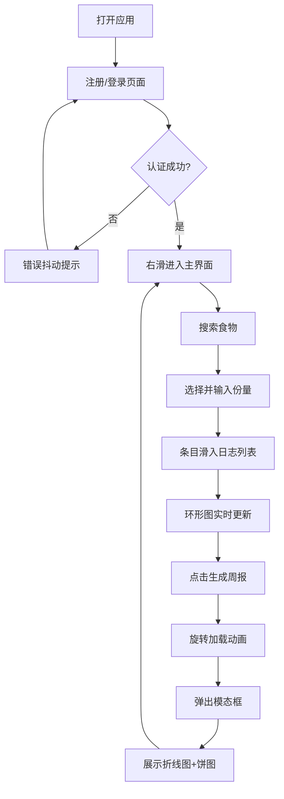

## 1. 产品概述

营养跟踪应用是一款帮助用户规划和管理每日饮食摄入的健康管理工具。它解决了用户难以实时追踪卡路里和营养元素摄入、缺乏可视化反馈来调整饮食结构的核心问题，使健康饮食管理变得简单直观。

- 主要目标用户：关注健康饮食、需要控制体重或管理营养摄入的普通用户
- 产品价值：提供便捷的营养追踪、清晰的可视化反馈和数据报告，帮助用户养成健康饮食习惯

## 2. 核心功能

### 2.1 用户角色

| 角色 | 注册方式 | 核心权限 |
|------|----------|----------|
| 普通用户 | 用户名密码注册 | 搜索食物、记录饮食、查看营养数据、生成周报 |

### 2.2 功能模块

1. **认证页面**：用户注册、用户登录
2. **主界面（仪表盘）**：食物搜索、饮食日志（按餐分组）、营养环形进度条、周报生成入口
3. **周报模态框**：本周卡路里趋势折线图、各营养元素平均占比饼图

### 2.3 页面详情

| 页面名称 | 模块名称 | 功能描述 |
|-----------|-------------|---------------------|
| 认证页面 | 注册/登录表单 | 表单淡入动画、按钮按压反馈、错误红色抖动提示、登录成功右滑动画 |
| 主界面 | 食物搜索栏 | 实时搜索匹配内置食物库，300ms内显示结果 |
| 主界面 | 饮食日志列表 | 按早/午/晚/加餐分组，可折叠展开，条目滑动渐入动画 |
| 主界面 | 营养进度环形图 | 展示卡路里/蛋白质/碳水/脂肪占比，填充动画+数字跳动，80%以下绿/80-100%橙/超100%红 |
| 主界面 | 报告生成按钮 | 点击后旋转加载动画，500ms内生成报告 |
| 周报模态框 | 趋势折线图 | 本周每日卡路里变化趋势，入场渐变动效 |
| 周报模态框 | 营养饼图 | 各营养元素平均占比，入场渐变动效 |

## 3. 核心流程

用户打开应用 → 注册/登录账户 → 登录成功后右滑进入主界面 → 搜索食物并添加份量 → 食物条目按餐分组显示，营养环形图实时更新 → 点击生成周报 → 弹出模态框展示趋势图和饼图 → 可继续添加或管理饮食记录

## 4. 用户界面设计

### 4.1 设计风格
- 主色调：薄荷绿(#4CAF50)，搭配白色卡片和灰色背景(#F5F5F5)
- 按钮/导航栏：渐变色微光效果
- 卡片样式：圆角白色卡片，hover时阴影加深并微微上浮
- 字体：简洁现代无衬线字体，突出数据可读性
- 图标风格：线性简洁图标，与薄荷绿主题呼应

### 4.2 页面设计概览

| 页面名称 | 模块名称 | UI元素 |
|-----------|-------------|-------------|
| 认证页面 | 表单区 | 居中白色卡片，淡入动画，输入框圆角聚焦高亮，错误红色抖动边框，底部渐变色按钮 |
| 主界面 | 搜索栏 | 顶部搜索框，圆角带搜索图标，实时下拉结果列表 |
| 主界面 | 营养环形图 | 四个彩色环形进度条，数字跳动+填充动画，卡片交错入场 |
| 主界面 | 日志分组 | 可折叠餐次分组，平滑高度过渡，条目滑入效果 |
| 主界面 | 报告按钮 | 渐变色圆角按钮，点击旋转加载动画 |
| 周报模态框 | 图表区 | 半透明遮罩，卡片入场渐变动效，折线图+饼图并排展示 |

### 4.3 响应式设计
- 桌面端：左侧边栏导航，右侧主内容区，环形图横向排列
- 平板端：保持桌面布局，适当缩小间距
- 移动端：侧边栏变为底部标签栏，环形图缩小排列，日志区域全宽展示

### 4.4 动效设计
- 页面加载：卡片交错上下滑动入场动画
- 交互反馈：所有按钮点击200ms内响应，按钮按压缩放反馈
- 数据变化：环形填充动画、数字跳动效果（500ms内完成）
- 折叠展开：平滑高度过渡动画（300ms ease）
