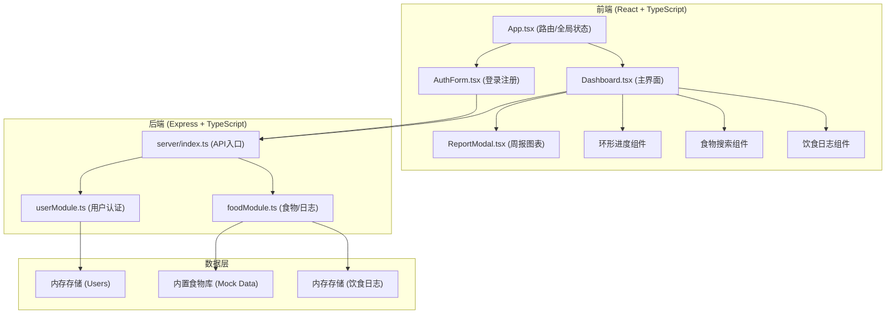
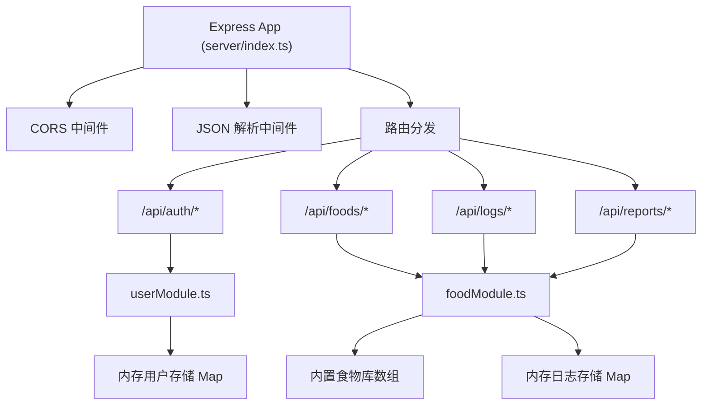
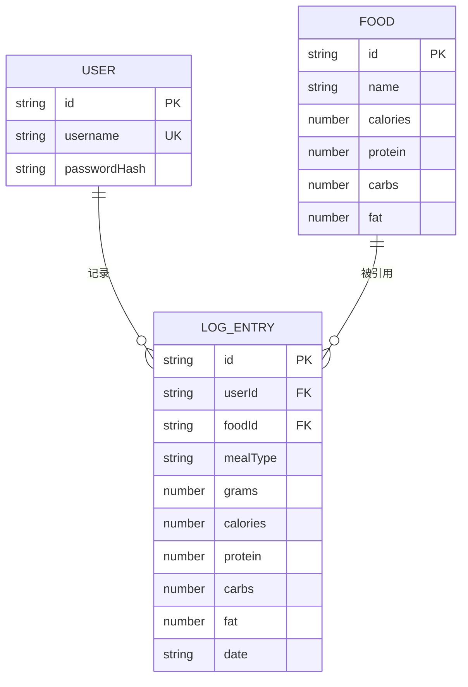

## 1. 架构设计



## 2. 技术描述

- **前端框架**: React 18 + TypeScript (严格模式)
- **构建工具**: Vite 5 + @vitejs/plugin-react
- **图表库**: Recharts (折线图、饼图)
- **HTTP通信**: Fetch API (前后端RESTful通信)
- **后端框架**: Express 4 + TypeScript
- **密码加密**: bcryptjs
- **唯一ID**: uuid
- **跨域**: cors
- **状态管理**: React useState/useContext (轻量级全局状态)
- **样式方案**: 内联CSS-in-JS + CSS动画 (避免额外依赖)

## 3. 路由定义 (前端)

| 路由 | 用途 |
|-------|---------|
| /auth | 认证页面（登录/注册） |
| /dashboard | 主界面仪表盘 |

## 4. API 定义

### 4.1 用户认证 API

```typescript
// POST /api/auth/register
interface RegisterRequest {
  username: string;
  password: string;
}
interface RegisterResponse {
  success: boolean;
  userId: string;
  username: string;
}

// POST /api/auth/login
interface LoginRequest {
  username: string;
  password: string;
}
interface LoginResponse {
  success: boolean;
  userId: string;
  username: string;
}
```

### 4.2 食物 API

```typescript
// GET /api/foods/search?q=关键词
interface FoodItem {
  id: string;
  name: string;
  calories: number;    // 每100g
  protein: number;     // 每100g
  carbs: number;       // 每100g
  fat: number;         // 每100g
}
interface SearchResponse {
  foods: FoodItem[];
}
```

### 4.3 饮食日志 API

```typescript
type MealType = 'breakfast' | 'lunch' | 'dinner' | 'snack';

interface LogEntry {
  id: string;
  foodId: string;
  foodName: string;
  mealType: MealType;
  grams: number;
  calories: number;
  protein: number;
  carbs: number;
  fat: number;
  date: string;  // YYYY-MM-DD
}

// POST /api/logs
interface AddLogRequest {
  userId: string;
  foodId: string;
  grams: number;
  mealType: MealType;
  date: string;
}
interface AddLogResponse {
  success: boolean;
  entry: LogEntry;
}

// GET /api/logs?userId=xxx&date=YYYY-MM-DD
interface GetLogsResponse {
  entries: LogEntry[];
  totals: {
    calories: number;
    protein: number;
    carbs: number;
    fat: number;
  };
}

// DELETE /api/logs/:id
interface DeleteLogResponse {
  success: boolean;
}

// GET /api/reports/weekly?userId=xxx
interface WeeklyReport {
  dailyTrend: { date: string; calories: number }[];
  avgNutrition: {
    protein: number;
    carbs: number;
    fat: number;
  };
}
```

## 5. 服务器架构



## 6. 数据模型

### 6.1 数据模型定义



### 6.2 默认营养目标

```typescript
const DAILY_GOALS = {
  calories: 2000,   // kcal
  protein: 60,      // g
  carbs: 250,       // g
  fat: 65,          // g
};
```

### 6.3 内置食物库示例数据

```
米饭: 116kcal/2.6g蛋白/25.6g碳水/0.3g脂肪 (每100g)
鸡胸肉: 165kcal/31g蛋白/0g碳水/3.6g脂肪
苹果: 52kcal/0.3g蛋白/13.8g碳水/0.2g脂肪
牛奶: 42kcal/3.4g蛋白/5g碳水/1g脂肪
鸡蛋: 155kcal/13g蛋白/1.1g碳水/11g脂肪
... (约20+常见食物)
```
