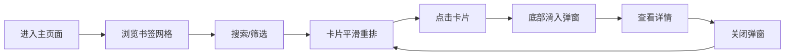

## 1. 产品概述

电子书签管理与阅读清单分配应用，帮助用户像管理书架一样收集网页链接和在线文章，支持打标签、添加阅读笔记，并按优先级分配阅读时间。

- 主要目的：提供直观的书签管理体验，帮助用户高效组织和筛选网络阅读资源
- 目标用户：需要管理大量在线文章和网页链接的知识工作者、学生和阅读爱好者
- 产品价值：通过卡片式展示、标签分类和快速搜索，提升信息管理效率

## 2. 核心功能

### 2.1 用户角色

| 角色 | 注册方式 | 核心权限 |
|------|----------|----------|
| 普通用户 | 无需注册（本地演示） | 浏览书签、搜索筛选、查看详情 |

### 2.2 功能模块

1. **主界面**：书签卡片网格展示、顶部筛选栏
2. **书签卡片**：favicon 图标、标题、摘要、彩色标签、悬停动画、点击弹窗
3. **筛选功能**：搜索框（防抖）、标签筛选器、平滑动画过渡
4. **详情弹窗**：完整链接、阅读笔记、底部滑入动画

### 2.3 页面详情

| 页面名称 | 模块名称 | 功能描述 |
|-----------|-------------|---------------------|
| 主页面 | 顶部筛选栏 | 搜索框支持关键词搜索，标签筛选器支持按分类过滤 |
| 主页面 | 书签卡片网格 | 三列响应式布局，卡片展示 favicon、标题、摘要、标签 |
| 主页面 | 详情弹窗 | 点击卡片后从底部滑入，展示完整链接和笔记 |

## 3. 核心流程

用户进入主页面 → 浏览所有书签卡片 → 通过搜索框输入关键词或点击标签筛选 → 卡片平滑过渡动画展示筛选结果 → 点击感兴趣的卡片 → 弹窗从底部滑入展示详情 → 关闭弹窗返回网格视图

## 4. 用户界面设计

### 4.1 设计风格

- **主色调**：深灰色背景（#1a1a2e），营造沉浸式阅读氛围
- **点缀色**：青蓝色（#00d4ff）作为主要交互色，琥珀色（#ffb347）作为强调色
- **卡片风格**：磨砂玻璃效果（backdrop-filter: blur），半透明背景
- **按钮风格**：圆角按钮，悬停时有柔和光晕反馈
- **字体**：现代无衬线字体，清晰易读
- **布局风格**：卡片式网格布局，整洁有序

### 4.2 页面设计概览

| 页面名称 | 模块名称 | UI 元素 |
|-----------|-------------|----------|
| 主页面 | 顶部筛选栏 | 搜索框（带搜索图标）、标签云（彩色圆角标签）、整体深色背景 |
| 主页面 | 书签卡片网格 | 三列网格、卡片悬停上浮效果、favicon 左上角展示、标签彩色排列 |
| 主页面 | 详情弹窗 | 底部滑入动画、半透明遮罩、完整链接、阅读笔记区域 |

### 4.3 响应式设计

- **桌面端**（>1024px）：三列网格布局
- **平板端**（768px-1024px）：两列网格布局
- **手机端**（<768px）：单列网格布局
- 筛选栏在移动端自适应堆叠
- 触摸优化：增大点击区域，适合手指操作

### 4.4 动效设计

- 卡片悬停：向上浮动 5px + 阴影增大
- 搜索筛选：卡片淡出淡入，逐行过渡
- 标签筛选：标签高亮，卡片平滑重排
- 详情弹窗：从底部滑入，带弹性缓动
- 按钮交互：悬停光晕效果
