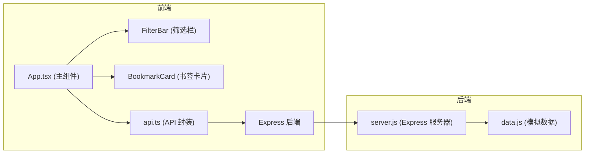
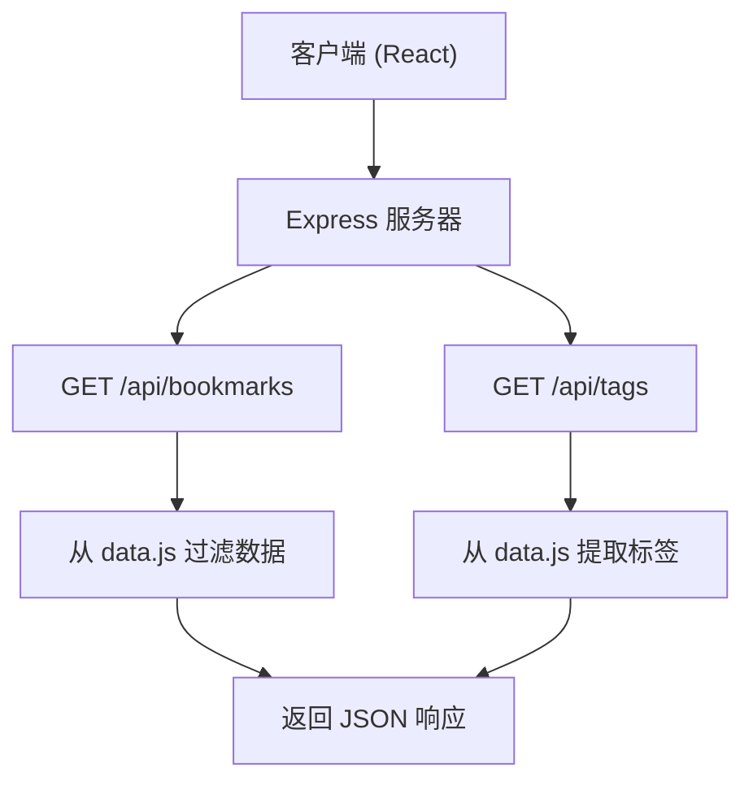
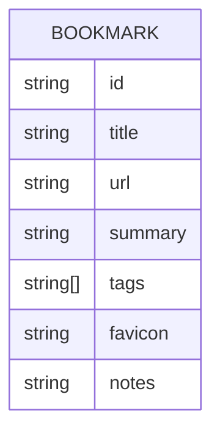

## 1. 架构设计



## 2. 技术栈说明

- **前端**：React 18 + TypeScript + Vite
- **构建工具**：Vite（配置路径别名 @ 指向 src）
- **样式**：CSS Modules / 原生 CSS（配合 CSS 变量）
- **后端**：Express 4 + Node.js
- **数据存储**：内存存储（data.js 模拟数据，20 条书签）
- **HTTP 客户端**：原生 fetch API
- **状态管理**：React useState/useEffect（轻量场景）

## 3. 路由定义

| 路由 | 用途 |
|-------|---------|
| / | 主页 - 书签网格展示与筛选 |

## 4. API 定义

### 4.1 获取书签列表

**GET** `/api/bookmarks?search=&tag=`

请求参数：
- `search` (可选)：搜索关键词，模糊匹配标题和摘要
- `tag` (可选)：标签筛选，精确匹配

响应类型：
```typescript
interface Bookmark {
  id: string;
  title: string;
  url: string;
  summary: string;
  tags: string[];
  favicon: string;
  notes?: string;
}

type BookmarkListResponse = Bookmark[];
```

### 4.2 获取所有标签

**GET** `/api/tags`

响应类型：
```typescript
type TagsResponse = string[];
```

## 5. 服务器架构图



## 6. 数据模型

### 6.1 数据模型定义



### 6.2 初始数据

- 20 条书签数据，涵盖科技、设计、编程、生活等多个分类
- 每条数据包含：id、title、url、summary、tags、favicon、notes
- 标签集合从书签数据中自动提取去重
