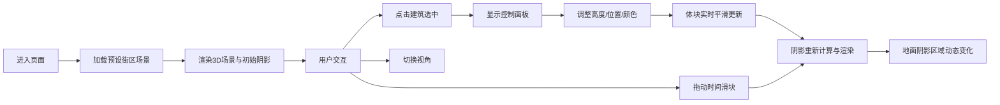

## 1. 产品概述

城市规划师3D体块遮挡分析工具，用于直观对比不同建筑体块对街道日照和视线的遮挡影响。通过交互式3D场景，用户可加载预设街区模型、调整建筑物高度和位置、实时观察日照阴影投射范围和视角遮挡区域。

- **核心价值**：将传统2D图纸无法呈现的三维空间光影变化可视化，提升城市规划方案评审效率
- **目标用户**：城市规划师、建筑设计师、方案评审专家

## 2. 核心功能

### 2.1 功能模块

1. **3D场景展示**：预设街区场景、半透明网格地面、建筑体块渲染
2. **建筑编辑**：点击选中建筑、高度/位置/颜色调整、平滑过渡动画
3. **日照分析**：时间滑块控制太阳位置、动态阴影投影区域、阴影边缘虚化
4. **视角切换**：俯视45度、正南方向、自由环绕三种相机模式
5. **辅助定位**：建筑底部垂直线投影、选中时高亮闪烁

### 2.2 页面详情

| 页面名称 | 模块名称 | 功能描述 |
|---------|---------|----------|
| 主页面 | 3D场景画布 | 全屏Canvas渲染，承载所有3D元素和交互 |
| 主页面 | 建筑控制面板 | 选中建筑后显示，含高度/X轴/Z轴滑块和颜色选择器 |
| 主页面 | 时间滑块 | 底部中央水平滑块，06:00-18:00，步长15分钟 |
| 主页面 | 视角切换按钮 | 右上角三个按钮，切换相机视角 |
| 主页面 | 投影辅助线 | 建筑底部垂直投影到地面，选中时黄色闪烁 |

## 3. 核心流程

## 4. 用户界面设计

### 4.1 设计风格

- **主题风格**：深色科技感主题，背景色 `#1a1a2e`
- **主色调**：蓝紫色渐变（控制面板滑块轨道）
- **辅助色**：暖黄到冷蓝渐变（时间滑块轨道，表示从早晨到傍晚）
- **地面网格**：淡蓝色 `rgba(100,200,255,0.15)`
- **阴影区域**：半透明深灰色多边形，边缘虚化
- **控件样式**：玻璃态毛玻璃效果（半透明磨砂背景、圆角12px、边框 `1px solid rgba(255,255,255,0.2)`）
- **滑块按钮**：白色圆形，带微弱发光阴影
- **建筑颜色**：红蓝绿黄紫渐变色系

### 4.2 页面设计概览

| 页面名称 | 模块名称 | UI元素 |
|---------|---------|--------|
| 主页面 | 3D场景 | 深色背景、半透明网格地面、彩色建筑体块、动态阴影 |
| 主页面 | 控制面板 | 玻璃态毛玻璃、圆角12px、渐变滑块、颜色选择器 |
| 主页面 | 时间滑块 | 底部居中、暖黄到冷蓝渐变轨道、白色圆形滑块 |
| 主页面 | 视角按钮 | 右上角排列、悬停放大(scale 1.05)、颜色加深 |
| 主页面 | 投影线 | 建筑中心垂直到地面、选中时黄色闪烁(0.8秒周期) |

### 4.3 响应式设计

- **桌面端**：控制面板悬浮在场景侧边，时间滑块底部居中，视角按钮右上角
- **移动端（宽度<768px）**：控制面板折叠为底部半透明抽屉，可上滑展开
- **触摸优化**：滑块和按钮增大点击区域，支持触摸拖拽

### 4.4 3D场景指引

- **环境**：深色背景 `#1a1a2e`，半透明网格地面，无HDRI
- **光照**：主光源为方向光（模拟太阳），位置随时间滑块变化；环境光提供基础照明
- **相机**：PerspectiveCamera，初始45度俯视，支持OrbitControls自由环绕
- **交互**：点击建筑选中高亮（边缘白色发光效果），拖拽OrbitControls旋转视角
- **后处理**：阴影边缘虚化效果，建筑选中发光效果
- **性能**：独立显卡60FPS，集成显卡不低于30FPS；阴影计算不阻塞主线程超过5ms

## 5. 数据与状态

### 5.1 建筑数据模型

| 属性 | 类型 | 说明 |
|------|------|------|
| id | string | 建筑唯一标识 |
| position | [number, number, number] | 建筑中心位置 [x, y, z] |
| width | number | 建筑宽度（X轴方向） |
| height | number | 建筑高度（Y轴方向） |
| depth | number | 建筑深度（Z轴方向） |
| color | string | 建筑颜色（十六进制） |

### 5.2 场景状态

| 状态 | 类型 | 说明 |
|------|------|------|
| selectedBuildingId | string \| null | 当前选中的建筑ID |
| timeOfDay | number | 当前时间（小时，6-18，步长0.25） |
| cameraMode | 'top45' \| 'south' \| 'free' | 当前相机模式 |
| buildings | Building[] | 所有建筑体块数据 |
