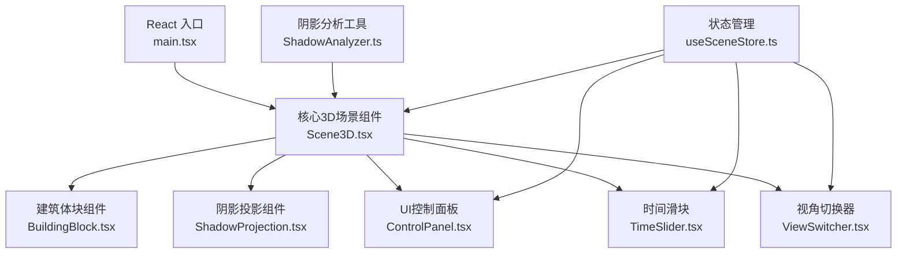
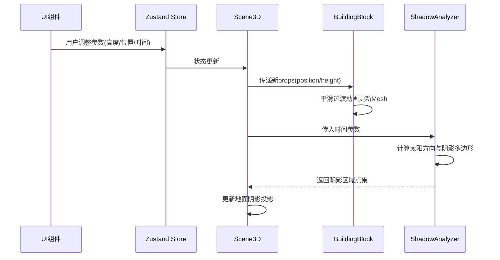

## 1. 架构设计



## 2. 技术描述

- **前端框架**：React 18 + TypeScript
- **3D引擎**：Three.js + @react-three/fiber + @react-three/drei
- **构建工具**：Vite
- **状态管理**：Zustand
- **样式方案**：CSS Modules / 内联样式（玻璃态效果）
- **动画库**：@react-three/drei 内置动画 + CSS transitions

## 3. 目录结构

```
src/
├── main.tsx                 # React 应用入口
├── Scene3D.tsx              # 核心3D场景组件
├── components/
│   ├── BuildingBlock.tsx    # 单个建筑体块组件
│   ├── ShadowProjection.tsx # 阴影投影区域组件
│   ├── ControlPanel.tsx     # 建筑控制面板
│   ├── TimeSlider.tsx       # 时间滑块组件
│   └── ViewSwitcher.tsx     # 视角切换器组件
├── utils/
│   └── ShadowAnalyzer.ts    # 阴影分析工具模块
├── store/
│   └── useSceneStore.ts     # 场景状态管理
├── types/
│   └── index.ts             # 类型定义
└── styles/
    └── global.css           # 全局样式
```

## 4. 数据流向



## 5. 核心模块说明

### 5.1 Scene3D.tsx（核心场景）

- **职责**：管理灯光、相机控件、地面网格、建筑体块列表
- **输入**：用户交互参数（来自store）
- **输出**：渲染完整3D场景
- **关键组件**：
  - `Canvas`：@react-three/fiber 根组件
  - `OrbitControls`：相机轨道控制
  - `ambientLight` + `directionalLight`：光照系统
  - `GridHelper` / 自定义地面网格
  - 建筑体块列表映射

### 5.2 BuildingBlock.tsx（建筑体块）

- **职责**：渲染单个建筑体块，支持选中高亮和动画
- **Props**：`position, width, height, depth, color, selected, onSelect`
- **特性**：
  - `BoxGeometry` + `MeshStandardMaterial`
  - `castShadow` 开启阴影投射
  - 选中时边缘发光效果（使用 `EdgesGeometry` + 发光材质）
  - 底部垂直投影线
  - 平滑过渡动画（使用 useFrame + lerp）

### 5.3 ShadowAnalyzer.ts（阴影分析）

- **职责**：计算给定时间的太阳方向，返回阴影投射区域多边形
- **输入**：时间（小时）、建筑位置和尺寸
- **输出**：阴影多边形顶点数组
- **算法**：
  - 根据时间计算太阳高度角和方位角
  - 计算建筑顶点在地面的投影位置
  - 生成凸包多边形点集

### 5.4 ControlPanel.tsx（控制面板）

- **职责**：显示选中建筑的编辑控件
- **控件**：高度滑块(10-80m)、X轴位置滑块(-20到20m)、Z轴位置滑块(-20到20m)、颜色选择器
- **样式**：玻璃态毛玻璃效果

### 5.5 TimeSlider.tsx（时间滑块）

- **职责**：控制一天中的时间，影响太阳位置
- **范围**：06:00 - 18:00，步长15分钟
- **样式**：渐变轨道（暖黄→冷蓝）

### 5.6 ViewSwitcher.tsx（视角切换）

- **职责**：切换相机视角
- **模式**：俯视45度、正南方向、自由环绕
- **动画**：0.6秒 ease-in-out 平滑过渡

## 6. 性能优化

### 6.1 渲染性能

- 建筑体块使用 `instancedMesh` 或复用几何体（数量少时可不使用）
- 阴影使用 `ShadowMaterial` 或自定义投影多边形，避免实时阴影贴图
- 地面网格使用 `BufferGeometry` 静态渲染

### 6.2 计算性能

- 阴影多边形计算优化：避免每帧重复计算，仅在时间或建筑变化时重算
- 使用 `requestIdleCallback` 或时间分片避免阻塞主线程
- 阴影多边形使用 `BufferGeometry` 动态更新顶点，不创建新对象

### 6.3 动画性能

- 使用 `useFrame` + `lerp` 实现平滑过渡，避免React重渲染
- CSS transitions 处理UI控件动画
- 颜色过渡使用材质颜色 lerp

## 7. 状态管理（Zustand Store）

```typescript
interface Building {
  id: string;
  position: [number, number, number];
  width: number;
  height: number;
  depth: number;
  color: string;
}

interface SceneState {
  buildings: Building[];
  selectedBuildingId: string | null;
  timeOfDay: number; // 6 - 18
  cameraMode: 'top45' | 'south' | 'free';
  selectBuilding: (id: string | null) => void;
  updateBuilding: (id: string, updates: Partial<Building>) => void;
  setTimeOfDay: (time: number) => void;
  setCameraMode: (mode: 'top45' | 'south' | 'free') => void;
}
```
