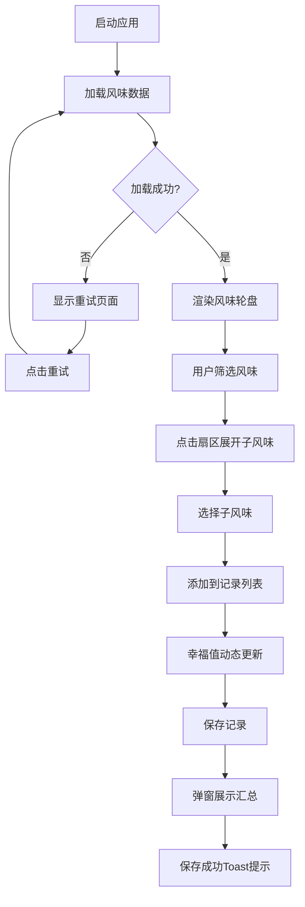

## 1. 产品概述
交互式咖啡豆风味轮盘应用，帮助咖啡爱好者通过可视化方式探索和记录不同咖啡豆的风味特征，生成个性化风味档案。

- 主要用途：可视化探索咖啡豆风味层次结构，记录个人风味偏好
- 目标用户：咖啡爱好者、品鉴师、咖啡从业者
- 产品价值：提供直观的风味探索体验，帮助用户建立系统化的风味认知

## 2. 核心功能

### 2.1 功能模块
1. **风味轮盘**：多层次同心圆布局的可交互风味图表
2. **风味记录列表**：用户已选风味标签管理
3. **筛选系统**：按烘焙程度和产地过滤风味
4. **记录保存**：保存风味档案并展示汇总信息
5. **加载与错误处理**：数据加载状态和重试机制

### 2.2 页面详情
| 页面名称 | 模块名称 | 功能描述 |
|-----------|-------------|---------------------|
| 主页面 | 风味轮盘 | D3绘制层次化环形图，支持点击展开、悬停扩张、旋转缩放动画 |
| 主页面 | 风味记录列表 | 显示已选风味标签，支持拖拽排序、删除、动态幸福值显示 |
| 主页面 | 筛选区域 | 按烘焙程度（浅/中/深烘）和产地（非洲/中南美/亚洲）过滤 |
| 主页面 | 保存弹窗 | 展示汇总信息，放大动画出现，收缩淡出消失 |
| 主页面 | Toast提示 | 保存成功后从底部滑入，2秒后自动滑出 |

## 3. 核心流程
用户打开应用 → 加载风味数据（显示旋转加载动画）→ 轮盘渲染完成 → 用户通过筛选条件过滤风味 → 点击轮盘扇区展开子风味 → 选择子风味添加到记录列表 → 查看幸福值动态变化 → 可拖拽排序或删除记录 → 点击保存按钮 → 弹窗展示汇总信息 → 确认保存 → Toast提示保存成功

## 4. 用户界面设计

### 4.1 设计风格
- **主色调**：浅米色 #F5E6D0（背景）、深棕色 #3E2723（主文字）、咖啡色 #6D4C41（强调色）
- **辅助色**：浅烘淡黄 #FFF9C4、中烘琥珀 #FFB74D、深烘咖啡色 #5D4037
- **按钮样式**：圆角胶囊按钮组，选中项背景色随选项改变
- **字体**：优雅的衬线字体配合现代无衬线字体
- **布局**：桌面端左侧70%轮盘区域 + 右侧30%记录列表，移动端纵向堆叠
- **图标风格**：咖啡豆图标、表情符号（😊😐😢）表示幸福值

### 4.2 页面设计概览
| 模块名称 | UI元素 |
|-----------|-------------|
| 风味轮盘 | 多层次同心圆、1px白线分隔扇区、柔和阴影悬停效果、中心咖啡豆图标、描述气泡 |
| 风味记录列表 | 从右侧滑入动画、淡出缩小删除、幸福值表情、拖拽排序手柄 |
| 筛选区域 | 圆角胶囊按钮组、选中高亮、淡入淡出过渡（300ms） |
| 保存弹窗 | 半透明模糊背景、中心放大动画出现、收缩淡出消失 |
| Toast提示 | 绿底白字、底部滑入、2秒自动滑出 |

### 4.3 响应式设计
- 桌面端（≥768px）：左侧70%轮盘 + 右侧30%记录列表横向布局
- 移动端（<768px）：轮盘在上、列表在下纵向布局，通过顶部切换按钮展开/收起列表，高度从0过渡到auto

### 4.4 动效规范
- 扇区悬停：向外扩张180%，柔和阴影投射
- 扇区展开：外圈弹性动画过渡，选中扇区高亮改变明度
- 标签添加：缩放渐入动画从右侧滑入
- 标签删除：淡出缩小消失
- 清空记录：所有标签飞回轮盘的重置动画
- 轮盘刷新：淡入淡出过渡，≤300ms
- 加载动画：咖啡豆图标每秒旋转2圈
- 按钮按压：回弹动画

## 5. 性能要求
- 轮盘交互响应延迟 ≤ 200ms
- 筛选切换动画帧率 ≥ 50fps
