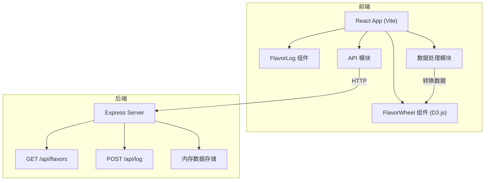
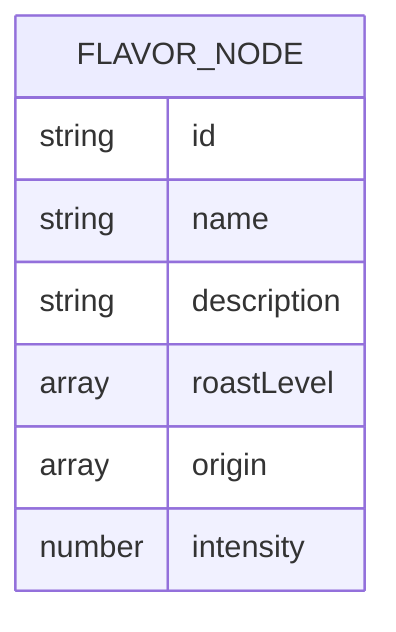

## 1. 架构设计



## 2. 技术描述
- **前端**：React 18 + TypeScript + Vite + D3.js v7
- **后端**：Express 4.x + CORS
- **状态管理**：React Hooks (useState, useEffect)
- **数据存储**：后端内存对象存储
- **构建工具**：Vite

## 3. 项目结构
```
auto38/
├── package.json
├── vite.config.js
├── tsconfig.json
├── index.html
├── server/
│   └── index.js
└── src/
    ├── main.tsx
    ├── App.tsx
    ├── components/
    │   ├── FlavorWheel.tsx
    │   └── FlavorLog.tsx
    └── modules/
        ├── api.ts
        └── data.ts
```

## 4. API 定义

### 4.1 GET /api/flavors
获取风味分类树数据

**响应数据类型：**
```typescript
interface FlavorNode {
  id: string;
  name: string;
  description?: string;
  roastLevel?: ('light' | 'medium' | 'dark')[];
  origin?: ('africa' | 'central_south_america' | 'asia')[];
  intensity?: number; // 1-5
  children?: FlavorNode[];
}
```

### 4.2 POST /api/log
提交用户风味记录

**请求体：**
```typescript
interface FlavorLogRequest {
  beanName: string;
  flavors: {
    id: string;
    name: string;
    intensity: number;
  }[];
  timestamp: string;
}
```

**响应：**
```typescript
interface FlavorLogResponse {
  success: boolean;
  message: string;
  id: string;
}
```

## 5. 数据模型

### 5.1 风味层级数据


### 5.2 初始数据结构
风味数据分为三层：
1. **核心味层**（酸、甜、苦）
2. **主风味层**（如柑橘类、浆果类、坚果类等）
3. **子风味层**（如柠檬、蓝莓、榛子等）

## 6. 核心模块说明

### 6.1 FlavorWheel 组件
- 接收扁平化风味数据，通过 data.ts 转换为 D3 层级结构
- 使用 d3.hierarchy 和 d3.partition 生成环形布局
- SVG 绘制多层同心圆扇区
- 处理点击展开/收起子级扇区
- 悬停时显示 tooltip 气泡
- 响应筛选条件变化，触发淡入淡出动画

### 6.2 FlavorLog 组件
- 展示已选风味标签列表
- 支持 HTML5 拖拽排序
- 添加时从右侧滑入动画
- 删除时淡出缩小动画
- 动态计算幸福值（根据所选风味强度和数量）
- 清空时触发飞回动画

### 6.3 api.ts 模块
- 封装 fetch 请求
- getFlavors(): 获取风味树
- submitLog(data): 提交风味记录

### 6.4 data.ts 模块
- flatToHierarchy(): 将后端扁平数据转为 D3 所需的层级结构
- filterByRoastAndOrigin(): 根据筛选条件过滤风味节点
- calculateHappiness(): 计算幸福值（0-100）
