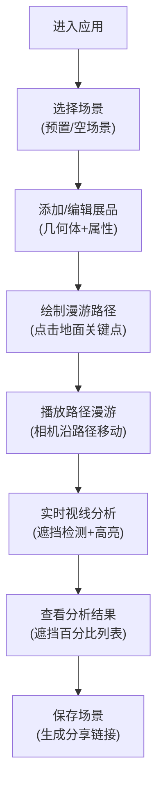

## 1. 产品概述
3D虚拟展览空间布局模拟器是一款专为艺术展览策展人设计的专业工具，解决传统平面图难以呈现三维空间观赏体验的痛点，支持在有限空间内模拟不同展品布局对观众视线和动线的影响。
- 核心价值：让策展人在实际布展前即可通过3D可视化方式预览展览效果，优化展品布局和观众体验
- 目标用户：美术馆策展人、画廊主理人、展览设计师、空间规划师

## 2. 核心功能

### 2.1 用户角色
| 角色 | 注册方式 | 核心权限 |
|------|----------|----------|
| 策展人 | 无需注册，直接使用 | 创建/编辑/保存场景、添加展品、设置漫游路径、进行视线分析、分享场景 |

### 2.2 功能模块
1. **场景管理模块**：加载预置场景、创建空场景、保存/分享场景
2. **3D场景编辑模块**：添加/删除/调整展品几何体、拖拽平移、旋转视角、滚轮缩放
3. **展品属性编辑模块**：设置展品颜色、透明度、位置、旋转、缩放
4. **视点路径漫游模块**：绘制漫游路径、路径播放、粒子光带指引
5. **视线遮挡分析模块**：实时计算遮挡情况、半透明红色高亮遮挡展品、分析结果列表展示

### 2.3 页面详情
| 页面名称 | 模块名称 | 功能描述 |
|---------|----------|----------|
| 主应用页面 | 3D场景渲染区域 | 左侧70%区域展示3D展览空间，支持鼠标交互操作 |
| 主应用页面 | 右侧控制面板 | 30%宽度，包含场景列表、展品属性、路径绘制、分析结果四个子面板 |
| 主应用页面 | 顶部工具栏 | 快捷操作按钮（添加几何体、保存场景、播放路径） |

## 3. 核心流程
用户进入应用后，可选择加载预置场景或创建空场景，在3D空间中添加和调整展品位置，绘制观众漫游路径，启动路径播放并实时查看视线遮挡分析结果，最后保存场景并生成分享链接。

## 4. 界面设计

### 4.1 设计风格
- 主色调：深色主题，背景#1a1a2e，辅助色#16213e，高亮色#0f3460
- UI控件：毛玻璃效果（backdrop-filter: blur(8px)），半透明面板，圆角12px，轻微扩散阴影
- 字体：使用Space Grotesk作为标题字体，Inter作为正文字体（需确认字体可用性）
- 图标：使用lucide-react图标库，线性风格

### 4.2 页面设计概览
| 页面名称 | 模块名称 | UI元素 |
|---------|----------|--------|
| 主应用 | 3D场景区域 | 深色空间背景、网格地面、聚光灯光源、展品几何体、选中蓝色描边、漫游路径虚线、粒子光带 |
| 主应用 | 控制面板 | 毛玻璃面板、场景下拉选择器、属性卡片、输入框（带图标）、进度条（绿到红渐变）、按钮（按压反馈） |
| 主应用 | 弹窗 | 保存进度条动画、分享链接复制框、错误提示框 |

### 4.3 响应式设计
- 桌面端（默认）：左右两栏布局，左侧70% 3D场景，右侧30%控制面板
- 平板端：保持左右布局，比例调整为60%/40%
- 移动端：控制面板折叠为底部抽屉，通过底部上滑按钮展开，动画持续0.3秒

### 4.4 3D场景设计指引
- 环境：美术馆风格，深灰色地面带网格线，柔和环境光+聚光灯
- 光照：AmbientLight(0xffffff, 0.4) + DirectionalLight(0xffffff, 0.8) + 多盏SpotLight
- 相机：初始位置(10, 8, 10)，lookAt(0, 0, 0)，透视相机fov=50
- 交互：OrbitControls，支持拖拽平移、右键旋转、滚轮缩放，限制俯仰角-30°到60°
- 后处理：轻微Bloom效果增强高光，SSR反射地面
- 性能：50个展品以内保持30FPS以上，分析计算单帧耗时≤16ms
