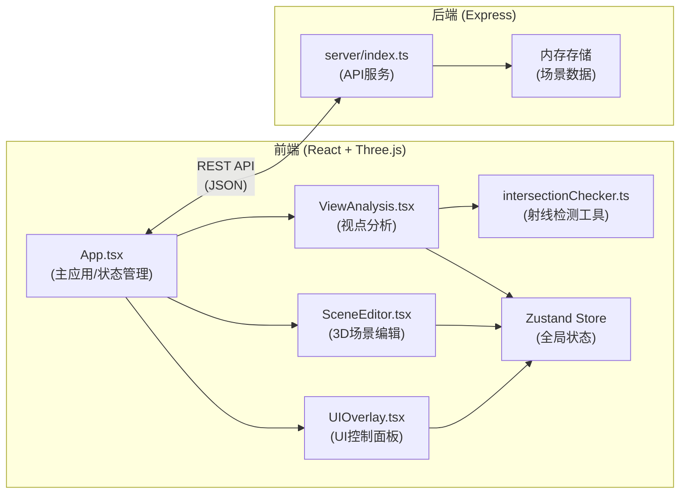
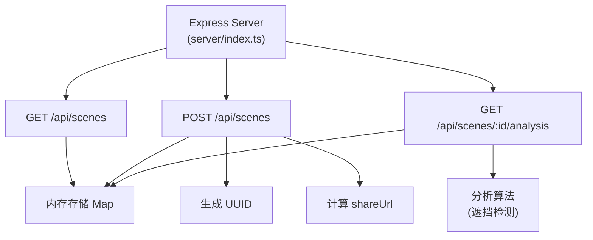
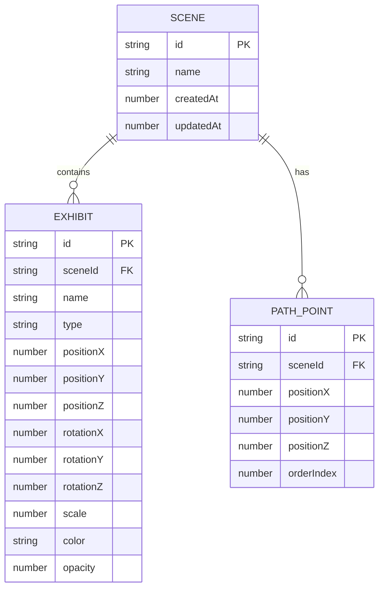

## 1. 架构设计



## 2. 技术描述
- **前端框架**：React 18 + TypeScript
- **3D渲染**：Three.js + @react-three/fiber + @react-three/drei
- **状态管理**：Zustand
- **构建工具**：Vite
- **样式方案**：CSS Modules / 内联样式 + 毛玻璃效果
- **后端框架**：Express 4
- **数据存储**：内存存储（Map）
- **唯一标识**：uuid
- **跨域处理**：cors

## 3. 路由定义
| 路由 | 用途 |
|------|------|
| / | 主应用页面（单页应用，无前端路由） |
| GET /api/scenes | 获取场景列表 |
| POST /api/scenes | 保存场景 |
| GET /api/scenes/:id/analysis | 返回视线分析结果 |

## 4. API 定义

### 数据类型定义
```typescript
// 展品类型
type ExhibitType = 'cube' | 'sphere' | 'cylinder' | 'torus';

interface Exhibit {
  id: string;
  name: string;
  type: ExhibitType;
  position: [number, number, number];
  rotation: [number, number, number];
  scale: number;
  color: string;
  opacity: number;
}

interface PathPoint {
  id: string;
  position: [number, number, number];
}

interface Scene {
  id: string;
  name: string;
  exhibits: Exhibit[];
  path: PathPoint[];
  createdAt: number;
  updatedAt: number;
}

interface AnalysisResult {
  exhibitId: string;
  exhibitName: string;
  isOccluded: boolean;
  occlusionPercentage: number;
  occlusionDuration: number;
}

// 请求/响应类型
type GetScenesResponse = Scene[];

type SaveSceneRequest = Omit<Scene, 'id' | 'createdAt' | 'updatedAt'>;
type SaveSceneResponse = { id: string; shareUrl: string };

type GetAnalysisResponse = {
  timestamp: number;
  results: AnalysisResult[];
  cameraPosition: [number, number, number];
};
```

## 5. 服务端架构



## 6. 数据模型

### 6.1 数据模型定义



### 6.2 内存存储结构
```typescript
// 内存中使用 Map 存储场景数据
const scenesStore = new Map<string, Scene>();

// 预置场景初始化数据
const presetScenes: Scene[] = [
  {
    id: 'preset-gallery',
    name: '美术馆展厅',
    exhibits: [...],
    path: [...],
    createdAt: Date.now(),
    updatedAt: Date.now()
  },
  {
    id: 'preset-corridor',
    name: '画廊走廊',
    exhibits: [...],
    path: [...],
    createdAt: Date.now(),
    updatedAt: Date.now()
  }
];
```

## 7. 文件结构与调用关系

```
project-root/
├── package.json                 # 依赖与脚本配置
├── vite.config.js              # Vite构建配置，@别名指向src
├── tsconfig.json               # TypeScript严格模式配置
├── index.html                  # 入口HTML，挂载React根组件
├── server/
│   └── index.ts                # Express API服务
│       ↑↓ 数据流向：REST API (JSON格式)
└── src/
    ├── main.tsx                # React入口，渲染App组件
    │   ↓ 渲染
    ├── App.tsx                 # 主应用组件，路由/全局状态管理
    │   ├─→ src/modules/SceneEditor.tsx    # 场景编辑模块
    │   │     ↓ 传递场景对象、相机位姿
    │   ├─→ src/modules/ViewAnalysis.tsx   # 视点分析模块
    │   │     ↓ 调用射线检测
    │   │     → src/utils/intersectionChecker.ts  # 遮挡计算工具
    │   └─→ src/components/UIOverlay.tsx   # UI控制面板
    │         ↓ 事件回调同步
    ├── types/                  # TypeScript类型定义
    ├── store/                  # Zustand状态管理
    └── styles/                 # 全局样式与CSS变量
```

### 核心数据流
1. **场景编辑数据流**：SceneEditor ↔ Zustand Store ↔ UIOverlay
2. **分析计算数据流**：ViewAnalysis → intersectionChecker → Analysis Results → UI
3. **前后端数据流**：App → Express API → 内存存储 → App
