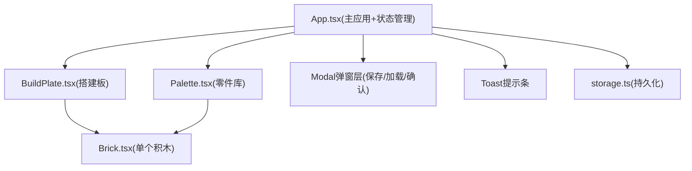

## 1. 架构设计



## 2. 技术描述
- 前端：React@18 + TypeScript(严格模式) + Vite
- 初始化工具：vite-init react-ts模板
- 后端：无后端，纯前端localStorage存储
- 状态管理：App组件内useState/useReducer(轻量场景)，不引入额外库
- 拖拽：原生HTML5 Drag & Drop API + 自定义mousemove(用于搭建板内预览跟随)
- 构建工具：Vite，配置路径别名 @ → src
- CSS方案：CSS Modules(组件级)+ 全局CSS变量定义主题

## 3. 路由定义
| 路由 | 用途 |
|------|------|
| / | 单页应用，无多路由，所有功能在主页内完成 |

## 4. 类型定义(TypeScript)

```typescript
// 积木尺寸类型(单位：网格格数)
type BrickSize = '1x1' | '1x2' | '2x2' | '2x4' | '2x3' | '1x4';

// 积木颜色
type BrickColor = 'red' | 'yellow' | 'blue' | 'green' | 'white';

// 单个积木实例数据
interface BrickData {
  id: string;              // 唯一ID，uuid或timestamp+random
  type: BrickSize;         // 尺寸类型
  color: BrickColor;       // 颜色
  x: number;               // 网格X坐标(左上端点)
  y: number;               // 网格Y坐标(左上端点)
  rotation: 0 | 90 | 180 | 270;  // 旋转角度
}

// 保存的作品
interface WorkData {
  id: string;
  name: string;
  createdAt: number;       // timestamp
  bricks: BrickData[];
  viewport: {
    scale: number;
    offsetX: number;
    offsetY: number;
  };
}

// 颜色元数据
interface ColorMeta {
  key: BrickColor;
  name: string;            // 中文名：红色/黄色...
  hex: string;             // CSS色值
}

// 尺寸元数据
interface SizeMeta {
  key: BrickSize;
  w: number;               // 宽(格数)
  h: number;               // 高(格数)
  label: string;           // 显示名
}
```

## 5. 数据模型与存储
### 5.1 localStorage键名约定
- `lego_works` → `WorkData[]` 作品列表

### 5.2 存储工具函数(storage.ts)
- `loadWorks(): WorkData[]` - 读取所有作品
- `saveWorks(list: WorkData[]): void` - 覆写全部作品
- `createWork(name: string, data: Omit<WorkData,'id'|'createdAt'>): WorkData` - 新建并保存
- `deleteWork(id: string): void` - 删除指定作品
- 错误处理：JSON解析失败时返回空数组，异常时console.warn不阻断UI

## 6. 核心交互实现要点

### 6.1 搭建板坐标系统
- 基础网格单元：`GRID_SIZE = 40px`(可通过常量调整)
- 世界坐标→屏幕坐标：`screenX = (x * GRID_SIZE + offsetX) * scale`
- 屏幕坐标→世界坐标(反推吸附)：`worldX = round((screenX / scale - offsetX) / GRID_SIZE)`
- 视口通过CSS `transform: translate(offsetX, offsetY) scale(scale)`应用到搭建板内容层

### 6.2 拖拽放置流程
1. Palette卡片dragstart：设置drag data为`{type, color}`，设置自定义半透明drag image
2. BuildPlate dragover：preventDefault，实时计算鼠标屏幕坐标→反推世界网格坐标→显示预览积木
3. BuildPlate drop：校验合法性(不越界、不与已有积木重叠)，合法则新增BrickData并触发放置动画/音效
4. 合法性检测：旋转90/270度时交换w/h，然后进行AABB矩形重叠检查

### 6.3 音效实现
- 使用Web Audio API合成咔嗒声(无需外部资源文件)
- 策略：短促高频正弦波+快速衰减，duration=80ms, freq=1200Hz→800Hz

### 6.4 组件数据流
- App.tsx持有：`bricks: BrickData[]`、`selectedId`、`viewport`、`works`、`modalState`
- BuildPlate接收：`bricks`、`selectedId`、`viewport`、事件回调(onPlace/onSelect/onMoveViewport/onScale)
- Palette接收：颜色分组数据(静态常量)，通过HTML5 DnD传递类型
- Brick接收：单个brick数据、selected状态，onClick选中、onDelete、onRotate回调

## 7. 性能优化清单
- 所有积木使用transform绝对定位，避免触发布局回流
- 拖拽预览使用独立绝对定位DOM，不触发列表重渲染
- 视口变换使用will-change: transform提示合成层
- 选中状态变化只重渲染对应单个Brick组件(key稳定唯一)
- 鼠标滚轮使用passive:true，防抖节流保证60fps
- localStorage操作在事件循环尾部异步触发(不阻塞关键路径)
