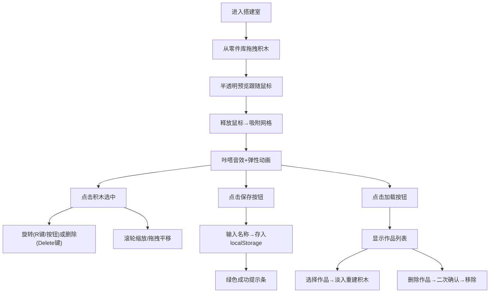

## 1. 产品概述
在线乐高虚拟搭建室是一款面向创意爱好者的网页应用，用户可以在浏览器中像玩真实乐高一样自由拼接虚拟积木块，保存和加载个人作品。
- 主要目的：为用户提供一个低门槛、高自由度的创意搭建平台，满足乐高爱好者在线创作和分享的需求
- 目标用户：乐高爱好者、创意设计爱好者、儿童和教育工作者
- 产品价值：无需实体积木即可体验搭建乐趣，作品永久保存随时编辑

## 2. 核心功能

### 2.1 功能模块
1. **搭建板模块**：网格背景的主画布、积木渲染、拖放吸附、缩放平移
2. **零件库模块**：按颜色分组的积木分类面板、可折叠/展开、积木卡片拖拽源
3. **积木交互模块**：积木选中高亮、旋转(90度)、删除动画、放置咔嗒效果
4. **作品管理模块**：保存作品(命名)、加载作品列表、删除作品(二次确认)、提示反馈

### 2.2 页面详情
| 页面名称 | 模块名称 | 功能描述 |
|---------|----------|----------|
| 主界面 | 顶栏信息区 | 显示总积木数量、当前选中积木颜色名称、保存/加载按钮 |
| 主界面 | 搭建板区域 | 带网格线画布、积木拖拽放置目标、鼠标滚轮缩放(0.5x-3x)、空白拖拽平移 |
| 主界面 | 右侧零件库 | 颜色分组(红黄蓝绿白)、分组折叠展开、积木卡片(缩略图+手柄)、悬停上浮效果 |
| 主界面 | 积木操作层 | 选中旋转按钮、R键旋转、Delete键删除、放置吸附、咔嗒音效+弹性动画 |
| 模态弹窗 | 保存弹窗 | 输入作品名称、确认保存、成功提示条(绿底对勾、3秒淡出) |
| 模态弹窗 | 加载弹窗 | 作品列表卡片、加载按钮、删除按钮(二次确认弹窗)、加载淡入动画 |

## 3. 核心流程
用户打开应用后，从右侧零件库选择颜色分组，将积木卡片拖拽至中央搭建板，积木跟随鼠标显示半透明预览，释放后自动吸附网格并播放咔嗒音效。用户可点击积木选中后旋转/删除，使用滚轮缩放和拖拽空白平移视角。完成搭建后点击保存按钮命名保存，或点击加载按钮从作品列表中恢复之前的作品。

## 4. 用户界面设计
### 4.1 设计风格
- 主色调：浅灰色背景(#f5f6f8)、搭建板米白色(#ffffff)
- 积木色：红(#e53935)、黄(#fdd835)、蓝(#1e88e5)、绿(#43a047)、白(#fafafa)
- 按钮风格：圆角(12px)、磨砂半透明质感、hover微高亮、点击微凹陷
- 字体：Roboto(无衬线)、标题500权重、正文400
- 布局：左侧顶栏信息+中央搭建板+右侧固定宽度零件库
- 图标风格：Lucide线性图标、与文字同色系

### 4.2 页面设计概述
| 页面/组件 | 模块 | UI元素 |
|-----------|------|--------|
| 主界面 | 整体布局 | 三栏flex布局、背景#f5f6f8、间距16px、阴影柔和 |
| 主界面 | 搭建板 | 白底+网格线(20px格子、浅灰#e0e0e0虚线)、圆角16px、可滚动容器 |
| 主界面 | 积木块 | 立体3D效果(顶高光+右/下阴影)、圆角3px、选中时2px蓝色描边+外发光 |
| 主界面 | 零件库卡片 | 白底圆角12px、阴影、悬停translateY(-2px)、拖拽手柄⋮⋮图标 |
| 主界面 | 顶栏信息 | 积木数量图标+数字、选中颜色圆点+中文名 |
| 主界面 | 操作按钮 | 磨砂玻璃(white/0.7 backdrop-blur)、圆角12px、图标+文字 |
| 动画效果 | 放置 | transform scale(1→1.15→1) 300ms弹性 |
| 动画效果 | 删除 | 红色闪烁2次→scale(1→0) opacity(1→0) 350ms |
| 动画效果 | 旋转 | transform rotate过渡 300ms cubic-bezier(0.4,0,0.2,1) |
| 动画效果 | 分组展开 | max-height 过渡 250ms ease-out |
| 动画效果 | 缩放/平移 | transform translate/scale 即时更新(非过渡)保证流畅 |

### 4.3 响应式
- Desktop-first设计，主搭建板自适应宽度，零件库固定宽度280px
- 最小窗口支持1024x768，低于此宽度横向滚动
- 触摸屏支持：单指拖拽平移、双指捏合缩放

### 4.4 性能要求
- 拖拽渲染帧率≥55fps：使用transform定位避免重排，requestAnimationFrame节流
- 保存加载响应≤500ms：localStorage同步读写，单作品JSON≤1MB
- 积木数量上限建议500块，超出时提示性能警告
