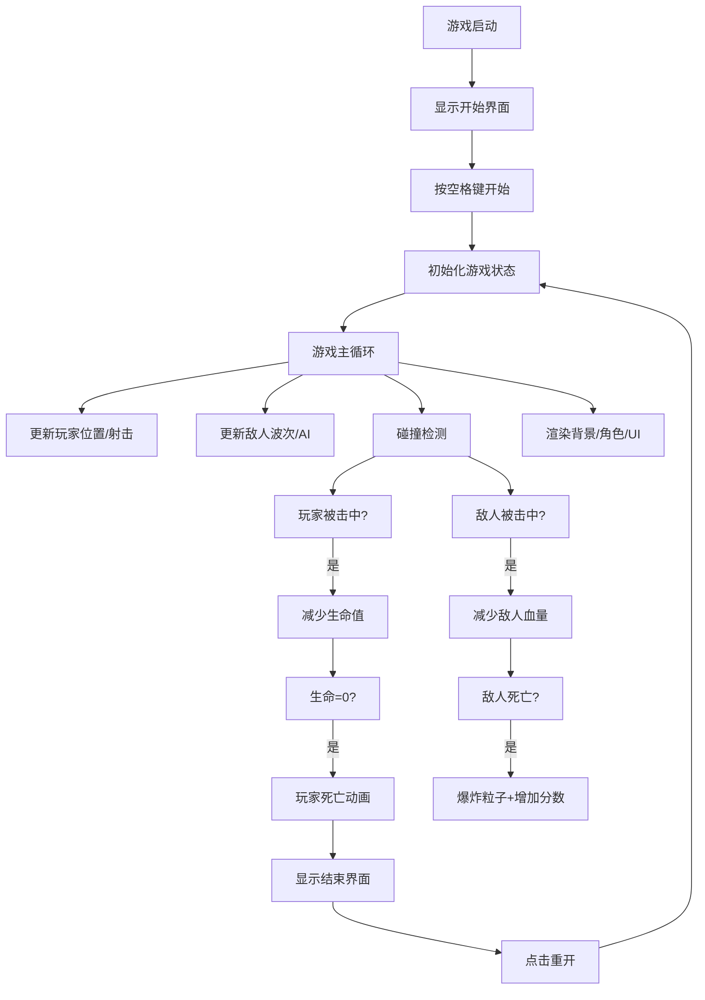

## 1. 产品概述
《星际猎手》是一款基于 Web 的 2D 横版卷轴射击游戏，玩家控制飞船在动态星际背景中躲避障碍物、攻击敌人、获取分数并挑战更高难度。
- 核心目标：提供流畅、刺激的射击游戏体验，通过波次递增难度挑战玩家的反应能力
- 目标用户：休闲游戏玩家、射击游戏爱好者
- 市场价值：纯前端实现，无需安装即可游玩，具有良好的传播性和可玩性

## 2. 核心 Features

### 2.1 功能模块
1. **游戏主场景**：飞船控制、敌人波次、射击碰撞、动态背景、音效系统
2. **开始界面**：游戏标题、开始提示、脉动光晕动画
3. **游戏界面**：分数显示、生命值、波次信息、飘散分数提示
4. **结束界面**：最终分数、击败波次、重开按钮

### 2.2 页面详情
| 页面名称 | 模块名称 | Feature 描述 |
|-----------|-------------|---------------------|
| 开始界面 | 标题模块 | 显示"星际猎手"游戏名称，"按空格开始"提示文字，开始区域有脉动光晕动画 |
| 游戏界面 | 飞船控制 | 方向键控制移动，空格键射击，边界限制，边缘滚动循环效果 |
| 游戏界面 | 敌人系统 | 按波次生成敌人，AI波动飞行，普通敌人和精英敌人，敌人射击 |
| 游戏界面 | 碰撞系统 | 矩形碰撞检测，玩家受伤减命，敌人死亡爆炸粒子，玩家死亡碎片动画 |
| 游戏界面 | 背景系统 | 两层视差滚动星空背景，近层快亮白，远层慢暗蓝 |
| 游戏界面 | 音效系统 | Web Audio API 生成射击、爆炸、受伤音效 |
| 游戏界面 | UI显示 | 左上角分数/生命值，右上角波次，像素字体呼吸闪烁效果 |
| 结束界面 | 结算模块 | 半透明遮罩，显示最终分数/击败波次，"再试一次"按钮悬停放大变色 |

## 3. 核心流程

## 4. 界面设计

### 4.1 设计风格
- 主色调：深空蓝黑色 `#0a0a2e` 作为背景
- 强调色：科技感青蓝色 `#00f0ff`，白色 `#ffffff`，金色 `#ffd700`
- 字体：像素风格 Press Start 2P，营造复古游戏氛围
- 动效：呼吸闪烁、脉动光晕、飘散动画、悬停放大

### 4.2 页面设计
| 页面名称 | 模块名称 | UI Elements |
|-----------|-------------|-------------|
| 开始界面 | 标题区 | 居中大标题"星际猎手"，下方"按空格开始"提示，周围脉动光晕 |
| 游戏界面 | HUD | 左上角：分数+生命值（青蓝色，呼吸闪烁）；右上角：波次信息 |
| 游戏界面 | 飘散提示 | 击杀敌人时 `+100` 金色文字向上飘散淡出 |
| 结束界面 | 结算面板 | 半透明黑色遮罩，居中白色文字显示分数和波次，青蓝色按钮 |

### 4.3 响应式
- Canvas 保持 16:9 比例，自动居中
- 根据屏幕宽度等比缩放，保证画面不被裁剪
- 触摸设备支持虚拟按键（可选扩展）

### 4.4 性能约束
- 渲染帧率：稳定 60FPS
- 粒子上限：10 个敌人同时活动时 ≤ 200 个粒子
- 内存占用：≤ 500MB
