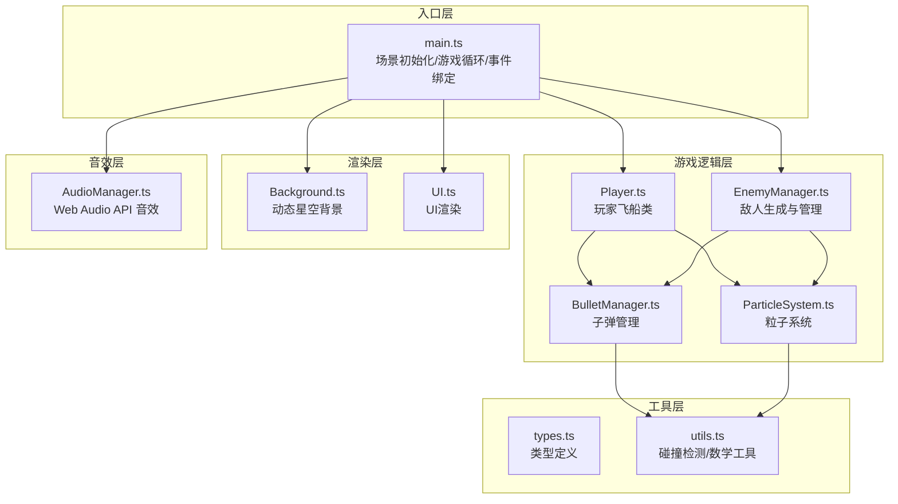

## 1. 架构设计



**数据流向说明**：
1. `main.ts` 初始化游戏循环，接收键盘输入事件
2. 键盘输入传递给 `Player.ts` 更新飞船位置和射击
3. `Player` 发射子弹到 `BulletManager`
4. `EnemyManager` 按波次生成敌人，控制 AI 行为
5. 每帧 `main.ts` 调用 `utils.ts` 进行碰撞检测
6. 碰撞结果通知各模块更新状态（减血、死亡、加分）
7. `Background.ts` 和 `UI.ts` 每帧从 `main.ts` 获取状态并渲染
8. 重要事件触发 `AudioManager.ts` 播放音效

## 2. 技术栈说明

- **前端框架**：原生 TypeScript，**不使用** React/Vue 框架
- **构建工具**：Vite 5.x
- **渲染引擎**：HTML5 Canvas 2D API
- **音效系统**：Web Audio API（程序化生成音效，无需音频文件）
- **类型系统**：TypeScript 严格模式（`strict: true`）

## 3. 项目文件结构

```
auto44/
├── package.json          # 依赖配置
├── vite.config.js        # Vite 构建配置
├── tsconfig.json         # TypeScript 配置（严格模式）
├── index.html            # 入口页面
└── src/
    ├── main.ts           # 场景初始化、游戏循环、事件绑定、UI控制
    ├── Player.ts         # 玩家飞船类（移动、射击、碰撞）
    ├── EnemyManager.ts   # 敌人生成与管理器（波次、AI、碰撞）
    ├── Enemy.ts          # 单个敌人类（普通/精英）
    ├── BulletManager.ts  # 子弹管理器（玩家/敌人子弹）
    ├── Bullet.ts         # 子弹类
    ├── ParticleSystem.ts # 粒子系统（爆炸、碎片）
    ├── Background.ts     # 动态星空背景（视差滚动）
    ├── UI.ts             # UI渲染类（分数、生命、界面）
    ├── AudioManager.ts   # 音效管理器（Web Audio API）
    ├── types.ts          # 全局类型定义
    └── utils.ts          # 工具函数（碰撞检测、数学）
```

## 4. 核心类与接口定义

### 4.1 类型定义 (types.ts)

```typescript
// 游戏状态枚举
export enum GameState {
  MENU = 'menu',
  PLAYING = 'playing',
  PAUSED = 'paused',
  GAME_OVER = 'game_over'
}

// 位置接口
export interface Position {
  x: number;
  y: number;
}

// 尺寸接口
export interface Size {
  width: number;
  height: number;
}

// 速度接口
export interface Velocity {
  vx: number;
  vy: number;
}

// 矩形碰撞体
export interface Rect extends Position, Size {}

// 玩家状态
export interface PlayerState {
  position: Position;
  health: number;
  maxHealth: number;
  isInvincible: boolean;
}

// 敌人类型
export enum EnemyType {
  NORMAL = 'normal',
  ELITE = 'elite'
}

// 子弹类型
export enum BulletType {
  PLAYER = 'player',
  ENEMY = 'enemy'
}

// 粒子类型
export enum ParticleType {
  EXPLOSION = 'explosion',
  DEBRIS = 'debris',
  SCORE = 'score'
}
```

### 4.2 核心常量配置

```typescript
// 画布配置
export const CANVAS_WIDTH = 1280;
export const CANVAS_HEIGHT = 720;
export const ASPECT_RATIO = CANVAS_WIDTH / CANVAS_HEIGHT;

// 玩家配置
export const PLAYER_SPEED = 300; // px/s
export const PLAYER_SIZE = { width: 50, height: 40 };
export const PLAYER_MAX_HEALTH = 3;
export const PLAYER_FIRE_RATE = 150; // ms

// 子弹配置
export const PLAYER_BULLET_SPEED = 500; // px/s
export const ENEMY_BULLET_SPEED = 250; // px/s
export const BULLET_SIZE = { width: 12, height: 4 };

// 敌人配置
export const WAVE_INTERVAL = 3000; // ms
export const ENEMY_BASE_SPEED = 80; // px/s
export const ELITE_ENEMY_HEALTH = 3;
export const NORMAL_ENEMY_HEALTH = 1;

// 分数配置
export const SCORE_PER_ENEMY = 100;
export const SCORE_PER_ELITE = 300;

// 颜色配置
export const COLORS = {
  BACKGROUND: '#0a0a2e',
  ACCENT: '#00f0ff',
  WHITE: '#ffffff',
  GOLD: '#ffd700',
  PLAYER: '#00f0ff',
  ENEMY: '#ff4444',
  ELITE: '#ff8800',
  STAR_NEAR: '#ffffff',
  STAR_FAR: '#4466aa'
};
```

## 5. 游戏循环架构

```typescript
// main.ts 中的游戏循环
class GameLoop {
  private lastTime: number = 0;
  private accumulator: number = 0;
  private fixedTimeStep: number = 1000 / 60; // 60 FPS 固定步长

  start(): void {
    requestAnimationFrame(this.loop.bind(this));
  }

  private loop(currentTime: number): void {
    const deltaTime = currentTime - this.lastTime;
    this.lastTime = currentTime;
    this.accumulator += deltaTime;

    // 固定步长更新，保证物理一致性
    while (this.accumulator >= this.fixedTimeStep) {
      this.update(this.fixedTimeStep / 1000); // 转换为秒
      this.accumulator -= this.fixedTimeStep;
    }

    this.render();
    requestAnimationFrame(this.loop.bind(this));
  }

  private update(dt: number): void {
    if (gameState !== GameState.PLAYING) return;
    
    player.update(dt, inputState);
    enemyManager.update(dt);
    bulletManager.update(dt);
    particleSystem.update(dt);
    collisionDetector.checkCollisions();
    background.update(dt);
  }

  private render(): void {
    // 清空画布
    ctx.fillStyle = COLORS.BACKGROUND;
    ctx.fillRect(0, 0, CANVAS_WIDTH, CANVAS_HEIGHT);
    
    background.render(ctx);
    bulletManager.render(ctx);
    enemyManager.render(ctx);
    player.render(ctx);
    particleSystem.render(ctx);
    ui.render(ctx, gameState);
  }
}
```

## 6. 碰撞检测策略

使用 **AABB（轴对齐包围盒）** 碰撞检测：

```typescript
// utils.ts
export function checkRectCollision(a: Rect, b: Rect): boolean {
  return (
    a.x < b.x + b.width &&
    a.x + a.width > b.x &&
    a.y < b.y + b.height &&
    a.y + a.height > b.y
  );
}

// 碰撞检测流程
// 1. 玩家子弹 vs 所有敌人
// 2. 敌人子弹 vs 玩家
// 3. 敌人 vs 玩家（可选）
```

## 7. 性能优化策略

1. **对象池模式**：子弹和粒子使用对象池复用，避免频繁 GC
2. **空间分区**：仅检测屏幕范围内的碰撞
3. **粒子上限**：超过 200 个粒子时自动回收最旧的粒子
4. **离屏渲染**：背景星星可以使用离屏 Canvas 预渲染
5. **requestAnimationFrame**：使用浏览器原生渲染循环
6. **类型化数组**：粒子数据使用 Float32Array 存储

## 8. 音效生成方案

使用 Web Audio API 程序化生成音效，无需外部资源：

```typescript
// AudioManager.ts
class AudioManager {
  private ctx: AudioContext;
  
  // 射击音效：短促高频方波
  playShootSound(): void {
    const osc = this.ctx.createOscillator();
    const gain = this.ctx.createGain();
    osc.type = 'square';
    osc.frequency.setValueAtTime(880, this.ctx.currentTime);
    osc.frequency.exponentialRampToValueAtTime(440, this.ctx.currentTime + 0.1);
    gain.gain.setValueAtTime(0.1, this.ctx.currentTime);
    gain.gain.exponentialRampToValueAtTime(0.01, this.ctx.currentTime + 0.1);
    osc.connect(gain);
    gain.connect(this.ctx.destination);
    osc.start();
    osc.stop(this.ctx.currentTime + 0.1);
  }
  
  // 爆炸音效：低频白噪声
  // 受伤音效：低沉蜂鸣
}
```
