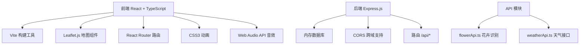
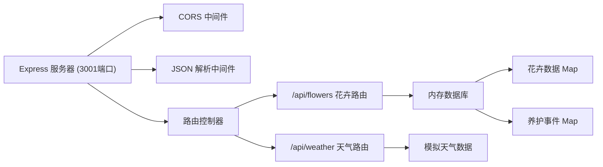
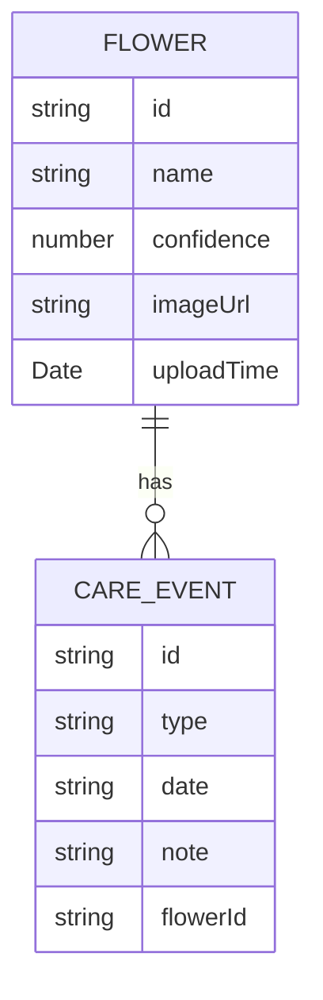

## 1. 架构设计



## 2. 技术栈说明

- 前端：React 18 + TypeScript 5 + Vite 5
- 后端：Express.js 4
- 地图：Leaflet.js + react-leaflet
- 样式：原生CSS + CSS变量
- 数据存储：内存数据库（后端）
- 构建工具：Vite 5
- 路由：React Router 6
- 唯一ID：uuid

## 3. 路由定义

| 路由 | 用途 |
|------|------|
| / | 主页面 - 花卉列表 + 日历视图 |
| /flower/:id | 花卉详情页 - 养护日历 + 事件管理 |

## 4. API 定义

### 4.1 类型定义

```typescript
interface Flower {
  id: string;
  name: string;
  confidence: number;
  imageUrl: string;
  uploadTime: Date;
  careEvents: CareEvent[];
  location?: { lat: number; lng: number };
}

interface CareEvent {
  id: string;
  type: 'watering' | 'fertilizing' | 'pruning';
  date: string;
  note: string;
  flowerId: string;
}

interface User {
  id: string;
  name: string;
}
```

### 4.2 后端API路由

| 方法 | 路由 | 描述 |
|------|------|------|
| POST | /api/flowers/identify | 上传图片识别花卉 |
| GET | /api/flowers | 获取所有花卉列表 |
| GET | /api/flowers/:id | 获取单个花卉详情 |
| DELETE | /api/flowers/:id | 删除花卉 |
| GET | /api/flowers/:id/events | 获取花卉养护事件 |
| POST | /api/flowers/:id/events | 添加养护事件 |
| DELETE | /api/flowers/:id/events/:eventId | 删除养护事件 |
| GET | /api/weather?lat=&lng= | 获取天气预报 |

## 5. 服务器架构



## 6. 数据模型

### 6.1 ER图



### 6.2 内置花卉数据库

```javascript
const FLOWER_DATABASE = [
  { name: '玫瑰', scientificName: 'Rosa rugosa', careGuide: '喜阳光，耐寒，每周浇水2-3次' },
  { name: '郁金香', scientificName: 'Tulipa gesneriana', careGuide: '喜凉爽，耐寒，保持土壤湿润' },
  { name: '向日葵', scientificName: 'Helianthus annuus', careGuide: '喜充足阳光，耐旱，每周浇水1-2次' },
  { name: '君子兰', scientificName: 'Clivia miniata', careGuide: '喜半阴，忌强光，保持盆土微湿' },
  { name: '绿萝', scientificName: 'Epipremnum aureum', careGuide: '喜散射光，耐阴，盆土干透浇透' }
];
```

## 7. 文件结构

```
d:\Pro\tasks\auto45/
├── package.json
├── vite.config.js
├── tsconfig.json
├── index.html
└── src/
    ├── types.ts
    ├── server.ts
    ├── main.tsx
    ├── App.tsx
    ├── index.css
    ├── api/
    │   ├── flowerApi.ts
    │   └── weatherApi.ts
    ├── components/
    │   ├── FlowerCard.tsx
    │   ├── CalendarView.tsx
    │   └── FlowerMap.tsx
    └── pages/
        ├── HomePage.tsx
        └── FlowerDetailPage.tsx
```

## 8. 性能优化

- 虚拟滚动：花卉列表超过50张时启用虚拟滚动
- 图片优化：使用FileReader预览，压缩显示
- 防抖节流：拖拽排序使用requestAnimationFrame
- 内存管理：事件监听器及时清理，防止内存泄漏
- 动画优化：使用transform和opacity属性实现GPU加速
