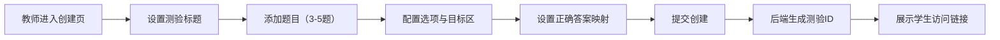
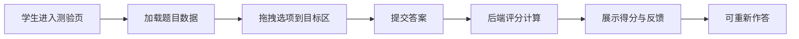

## 1. 产品概述
拖拽式互动测验应用，为在线教育场景提供交互式测验解决方案。教师可快速创建拖拽题型，学生通过直观的拖拽操作完成答题并获得即时反馈，提升学习参与度和答题效率。

- 核心价值：将传统选择题转化为高互动性的拖拽体验，增强学习趣味性
- 目标用户：K12及成人在线教育场景中的教师与学生
- 市场定位：轻量化、高性能的在线互动测验工具

## 2. 核心功能

### 2.1 用户角色
| 角色 | 登录方式 | 核心权限 |
|------|----------|----------|
| 教师 | 直接进入教师端 | 创建测验、设置题目与正确答案映射、获取测验链接 |
| 学生 | 通过测验链接进入 | 拖拽答题、查看评分结果、重新作答 |

### 2.2 功能模块
1. **测验创建模块（教师端）**：动态添加题目、配置拖拽选项与目标区、设置正确答案映射
2. **答题交互模块（学生端）**：拖拽操作、视觉反馈、实时状态更新
3. **评分反馈模块**：自动比对答案、计算得分、错误高亮与正确答案提示
4. **重置功能模块**：一键恢复初始状态，支持重新作答

### 2.3 页面详情
| 页面名称 | 模块名称 | 功能描述 |
|----------|----------|----------|
| 教师创建页 | 测验表单 | 输入测验标题，动态添加/删除题目（3-5题），每道题配置选项文本、目标区标签、正确答案映射关系 |
| 教师创建页 | 提交创建 | 表单验证后调用后端API创建测验，生成可访问的学生测验链接 |
| 学生答题页 | 题目卡片 | 垂直排列3-5道题目卡片，入场时从下方滑入的淡入动画 |
| 学生答题页 | 拖拽交互 | 选项列表与目标区水平排列，拖拽时有半透明跟随阴影，放置区高亮反馈 |
| 学生答题页 | 评分展示 | 提交后显示每题得分与总分，正确/错误边框高亮，半透明浮层覆盖显示正确答案 |
| 学生答题页 | 重置功能 | 一键重置所有拖拽状态，选项回到初始位置，清空评分信息 |

## 3. 核心流程

### 3.1 教师创建测验流程
教师进入创建页面 → 设置测验标题 → 添加题目（3-5题）→ 为每题配置选项和目标区 → 设置正确答案映射（选项→目标区）→ 提交创建 → 后端生成测验ID → 展示学生访问链接

### 3.2 学生答题流程
学生通过链接进入 → 加载测验题目 → 依次拖拽选项到目标区 → 确认提交 → 后端计算得分 → 展示评分结果与正确答案 → 可选择重新作答

## 4. 用户界面设计

### 4.1 设计风格
- **主色调**：#4A90D9（教育蓝），#F5F7FA（浅灰辅色）
- **按钮样式**：圆角8px，扁平化设计，hover时轻微上浮与阴影加深
- **字体**：使用"Noto Sans SC"作为显示字体，"PingFang SC"作为正文字体，确保中文显示优雅
- **布局风格**：卡片式布局，最大宽度1200px居中，充足留白营造清爽感
- **图标风格**：使用lucide-react线性图标，保持简洁统一

### 4.2 页面设计概述
| 页面名称 | 模块名称 | UI元素 |
|----------|----------|--------|
| 教师创建页 | 顶部导航 | 品牌标识、教师/学生切换标签、简洁的页头渐变背景 |
| 教师创建页 | 题目表单 | 卡片式题目容器，可折叠展开，动态添加按钮使用主色强调 |
| 教师创建页 | 答案映射 | 下拉选择器配置选项与目标区的对应关系，视觉清晰 |
| 学生答题页 | 题目卡片 | 白色圆角卡片（12px），入场动画（translateY(20px) → 0，opacity 0→1，0.4s ease） |
| 学生答题页 | 选项卡片 | 圆角8px，浅灰色背景，拖拽时cursor: grab，阴影加深，opacity: 0.8 |
| 学生答题页 | 放置区 | 虚线边框2px，灰色背景，拖入时变为实线边框+浅蓝色背景（#E8F2FB） |
| 学生答题页 | 评分结果 | 半透明浮层（rgba(255,255,255,0.95)），0.3s ease过渡，正确绿色边框（#4CAF50），错误红色边框（#F56C6C） |
| 学生答题页 | 底部操作栏 | 提交按钮（主色填充）、重置按钮（边框样式），固定在视口底部 |

### 4.3 响应式设计
- **桌面端（≥1024px）**：选项列表与目标区水平并排，拖拽交互
- **平板端（768px-1024px）**：保持水平布局，适当缩小间距
- **移动端（<768px）**：选项列表与目标区垂直堆叠，交互改为"点击选择+点击放置"模式，避免拖拽操作不便

### 4.4 动效设计
- 题目卡片入场：staggered animation，每题延迟0.1s依次进入
- 拖拽反馈：元素跟随鼠标移动时添加轻微旋转（1-2deg）增强真实感
- 放置成功：放置区缩放动画（scale 1.02 → 1）配合背景色过渡
- 评分显示：浮层从顶部滑入（translateY(-20px) → 0）配合淡入
