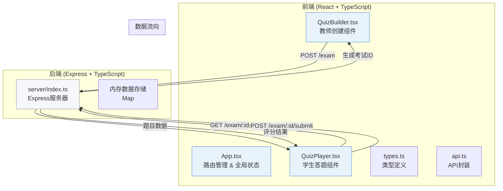
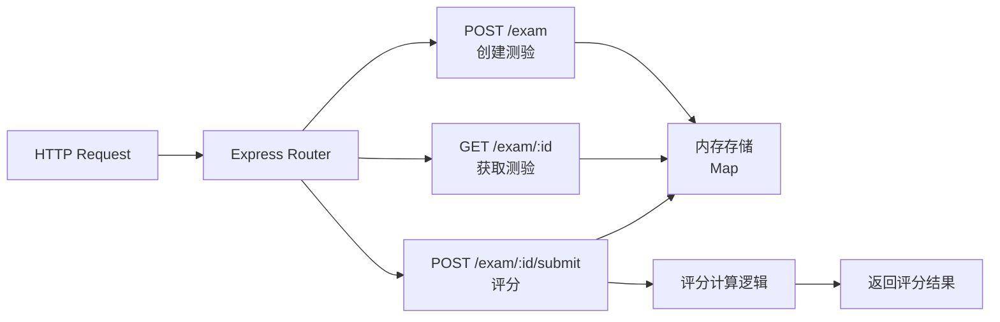
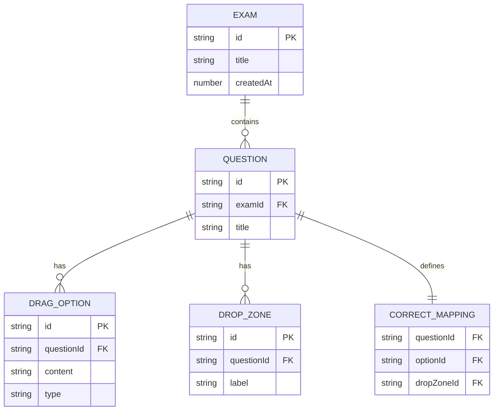

## 1. 架构设计



## 2. 技术描述
- **前端框架**：React 18 + TypeScript 5
- **构建工具**：Vite 5 + @vitejs/plugin-react
- **状态管理**：React useState/useReducer（轻量场景，无需额外状态库）
- **样式方案**：Tailwind CSS 3 + 自定义CSS变量
- **拖拽实现**：HTML5 Drag and Drop API + 移动端点击降级方案
- **后端**：Express 4 + TypeScript
- **数据存储**：内存Map存储（无需数据库）
- **跨域处理**：cors中间件
- **图标**：lucide-react

## 3. 目录结构
```
auto5/
├── package.json
├── vite.config.js
├── tsconfig.json
├── index.html
├── server/
│   └── index.ts          # Express后端API
├── src/
│   ├── App.tsx           # 主组件（路由/状态/切换）
│   ├── QuizBuilder.tsx   # 教师创建组件
│   ├── QuizPlayer.tsx    # 学生答题组件
│   ├── types.ts          # 共享类型定义
│   ├── api.ts            # API请求封装
│   ├── main.tsx          # React入口
│   └── index.css         # 全局样式
└── .trae/documents/
    ├── PRD_拖拽互动测验平台.md
    └── TECH_拖拽互动测验平台.md
```

## 4. 路由定义
| 前端路由 | 页面/组件 | 说明 |
|----------|-----------|------|
| /builder | QuizBuilder | 教师创建测验页面 |
| /quiz/:id | QuizPlayer | 学生答题页面 |
| / | App | 默认路由（显示教师/学生入口选择） |

## 5. API 定义

### 5.1 类型定义
```typescript
// 可拖拽选项
interface DragOption {
  id: string;
  content: string;
  type: 'text' | 'image';
}

// 目标放置区
interface DropZone {
  id: string;
  label: string;
}

// 单道题目
interface Question {
  id: string;
  title: string;
  options: DragOption[];
  dropZones: DropZone[];
  correctMapping: Record<string, string>; // optionId -> dropZoneId
}

// 测验
interface Exam {
  id: string;
  title: string;
  questions: Question[];
  createdAt: number;
}

// 学生答案
interface StudentAnswer {
  questionId: string;
  placements: Record<string, string>; // optionId -> dropZoneId
}

// 提交答案请求
interface SubmitRequest {
  answers: StudentAnswer[];
}

// 单题评分结果
interface QuestionResult {
  questionId: string;
  score: number;
  total: number;
  correctPlacements: string[]; // optionId
  wrongPlacements: string[];   // optionId
  correctMapping: Record<string, string>;
}

// 评分响应
interface SubmitResponse {
  totalScore: number;
  maxScore: number;
  results: QuestionResult[];
}
```

### 5.2 API 接口
| 方法 | 路径 | 请求体 | 响应 | 说明 |
|------|------|--------|------|------|
| POST | /exam | `{ title: string; questions: Question[] }` | `{ id: string }` | 创建测验 |
| GET | /exam/:id | - | `Exam` | 获取测验题目 |
| POST | /exam/:id/submit | `SubmitRequest` | `SubmitResponse` | 提交答案并获取评分 |

## 6. 服务器架构


## 7. 数据模型

### 7.1 ER图


### 7.2 内存存储实现
使用 TypeScript Map 存储：
```typescript
const examStore = new Map<string, Exam>();
```

## 8. 性能优化点
1. **拖拽性能**：使用 requestAnimationFrame 优化拖拽元素位置更新，避免频繁重排
2. **评分计算**：后端使用 O(n) 线性算法比对答案，确保 < 1s 响应
3. **动画性能**：使用 transform 和 opacity 属性实现动画，触发 GPU 加速
4. **内存管理**：及时清理拖拽事件监听器，避免内存泄漏
5. **重绘优化**：使用 will-change 属性提示浏览器优化
6. **FPS监控**：开发环境可开启 performance monitor 监控帧率

## 9. 调用关系说明

### 9.1 文件依赖图
```
App.tsx
├── imports types.ts
├── imports api.ts
├── imports QuizBuilder.tsx
└── imports QuizPlayer.tsx

QuizBuilder.tsx
├── imports types.ts
└── imports api.ts

QuizPlayer.tsx
├── imports types.ts
└── imports api.ts

api.ts
└── imports types.ts

server/index.ts
└── imports types (inline defined)
```

### 9.2 数据流
1. **创建流程**：QuizBuilder → api.createExam() → POST /exam → server → 返回 examId → QuizBuilder 展示链接
2. **加载流程**：App 路由捕获 /quiz/:id → QuizPlayer → api.getExam(id) → GET /exam/:id → 返回 Exam 数据 → 渲染题目
3. **提交流程**：QuizPlayer 收集答案 → api.submitAnswers(id, answers) → POST /exam/:id/submit → server 计算得分 → 返回结果 → QuizPlayer 渲染评分
