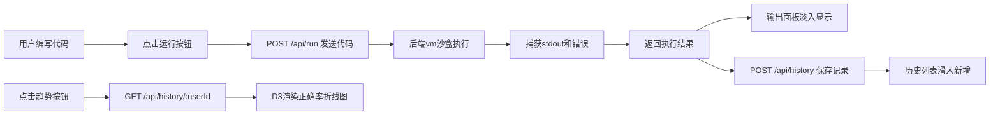

## 1. 产品概述
在线代码评测与提交历史可视化平台，为学生提供限时编程挑战环境，支持实时代码执行验证、结果反馈和历史提交复盘分析。
- 主要解决在线教育场景下学生编程练习的即时反馈和学习轨迹追踪问题
- 目标用户为编程学习者和教育机构，核心价值在于低延迟执行、直观结果展示和数据驱动的学习分析

## 2. 核心功能

### 2.1 用户角色
| 角色 | 注册方式 | 核心权限 |
|------|----------|----------|
| 学习者 | 自动分配用户ID | 编写代码、执行运行、查看历史、浏览正确率趋势 |

### 2.2 功能模块
1. **主页面**：代码编辑器、运行控制、输出面板、历史记录、正确率图表
2. **代码执行模块**：沙盒执行、stdout捕获、错误处理、执行计时
3. **历史记录模块**：提交存储、列表展示、虚拟滚动、滑入动画
4. **数据分析模块**：正确率计算、D3折线图、悬停提示、平滑过渡

### 2.3 页面详情
| 页面名称 | 模块名称 | 功能描述 |
|-----------|-------------|---------------------|
| 主页面 | 代码编辑器 | 语法高亮编辑区、运行按钮（弹性动画/加载状态） |
| 主页面 | 输出面板 | 仿终端样式、淡入动画、红色错误抖动提示、执行时间 |
| 主页面 | 历史列表 | 紧凑滚动列表、状态图标（对号/叉号）、虚拟滚动（>100条） |
| 主页面 | 趋势图表 | 平滑折线图、悬停提示、展开/收起高度过渡动画 |

## 3. 核心流程
用户在代码编辑器编写JavaScript代码，点击运行按钮后，代码字符串通过API发送到后端沙盒执行，后端捕获输出并返回结果，前端在输出面板展示，同时记录提交到历史列表，用户可展开趋势图查看累积正确率变化。

## 4. 用户界面设计

### 4.1 设计风格
- **主色调**：深蓝灰 #1e293b（面板）、#0f172a（背景）
- **高亮色**：青色 #06b6d4（分割线、按钮hover、图表线条）
- **状态色**：绿色（成功输出）、红色（错误信息）
- **字体**：Inter（正文）、等宽字体（代码/终端）
- **按钮样式**：圆角按钮，hover背景渐变过渡0.3s，点击缩放变换0.1s
- **布局风格**：左右两栏卡片式布局，12px圆角，box-shadow漂浮感
- **图标风格**：Lucide React 线性图标

### 4.2 页面设计概述
| 页面名称 | 模块名称 | UI元素 |
|-----------|-------------|-------------|
| 主页面 | 代码编辑器 | 左侧70%宽度上部，深色卡片，语法高亮，右下运行按钮带弹性动画 |
| 主页面 | 输出面板 | 左侧70%宽度下部，仿终端样式，等宽字体，淡入动画，错误抖动 |
| 主页面 | 历史列表 | 右侧30%宽度上部，紧凑滚动列表，1px青色分割线与左侧隔开 |
| 主页面 | 趋势图表 | 右侧30%宽度下部，可展开/收起，平滑高度过渡，悬停数据点提示 |

### 4.3 响应式
- **桌面优先（>768px）**：左右两栏布局，左侧70%右侧30%，垂直分割线
- **移动端（≤768px）**：上下堆叠布局，左侧在上右侧在下，水平分割线
- **触摸优化**：按钮最小触控区域44px，滚动区域惯性滚动支持

### 4.4 性能约束
- 代码执行总延迟（网络+沙盒）≤ 500ms
- 历史记录超100条启用虚拟滚动，仅渲染可见DOM
