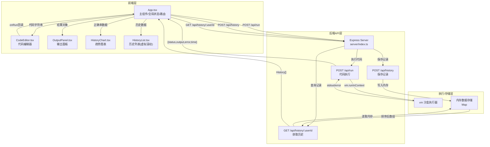
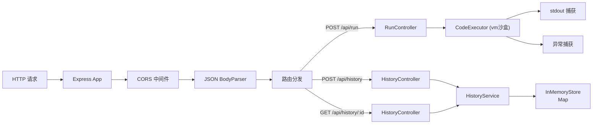
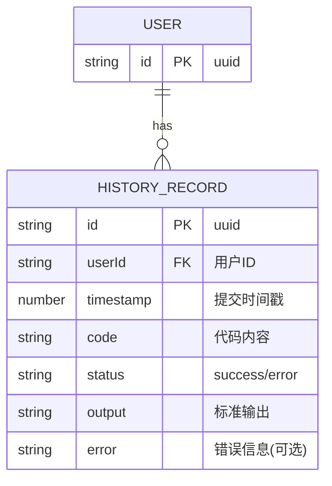

## 1. 架构设计



## 2. 技术描述
- **前端框架**：React@18 + TypeScript@5 + Vite@6
- **构建工具**：Vite + @vitejs/plugin-react
- **状态管理**：React useState/useEffect（组件级），无全局状态库
- **后端框架**：Express@4 + TypeScript@5
- **代码执行**：Node.js vm 模块（沙盒环境）
- **图表库**：d3@7（折线图渲染）
- **图标库**：lucide-react
- **数据存储**：内存 Map（无需持久化数据库）
- **样式方案**：原生CSS（CSS Modules风格类名，CSS变量主题）
- **包管理器**：npm

## 3. 路由定义
| 路由 | 用途 |
|-------|---------|
| / | 主应用页面（单页应用，无路由跳转） |

## 4. API 定义

### 4.1 TypeScript 类型

```typescript
// 前端类型
interface RunResult {
  status: 'success' | 'error';
  output: string;
  error?: string;
  executionTime: number;
}

interface HistoryRecord {
  id: string;
  userId: string;
  timestamp: number;
  code: string;
  status: 'success' | 'error';
  output: string;
  error?: string;
}

interface AccuracyPoint {
  index: number;
  accuracy: number;
}

// API 请求/响应
// POST /api/run
interface RunRequest { code: string; }
interface RunResponse extends RunResult {}

// POST /api/history
interface HistoryRequest {
  userId: string;
  code: string;
  status: 'success' | 'error';
  output: string;
  error?: string;
}
interface HistoryResponse { id: string; timestamp: number; }

// GET /api/history/:userId
interface HistoryListResponse { records: HistoryRecord[]; }
```

### 4.2 后端沙盒执行逻辑
```
代码执行流程：
1. 创建 vm.Script，捕获语法错误
2. 构造 context：{ console: { log: 捕获函数 }, ...内置对象 }
3. 重定向 console.log 输出到内存缓冲区
4. 使用 vm.runInContext，设置 timeout 限制
5. 捕获异常（SyntaxError, Error），记录 stack
6. 返回 { status, output, error, executionTime }
```

## 5. 服务器架构图



## 6. 数据模型

### 6.1 数据模型定义



### 6.2 内存存储结构
```typescript
// 内存数据结构
const store = {
  histories: new Map<string, HistoryRecord[]>()
};

// 操作方法
// - addHistory(userId, record): void  (插入后按timestamp降序排序)
// - getHistories(userId): HistoryRecord[]
// - computeAccuracy(records): AccuracyPoint[]  (累积正确率序列)
```
