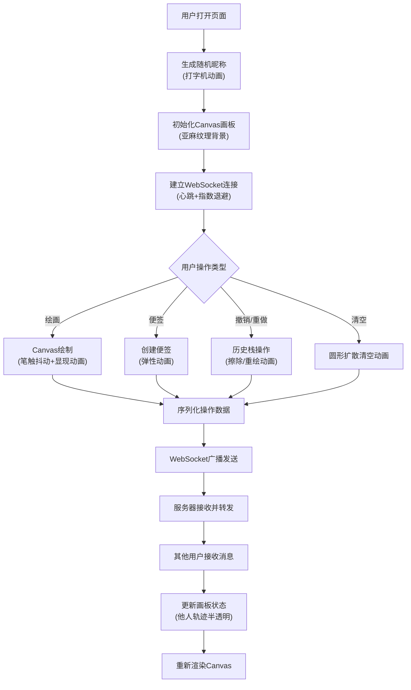

## 1. 产品概述
在线手写白板协作应用，支持多用户实时绘画、便签添加与同步。
- 主要用途：团队远程协作、创意 brainstorming、在线教学、远程会议中的图形化交流
- 目标用户：远程团队、教育工作者、学生、设计师
- 产品价值：低延迟、流畅的实时协作白板体验，模拟真实手绘感

## 2. 核心功能

### 2.1 用户角色
| 角色 | 注册方式 | 核心权限 |
|------|----------|----------|
| 匿名用户 | 自动分配随机昵称 | 绘画、添加便签、撤销/重做、清空画板、实时同步 |

### 2.2 功能模块
1. **画板页面**：Canvas 绘画画布、亚麻纹理背景、实时渲染
2. **工具栏面板**：颜色选择器、粗细滑块、便签按钮、撤销/重做/清空按钮
3. **便签系统**：可拖拽可缩放的文字便签、弹性动画
4. **实时同步系统**：WebSocket 多用户同步、他人轨迹显示、心跳机制

### 2.3 页面详情
| 页面名称 | 模块名称 | 功能描述 |
|----------|----------|----------|
| 白板主页 | 用户昵称区域 | 左上角随机昵称打字机效果展示 |
| 白板主页 | Canvas 画板 | 全屏自适应画布、支持鼠标/触控绘画、笔触抖动、显现动画 |
| 白板主页 | 侧边工具栏 | 悬浮磨砂玻璃面板、颜色选择、粗细调节、操作按钮 |
| 白板主页 | 便签组件 | 可拖拽/缩放/输入文字、弹性动画 |
| 白板主页 | 同步系统 | WebSocket 实时同步、他人笔迹半透明显示、指数退避重连 |

## 3. 核心流程
用户进入页面 → 自动生成随机昵称（打字机动画）→ 初始化空白画板（亚麻纹理）→ 建立 WebSocket 连接 → 用户绘画/添加便签 → 操作广播到服务器 → 服务器转发给所有在线用户 → 其他用户接收并渲染 → 用户可撤销/重做最近10步操作

## 4. 用户界面设计

### 4.1 设计风格
- **主色调**：深色模式科技风
  - 主背景：#1a1a2e
  - 副背景：#16213e
  - 强调色：#e94560
- **画笔颜色**：深蓝 #1e3a8a、翠绿 #059669、朱红 #dc2626、橙黄 #d97706、紫色 #7c3aed、黑色 #111827
- **便签颜色**：淡黄色 #fff8dc
- **工具栏**：磨砂玻璃效果 (backdrop-filter: blur(16px))，半透明，边缘微弱发光
- **按钮样式**：圆角、悬停上浮 translateY(-2px)、阴影加深、点击按压缩放
- **字体**：现代无衬线字体，标题加粗，正文常规
- **图标风格**：线性简约风格 (lucide-react)

### 4.2 页面设计概述
| 页面名称 | 模块名称 | UI 元素 |
|----------|----------|----------|
| 白板主页 | 用户昵称 | 左上角，打字机逐字出现效果，浅色文字 |
| 白板主页 | 画板区域 | 全屏自适应，亚麻纹理 SVG/Canvas 背景纸 |
| 白板主页 | 侧边工具栏 | 左侧悬浮，磨砂玻璃，垂直排列按钮，颜色圆形展开动画 |
| 白板主页 | 便签组件 | 淡黄色方块，可拖拽，右下角缩放手柄，文字自动换行 |
| 白板主页 | 移动端工具栏 | 底部可折叠面板，按钮间距自适应 |

### 4.3 响应式设计
- **桌面端**：左侧悬浮工具栏（固定定位）
- **移动端**：< 768px 自动隐藏侧边栏，改为底部可折叠工具栏，支持多点触控防误触
- **触控优化**：passive 事件监听、触摸目标 ≥ 44px、手势防抖

### 4.4 动画效果清单
1. 昵称打字机逐字出现
2. 绘画笔触 2s 内从半透明→完全不透明（显现动画）
3. 便签从中心放大出现（overshoot 弹性动画）
4. 颜色选择器色块圆形展开动画
5. 按钮悬停上浮 + 阴影加深
6. 按钮点击按压缩放动画
7. 撤销：线条从起点→终点擦除动画
8. 重做：线条从起点→终点重绘动画
9. 清空画板：圆形扩散消失动画
10. WebSocket 断线重连状态指示动画

## 5. 性能指标
- 绘画 FPS：稳定 58-60fps（使用 requestAnimationFrame）
- 同步延迟：< 200ms
- 路径点容量：≥ 500 个路径点无卡顿
- 内存占用：长期运行无明显泄漏

## 6. 技术约束
- 后端仅内存存储，重启数据丢失
- WebSocket 心跳机制：30s 间隔
- 重连策略：指数退避（1s → 2s → 4s → 8s → ... → 最大 30s）
- 历史栈：最近 10 步操作
