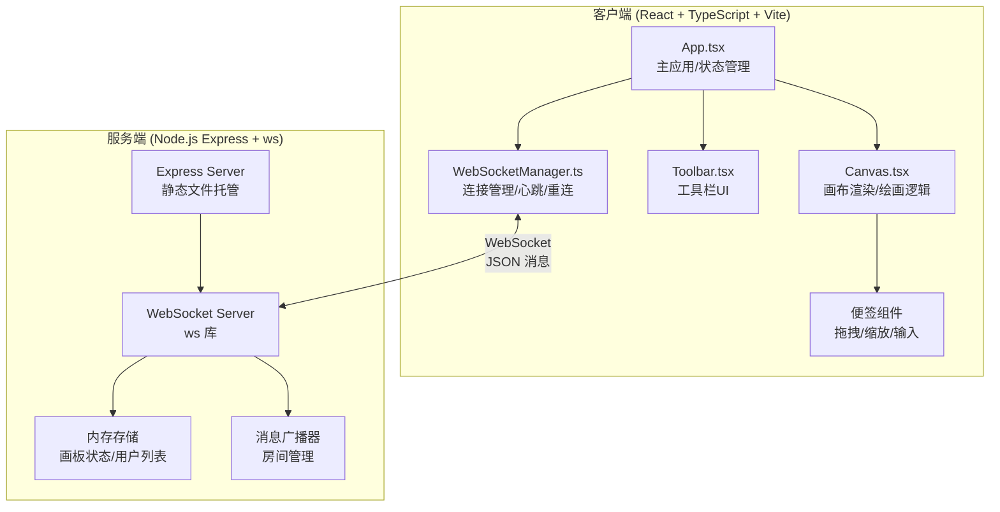
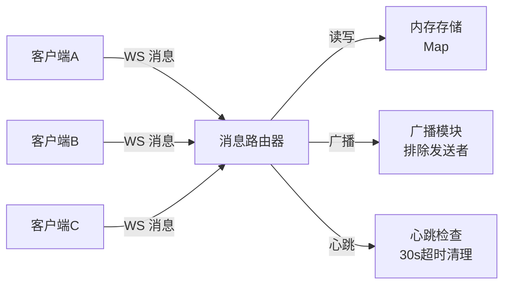

## 1. 架构设计



## 2. 技术栈说明
- **前端框架**：React 18 + TypeScript（严格模式）
- **构建工具**：Vite 5 + @vitejs/plugin-react
- **后端**：Express 4 + CORS + ws (WebSocket)
- **状态管理**：React useState/useReducer（无需额外库，满足需求即可）
- **图标库**：lucide-react（内置支持）
- **样式方案**：内联 CSS + CSS Modules，CSS 变量管理主题色
- **唯一ID**：uuid
- **动画实现**：CSS transition/animation + Canvas requestAnimationFrame

## 3. 项目文件结构
```
auto51/
├── package.json          # 依赖配置 + 启动脚本
├── vite.config.js        # Vite 构建配置
├── tsconfig.json         # TypeScript 严格模式配置
├── index.html            # 入口 HTML
├── server/
│   └── index.ts          # Express + WebSocket 后端服务
└── src/
    ├── App.tsx           # 主应用组件
    ├── Canvas.tsx        # Canvas 画布组件
    ├── Toolbar.tsx       # 工具栏组件
    ├── StickyNote.tsx    # 便签组件
    ├── WebSocketManager.ts  # WebSocket 管理器
    ├── types.ts          # 全局类型定义
    └── utils.ts          # 工具函数（昵称生成、动画等）
```

## 4. 数据类型定义（TypeScript）

```typescript
// 点坐标
interface Point {
  x: number;
  y: number;
  jitterX?: number;
  jitterY?: number;
}

// 绘画路径
interface DrawPath {
  id: string;
  type: 'path';
  userId: string;
  color: string;
  thickness: number;
  points: Point[];
  createdAt: number;
  opacity?: number;      // 用于显现动画
  isRemote?: boolean;    // 是否为他人绘制
}

// 便签
interface StickyNote {
  id: string;
  type: 'note';
  userId: string;
  x: number;
  y: number;
  width: number;
  height: number;
  text: string;
  createdAt: number;
}

// 操作项（用于撤销/重做栈）
type ActionItem = DrawPath | StickyNote;

// 画板状态
interface BoardState {
  paths: DrawPath[];
  notes: StickyNote[];
}

// WebSocket 消息类型
type WSMessage =
  | { type: 'init'; state: BoardState; yourId: string }
  | { type: 'user-join'; userId: string; nickname: string }
  | { type: 'user-leave'; userId: string }
  | { type: 'draw-start'; path: DrawPath }
  | { type: 'draw-point'; pathId: string; point: Point; userId: string }
  | { type: 'draw-end'; pathId: string; userId: string }
  | { type: 'note-add'; note: StickyNote }
  | { type: 'note-update'; note: StickyNote }
  | { type: 'undo'; userId: string; actionId: string }
  | { type: 'redo'; userId: string; actionId: string }
  | { type: 'clear'; userId: string }
  | { type: 'heartbeat'; timestamp: number };

// 工具栏状态
interface ToolbarState {
  activeColor: string;
  thickness: 2 | 5 | 10;
  activeTool: 'pen' | 'note';
}
```

## 5. API 定义（WebSocket）

| 消息类型 | 方向 | 说明 |
|----------|------|------|
| init | S→C | 连接建立时发送当前画板完整状态 |
| user-join | S→C | 有新用户加入时广播 |
| user-leave | S→C | 有用户离开时广播 |
| draw-start | C→S / S→C | 开始绘制路径 |
| draw-point | C→S / S→C | 正在绘制（实时路径点） |
| draw-end | C→S / S→C | 结束绘制 |
| note-add | C→S / S→C | 添加便签 |
| note-update | C→S / S→C | 更新便签（移动/缩放/文字） |
| undo | C→S / S→C | 撤销操作 |
| redo | C→S / S→C | 重做操作 |
| clear | C→S / S→C | 清空画板 |
| heartbeat | C↔S | 30s 心跳，维持连接 |

## 6. 服务端架构图



## 7. 关键算法与实现要点

### 7.1 笔触抖动算法
```
对每个绘制点 (x, y)：
  jitterX = (Math.random() - 0.5) * thickness * 0.3
  jitterY = (Math.random() - 0.5) * thickness * 0.3
  实际绘制点 = (x + jitterX, y + jitterY)
```

### 7.2 路径显现动画（2s 渐显）
```
使用 requestAnimationFrame 每帧更新：
  path.opacity = Math.min(1, (now - path.createdAt) / 2000)
  重绘时使用 globalAlpha = path.opacity
```

### 7.3 撤销/重做擦除/重绘动画
```
擦除动画（undo）：
  progress = 0 → 1 over 300ms
  clipPath 从起点到 progress*length 的路径长度
  只绘制 progress 比例之前的部分，之后的透明

重绘动画（redo）：
  类似但反过来，progress=0 时完全不显示，=1 时完全显示
```

### 7.4 指数退避重连
```
reconnectDelay = 1000ms
每次重连失败：reconnectDelay = Math.min(reconnectDelay * 2, 30000)
连接成功后重置为 1000ms
```

### 7.5 Canvas 渲染循环（60fps）
```
每帧执行：
  1. 清空画布
  2. 绘制亚麻纹理背景
  3. 遍历所有 path：
     - 更新 opacity（显现动画）
     - 根据 undo/redo progress 裁剪
     - 绘制二次贝塞尔平滑曲线
  4. 绘制便签层（DOM 层）
```

## 8. 性能优化策略
1. **批量路径点**：draw-point 消息每 16ms (1帧) 批量发送，而非每像素
2. **离屏缓冲**：使用离屏 Canvas 缓存静态路径，新路径在主 Canvas 绘制
3. **脏矩形**：仅重绘变化区域（可选）
4. **节流广播**：服务端对高频消息节流
5. **及时释放**：历史栈超过 10 时主动释放引用
6. **被动触摸**：touch 事件使用 passive: true 防卡顿
