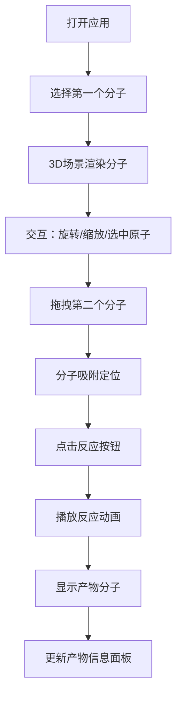

## 1. 产品概述

交互式3D分子结构查看与反应模拟应用，让用户通过可视化方式探索分子立体结构和化学反应过程。
- 主要用途：化学教育、分子可视化、反应机理演示
- 目标用户：学生、教师、化学爱好者
- 产品价值：将抽象的分子结构和化学反应转化为直观的3D交互体验

## 2. 核心特性

### 2.1 用户角色
| 角色 | 注册方式 | 核心权限 |
|------|----------|----------|
| 普通用户 | 无需注册 | 浏览分子、模拟反应、查看产物信息 |

### 2.2 功能模块
1. **分子选择面板**：预设分子列表（水、甲烷、二氧化碳、苯环），卡片式展示，弹性动画
2. **3D分子场景**：球棍模型渲染，原子拖拽旋转，滚轮缩放，原子高亮选中
3. **反应模拟系统**：双分子拖拽吸附，反应动画播放，粒子特效
4. **信息展示**：旋转速度、缩放比例实时显示，产物化学式和分子量
5. **响应式布局**：桌面端侧边栏，移动端底部抽屉

### 2.3 页面详情
| 页面名称 | 模块名称 | 功能描述 |
|----------|----------|----------|
| 主页面 | 分子选择面板 | 展示预设分子卡片，支持点击选择和拖拽操作 |
| 主页面 | 3D场景区域 | 渲染分子球棍模型，处理旋转缩放交互，播放反应动画 |
| 主页面 | 信息面板 | 显示当前分子信息、旋转速度、缩放比例、产物数据 |
| 主页面 | 反应控制区 | 显示反应按钮，触发化学反应动画 |

## 3. 核心流程

用户打开应用 → 从左侧面板选择分子 → 分子以弹性动画出现在3D场景 → 拖拽旋转/滚轮缩放观察分子 → 点击原子查看元素符号 → 拖拽第二个分子到场景 → 分子吸附到主分子旁 → 点击"反应"按钮 → 播放2秒反应动画（旧键碎裂、原子重排、新分子生成、粒子扩散）→ 显示产物分子和信息 → 产物缓慢自转

## 4. 用户界面设计

### 4.1 设计风格
- **主色调**：#1a1a2e（深蓝背景）、#16213e（辅色）、#0f3460（高亮色）
- **原子配色**：遵循CPK标准 - 氢(白色)、碳(黑色)、氧(红色)、氮(蓝色)、硫(黄色)、氯(绿色)
- **按钮样式**：圆角8px，悬停有轻微上浮和发光效果
- **字体**：现代无衬线字体，标题加粗，正文清晰可读
- **布局风格**：左侧固定面板 + 中央3D场景 + 浮动信息元素，深空背景配浅灰网格地面
- **动画风格**：弹性缩放、平滑过渡、粒子扩散、碎裂淡出

### 4.2 页面设计概述
| 页面名称 | 模块名称 | UI元素 |
|----------|----------|--------|
| 主页面 | 分子选择面板 | 卡片网格、分子预览图、元素符号、拖拽手柄 |
| 主页面 | 3D场景 | 星空背景、网格地面、球体原子、圆柱键、粒子系统 |
| 主页面 | 信息面板 | 半透明玻璃态、实时数据显示、化学式、分子量 |
| 主页面 | 反应按钮 | 渐变背景、脉冲动画、悬停效果 |

### 4.3 响应式设计
- **桌面端（≥768px）**：左侧固定280px宽面板，中央3D场景占满剩余空间
- **移动端（<768px）**：面板折叠为底部滑动抽屉，可上滑展开，3D场景全屏
- **触摸优化**：支持双指缩放，点击选中，长按拖拽

### 4.4 3D场景设计
- **环境**：深蓝色星空背景，动态星点闪烁，浅灰色网格地面
- **光照**：半球光 + 两盏方向光，营造柔和立体效果，无硬阴影
- **相机**：透视相机，初始距离6，fov 50度，支持轨道控制
- **构图**：分子居中，留有足够空间进行旋转观察
- **交互**：OrbitControls拖拽旋转，滚轮缩放，阻尼效果
- **后处理**：旋转速度>30°/s时添加轻微动态模糊
- **性能预算**：≤60个原子时稳定50fps以上，单分子draw call<20
