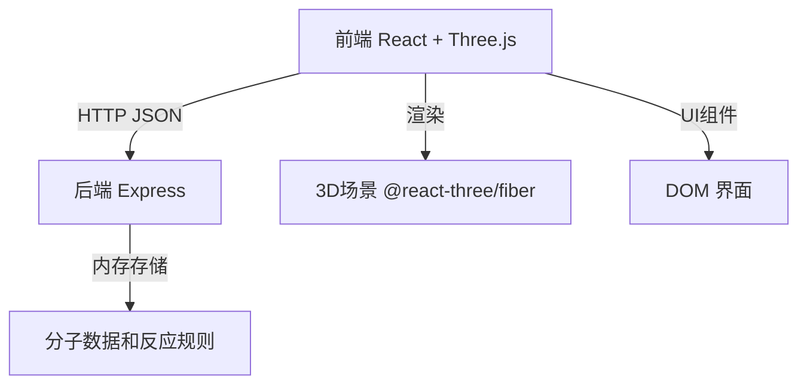
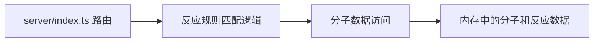
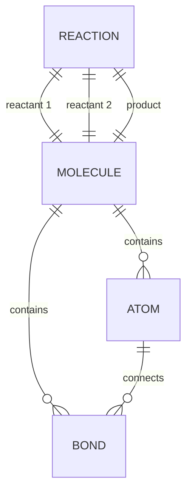

## 1. 架构设计



## 2. 技术描述

- **前端**：React 18 + TypeScript + Vite
- **3D渲染**：Three.js + @react-three/fiber + @react-three/drei
- **状态管理**：React Hooks (useState, useRef)
- **后端**：Express 4 + TypeScript
- **数据存储**：内存存储（无需数据库）
- **初始化工具**：Vite react-ts 模板

## 3. 目录结构

```
auto55/
├── server/
│   └── index.ts           # Express后端服务
├── src/
│   ├── components/
│   │   ├── MoleculeViewer.tsx   # 3D场景组件
│   │   └── MoleculePanel.tsx    # 分子选择面板
│   ├── hooks/
│   │   └── useMoleculeData.ts   # 数据请求Hook
│   ├── types.ts           # 类型定义
│   ├── App.tsx            # 主应用组件
│   └── main.tsx           # 入口文件
├── package.json
├── vite.config.js
├── tsconfig.json
└── index.html
```

## 4. API 定义

### 类型定义
```typescript
interface Atom {
  id: string;
  element: string;
  x: number;
  y: number;
  z: number;
}

interface Bond {
  id: string;
  atom1: string;
  atom2: string;
  type: 'single' | 'double' | 'triple' | 'aromatic';
}

interface Molecule {
  id: string;
  name: string;
  formula: string;
  molecularWeight: number;
  atoms: Atom[];
  bonds: Bond[];
}

interface ReactionResult {
  product: Molecule;
  reactant1Id: string;
  reactant2Id: string;
  atomMapping: Record<string, string>;
}
```

### GET /api/molecules
- **描述**：获取所有预设分子列表
- **响应**：`Molecule[]`

### POST /api/react
- **描述**：提交两个分子ID，返回反应产物
- **请求体**：`{ molecule1Id: string, molecule2Id: string }`
- **响应**：`ReactionResult`

## 5. 服务架构



## 6. 数据模型

### 6.1 数据实体关系



### 6.2 预设分子数据

| 分子ID | 名称 | 化学式 | 原子数 | 分子量 |
|--------|------|--------|--------|--------|
| h2o | 水 | H₂O | 3 | 18.015 |
| ch4 | 甲烷 | CH₄ | 5 | 16.04 |
| co2 | 二氧化碳 | CO₂ | 3 | 44.01 |
| c6h6 | 苯 | C₆H₆ | 12 | 78.11 |

### 6.3 预设反应规则
- H₂O + CO₂ → H₂CO₃ (碳酸)
- CH₄ + 2O₂ → CO₂ + 2H₂O (需简化为两分子反应)
- C₆H₆ + Br₂ → C₆H₅Br + HBr
- H₂O + CH₄ → CH₃OH + H₂
