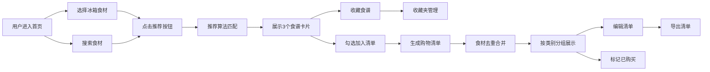

## 1. 产品概述

智能食谱推荐与购物清单生成应用，帮助用户在家庭餐后或小型派对上快速决策吃什么。用户可根据已选食材和口味偏好随机获得食谱，并将所需食材自动汇总为购物清单，支持清单的在线编辑和导出。

- 核心目标：减轻用户决策负担，简化食材采购流程
- 目标用户：家庭主妇/主夫、派对组织者、烹饪爱好者
- 市场价值：解决"今天吃什么"的普遍痛点，提供从食谱推荐到购物清单的一站式解决方案

## 2. 核心 Features

### 2.1 用户角色
| 角色 | 注册方式 | 核心权限 |
|------|----------|----------|
| 普通用户 | 无需注册 | 浏览食谱、搜索食材、收藏食谱、生成购物清单、编辑清单、导出清单 |

### 2.2 功能模块
1. **食谱推荐页**：食材搜索、冰箱食材选择、食谱卡片展示、推荐算法
2. **收藏夹侧栏**：收藏管理、数字徽标、拖拽排序
3. **购物清单页**：自动生成清单、食材分类、已购买标记
4. **清单编辑功能**：添加食材、编辑数量、删除项目、导出清单

### 2.3 页面详情
| 页面名称 | 模块名称 | 功能描述 |
|-----------|-------------|---------------------|
| 食谱推荐页 | 搜索框 | 按食材名称搜索食谱 |
| 食谱推荐页 | 冰箱食材面板 | 20种常见食材图标选择，渐变色背景，选中高亮放大 |
| 食谱推荐页 | 推荐按钮 | 触发推荐算法，展示3个最佳匹配食谱 |
| 食谱推荐页 | 食谱卡片 | 封面图、名称、食材列表、烹饪时长，交错淡入动画 |
| 收藏夹侧栏 | 收藏图标 | 心形填充动画（300ms） |
| 收藏夹侧栏 | 数字徽标 | 弹性缩放动画显示收藏数量 |
| 收藏夹侧栏 | 拖拽排序 | 长按拖拽调整食谱顺序 |
| 购物清单页 | 清单生成 | 多食谱食材去重合并，按类别分组 |
| 购物清单页 | 已购买标记 | 复选框勾选后文字变灰+划线动画 |
| 清单编辑 | 添加食材 | 表单平滑下滑动画 |
| 清单编辑 | 编辑数量 | 数字翻转动画更新 |
| 清单编辑 | 删除项目 | 右滑显示删除按钮，缩小淡出动画 |
| 清单编辑 | 导出功能 | 复制到剪贴板，绿色toast提示 |

## 3. 核心流程

### 3.1 食谱推荐流程
用户进入首页 → 在左侧面板勾选冰箱现有食材 → 在搜索框输入想要的食材 → 点击推荐按钮 → 系统根据匹配度推荐3个食谱 → 食谱卡片以交错淡入动画展示 → 用户可收藏食谱或勾选加入清单

### 3.2 购物清单流程
用户勾选多个推荐食谱 → 点击生成清单按钮 → 系统自动去重合并食材 → 按类别分组展示清单 → 用户可标记已购买、添加/编辑/删除食材 → 点击导出按钮复制到剪贴板 → 显示成功toast

### 3.3 收藏管理流程
用户点击食谱心形收藏图标 → 心形填充动画 → 收藏夹数字徽标弹性缩放更新 → 右侧收藏夹侧栏滑入 → 用户可长按拖拽调整顺序 → 点击收藏夹食谱可快速查看

### 3.4 Mermaid 流程图

## 4. 用户界面设计

### 4.1 设计风格
- **主色调**：米白 #FFF8E7（背景）、珊瑚橙 #FF6B61（强调色）、墨绿 #2D5A27（辅色）
- **卡片样式**：圆角12px，柔和阴影 `box-shadow: 0 4px 20px rgba(0,0,0,0.08)`
- **按钮样式**：圆角按钮，hover缩放 `transform: scale(1.05)` 过渡150ms，点击涟漪效果
- **字体**：系统字体堆栈，基础字号16px
- **图标**：使用lucide-react图标库，食材图标带渐变色背景

### 4.2 页面设计概览
| 页面名称 | 模块名称 | UI元素 |
|-----------|-------------|-------------|
| 食谱推荐页 | 顶部导航 | Logo、页面切换、收藏夹按钮 |
| 食谱推荐页 | 食材面板 | 20个食材图标网格，渐变色背景，选中放大高亮 |
| 食谱推荐页 | 搜索区域 | 搜索框、推荐按钮 |
| 食谱推荐页 | 食谱网格 | 3列卡片布局，交错淡入动画，hover上移加深阴影 |
| 收藏夹侧栏 | 侧栏容器 | 固定宽度300px，右侧滑入/收起（300ms ease-out） |
| 收藏夹侧栏 | 标题区 | 标题文字、数字徽标（弹性缩放动画） |
| 收藏夹侧栏 | 列表项 | 食谱缩略图、名称、长按拖拽 |
| 购物清单页 | 分类标题 | 蔬菜、肉类、调味品等分类 |
| 购物清单页 | 清单项 | 复选框、食材名称、数量、单位 |
| 购物清单页 | 添加表单 | 平滑下滑动画，名称/数量/单位输入 |

### 4.3 响应式设计
- **桌面端**（>768px）：3列食谱网格，左侧食材面板+主内容+右侧收藏夹
- **平板端**（480px-768px）：2列食谱网格，收藏夹可折叠
- **移动端**（<480px）：1列食谱网格，食材面板改为横向滚动
- 触摸优化：所有可点击元素最小尺寸44x44px

### 4.4 动画效果
| 动画名称 | 触发时机 | 动画效果 | 时长 |
|---------|----------|----------|------|
| 交错淡入 | 食谱推荐 | 卡片逐个淡入上移 | 每个100ms延迟 |
| 心形填充 | 点击收藏 | 心形从透明到填充 | 300ms |
| 徽标弹性 | 收藏计数变化 | 弹性缩放 | 300ms |
| 侧栏滑入 | 打开收藏夹 | 从右侧滑入 | 300ms ease-out |
| 划线动画 | 标记已购买 | 从左到右划线 | 400ms |
| 表单下滑 | 添加食材 | 表单平滑展开 | 300ms |
| 数字翻转 | 更新数量 | 3D翻转动画 | 200ms |
| 缩小淡出 | 删除项目 | 缩小+透明度降低 | 300ms |
| Toast滑入 | 导出成功 | 从底部滑入 | 300ms |
| 涟漪波纹 | 按钮点击 | 圆形水波扩散 | 400ms |

### 4.5 性能指标
- 食谱搜索响应时间：≤200ms（本地内存数据）
- 清单生成计算：≤100ms
- 页面DOM操作帧率：≥55fps
- 动画流畅度：所有动画保持60fps
