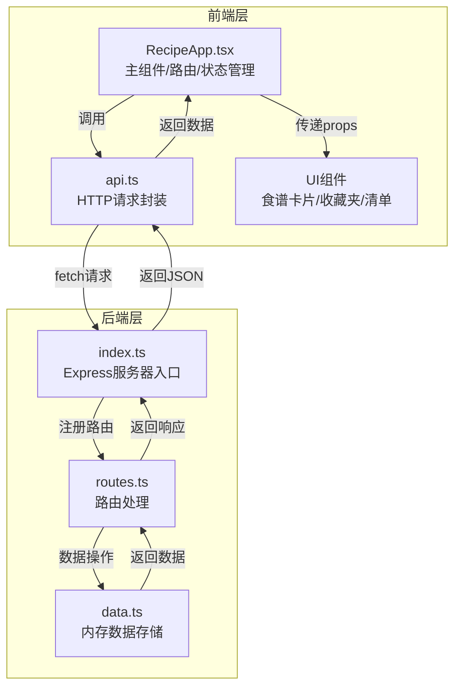
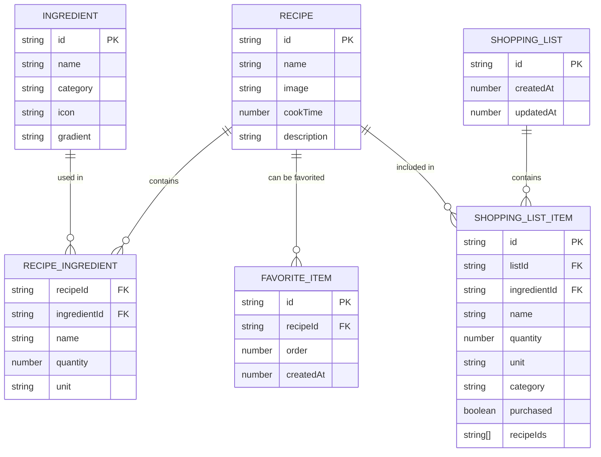
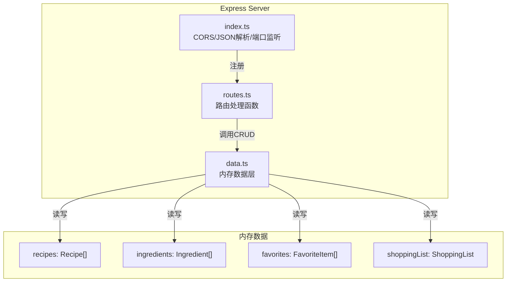

## 1. 架构设计



## 2. 技术描述

- **前端**：React@18 + TypeScript + Vite + zustand（状态管理）+ lucide-react（图标）
- **后端**：Express@4 + TypeScript + uuid（唯一ID生成）+ cors（跨域）
- **构建工具**：Vite@5
- **数据存储**：内存存储（Node.js内存）
- **样式方案**：CSS Modules + CSS Variables（避免使用Tailwind，用户未明确要求）
- **初始化模板**：react-express-ts

## 3. 文件结构

```
auto56/
├── package.json
├── vite.config.js
├── tsconfig.json
├── index.html
└── src/
    ├── client/
    │   ├── RecipeApp.tsx          # 前端主组件，路由和全局状态
    │   ├── api.ts                 # HTTP请求封装
    │   ├── components/            # UI组件
    │   │   ├── RecipeCard.tsx     # 食谱卡片
    │   │   ├── IngredientPanel.tsx # 食材选择面板
    │   │   ├── FavoritesSidebar.tsx # 收藏夹侧栏
    │   │   ├── ShoppingList.tsx   # 购物清单
    │   │   ├── Toast.tsx          # Toast提示
    │   │   └── RippleButton.tsx   # 带涟漪效果的按钮
    │   ├── hooks/
    │   │   └── useRipple.ts       # 涟漪效果Hook
    │   ├── store/
    │   │   └── useAppStore.ts     # Zustand全局状态
    │   ├── types/
    │   │   └── index.ts           # TypeScript类型定义
    │   └── styles/
    │       ├── variables.css      # CSS变量
    │       └── animations.css     # 动画关键帧
    └── server/
        ├── index.ts               # Express服务器入口
        ├── routes.ts              # API路由
        └── data.ts                # 内存数据存储
```

### 文件调用关系
1. **RecipeApp.tsx** → **api.ts** → 后端API → **routes.ts** → **data.ts**
2. **RecipeApp.tsx** → 子组件（RecipeCard, IngredientPanel, FavoritesSidebar, ShoppingList）
3. 子组件 → **useAppStore.ts**（状态管理）
4. **RippleButton.tsx** → **useRipple.ts**（涟漪效果）

## 4. 路由定义

### 前端路由
| 路由 | 页面 | 说明 |
|-------|------|------|
| / | 食谱推荐页 | 食材选择、搜索、推荐展示 |
| /list | 购物清单页 | 清单展示、编辑、导出 |

### API路由
| 方法 | 路由 | 目的 |
|------|------|------|
| GET | /api/recipes | 获取所有食谱 |
| GET | /api/recipes/search | 按食材搜索食谱 |
| GET | /api/recipes/recommend | 根据所选食材推荐食谱 |
| GET | /api/favorites | 获取收藏列表 |
| POST | /api/favorites | 添加收藏 |
| DELETE | /api/favorites/:id | 取消收藏 |
| PUT | /api/favorites/reorder | 重新排序收藏 |
| GET | /api/list | 获取购物清单 |
| POST | /api/list/generate | 根据选中食谱生成清单 |
| POST | /api/list/items | 添加清单项 |
| PUT | /api/list/items/:id | 更新清单项 |
| DELETE | /api/list/items/:id | 删除清单项 |
| PATCH | /api/list/items/:id/toggle | 切换已购买状态 |

## 5. 数据模型

### 5.1 TypeScript 类型定义

```typescript
// 食材
interface Ingredient {
  id: string;
  name: string;
  category: 'vegetable' | 'meat' | 'seasoning' | 'grain' | 'seafood' | 'dairy' | 'other';
  icon: string;
  gradient: string;
}

// 食谱食材
interface RecipeIngredient {
  ingredientId: string;
  name: string;
  quantity: number;
  unit: string;
}

// 食谱
interface Recipe {
  id: string;
  name: string;
  image: string;
  cookTime: number; // 分钟
  ingredients: RecipeIngredient[];
  description: string;
}

// 收藏项
interface FavoriteItem {
  id: string;
  recipeId: string;
  recipe: Recipe;
  order: number;
  createdAt: number;
}

// 清单项
interface ShoppingListItem {
  id: string;
  ingredientId: string;
  name: string;
  quantity: number;
  unit: string;
  category: string;
  purchased: boolean;
  recipeIds: string[]; // 来自哪些食谱
}

// 购物清单
interface ShoppingList {
  id: string;
  items: ShoppingListItem[];
  createdAt: number;
  updatedAt: number;
}

// 推荐请求
interface RecommendRequest {
  selectedIngredients: string[];
  searchQuery?: string;
}

// 清单生成请求
interface GenerateListRequest {
  recipeIds: string[];
}
```

### 5.2 Mermaid ER图



## 6. 服务器架构



### 6.1 数据层方法（data.ts）

```typescript
// 食谱相关
getRecipes(): Recipe[]
getRecipeById(id: string): Recipe | undefined
searchRecipesByIngredient(ingredientName: string): Recipe[]
recommendRecipes(selectedIngredientIds: string[], searchQuery?: string): Recipe[]

// 食材相关
getAllIngredients(): Ingredient[]

// 收藏相关
getFavorites(): FavoriteItem[]
addFavorite(recipeId: string): FavoriteItem
removeFavorite(id: string): boolean
reorderFavorites(orderedIds: string[]): boolean

// 清单相关
getShoppingList(): ShoppingList
generateShoppingList(recipeIds: string[]): ShoppingListItem[]
addListItem(item: Omit<ShoppingListItem, 'id'>): ShoppingListItem
updateListItem(id: string, updates: Partial<ShoppingListItem>): ShoppingListItem | undefined
removeListItem(id: string): boolean
toggleItemPurchased(id: string): ShoppingListItem | undefined
```

## 7. 初始数据

### 7.1 20种常见食材

```typescript
const ingredients: Ingredient[] = [
  { id: '1', name: '鸡肉', category: 'meat', icon: 'drumstick', gradient: 'linear-gradient(135deg, #FF9A8B, #FF6B61)' },
  { id: '2', name: '牛肉', category: 'meat', icon: 'beef', gradient: 'linear-gradient(135deg, #FF6B61, #E84393)' },
  { id: '3', name: '猪肉', category: 'meat', icon: 'ham', gradient: 'linear-gradient(135deg, #FD79A8, #FDCB6E)' },
  { id: '4', name: '土豆', category: 'vegetable', icon: 'potato', gradient: 'linear-gradient(135deg, #FDCB6E, #E17055)' },
  { id: '5', name: '胡萝卜', category: 'vegetable', icon: 'carrot', gradient: 'linear-gradient(135deg, #FF7675, #FDCB6E)' },
  { id: '6', name: '西红柿', category: 'vegetable', icon: 'tomato', gradient: 'linear-gradient(135deg, #FF6B61, #FF9A8B)' },
  { id: '7', name: '青菜', category: 'vegetable', icon: 'leaf', gradient: 'linear-gradient(135deg, #2D5A27, #55EFC4)' },
  { id: '8', name: '黄瓜', category: 'vegetable', icon: 'cucumber', gradient: 'linear-gradient(135deg, #55EFC4, #81ECEC)' },
  { id: '9', name: '鸡蛋', category: 'dairy', icon: 'egg', gradient: 'linear-gradient(135deg, #FDCB6E, #FFEAA7)' },
  { id: '10', name: '牛奶', category: 'dairy', icon: 'milk', gradient: 'linear-gradient(135deg, #DFE6E9, #74B9FF)' },
  { id: '11', name: '大米', category: 'grain', icon: 'wheat', gradient: 'linear-gradient(135deg, #FDCB6E, #DFE6E9)' },
  { id: '12', name: '面条', category: 'grain', icon: 'utensils', gradient: 'linear-gradient(135deg, #E17055, #FDCB6E)' },
  { id: '13', name: '虾', category: 'seafood', icon: 'shrimp', gradient: 'linear-gradient(135deg, #FF7675, #E84393)' },
  { id: '14', name: '鱼', category: 'seafood', icon: 'fish', gradient: 'linear-gradient(135deg, #74B9FF, #0984E3)' },
  { id: '15', name: '大蒜', category: 'seasoning', icon: 'garlic', gradient: 'linear-gradient(135deg, #DFE6E9, #FDCB6E)' },
  { id: '16', name: '生姜', category: 'seasoning', icon: 'ginger', gradient: 'linear-gradient(135deg, #E17055, #FDCB6E)' },
  { id: '17', name: '酱油', category: 'seasoning', icon: 'soy', gradient: 'linear-gradient(135deg, #636E72, #2D3436)' },
  { id: '18', name: '盐', category: 'seasoning', icon: 'salt', gradient: 'linear-gradient(135deg, #DFE6E9, #B2BEC3)' },
  { id: '19', name: '豆腐', category: 'other', icon: 'tofu', gradient: 'linear-gradient(135deg, #FFF8E7, #DFE6E9)' },
  { id: '20', name: '蘑菇', category: 'vegetable', icon: 'mushroom', gradient: 'linear-gradient(135deg, #B2BEC3, #DFE6E9)' },
];
```

### 7.2 示例食谱（至少10个）

包含宫保鸡丁、红烧牛肉、番茄炒蛋、土豆烧牛肉、清蒸鱼、蒜蓉西兰花、虾仁炒饭、麻婆豆腐、红烧肉、糖醋里脊等常见食谱。

## 8. 性能优化

### 8.1 前端性能
- 使用React.memo优化组件重渲染
- 列表使用虚拟滚动（如果清单过长）
- 动画使用transform和opacity避免重排
- 使用useMemo和useCallback缓存计算结果和回调函数
- 防抖处理搜索输入（150ms）

### 8.2 后端性能
- 内存数据使用Map进行ID索引，O(1)查找
- 推荐算法使用集合操作优化匹配计算
- CORS预检请求缓存
- 请求体大小限制（100kb）

### 8.3 构建优化
- Vite代码分割
- 生产环境sourcemap关闭
- 依赖按需导入
- CSS压缩和Tree Shaking
