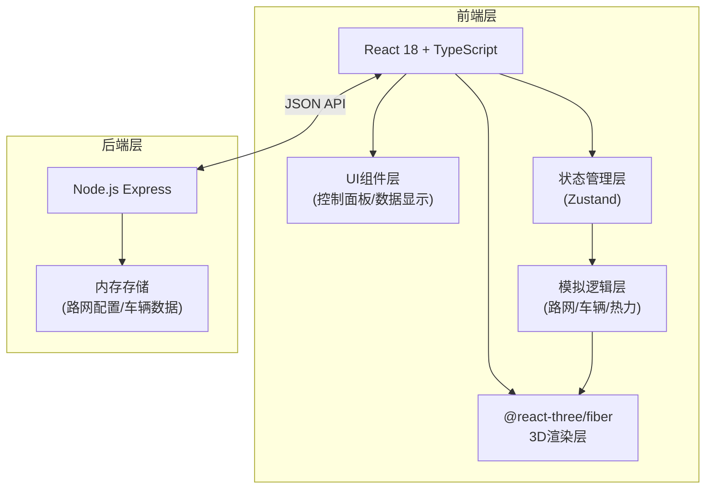
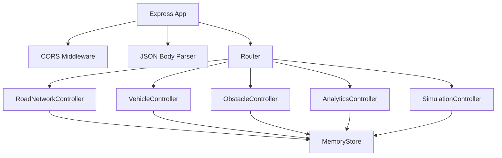

## 1. 架构设计



## 2. 技术说明

- **前端框架**：React 18 + TypeScript（严格模式，ES2020模块）
- **3D渲染**：Three.js + @react-three/fiber + @react-three/drei
- **构建工具**：Vite（@vitejs/plugin-react，路径别名@指向src）
- **状态管理**：Zustand（轻量级全局状态）
- **样式方案**：CSS Modules + CSS变量（响应式适配）
- **后端服务**：Node.js Express + CORS（内存存储，无需数据库）
- **通信协议**：RESTful API + JSON格式

## 3. 路由定义

| 路由 | 用途 |
|------|------|
| / | 主页面，集成3D场景与控制面板 |
| /api/road-network | 获取/保存路网配置 |
| /api/vehicles | 获取实时车辆数据 |
| /api/simulation | 控制模拟启停与参数 |

## 4. API定义

```typescript
// 路网节点（交叉路口）
interface Intersection {
  id: string;
  x: number;
  z: number;
  signalState: 'red' | 'green';
  signalTimer: number;
}

// 道路段
interface RoadSegment {
  id: string;
  from: string; // intersection id
  to: string;   // intersection id
  type: 'main' | 'branch';
  lanes: number;
  speedLimit: number; // km/h
  allowUTurn: boolean;
}

// 路网配置
interface RoadNetwork {
  intersections: Intersection[];
  segments: RoadSegment[];
  signalCycle: { red: number; green: number };
}

// 车辆
interface Vehicle {
  id: string;
  position: { x: number; y: number; z: number };
  rotation: { y: number };
  speed: number;
  targetSpeed: number;
  path: string[]; // intersection id sequence
  strategy: 'shortest' | 'avoid-congestion';
  isBraking: boolean;
  color: string;
}

// 障碍物
interface Obstacle {
  id: string;
  position: { x: number; z: number };
  affectedSegmentId?: string;
}

// 热力图数据
interface HeatmapCell {
  x: number;
  z: number;
  congestionLevel: 0 | 1 | 2; // 0=畅通 1=缓行 2=拥堵
  avgSpeed: number;
}

// 统计指标
interface Analytics {
  totalVehicles: number;
  avgSpeed: number;
  congestionIndex: number; // 0-100
}
```

### API端点

```
GET  /api/road-network          -> RoadNetwork
PUT  /api/road-network          -> RoadNetwork (保存配置)
GET  /api/vehicles              -> Vehicle[]
GET  /api/obstacles             -> Obstacle[]
POST /api/obstacles             -> Obstacle
DELETE /api/obstacles/:id       -> void
GET  /api/analytics             -> Analytics
POST /api/simulation/start      -> { running: true }
POST /api/simulation/stop       -> { running: false }
```

## 5. 服务端架构图



## 6. 数据模型

### 6.1 数据模型定义

```mermaid
erDiagram
    ROAD_NETWORK ||--o{ INTERSECTION : contains
    ROAD_NETWORK ||--o{ ROAD_SEGMENT : contains
    ROAD_SEGMENT }o--|| INTERSECTION : from
    ROAD_SEGMENT }o--|| INTERSECTION : to
    VEHICLE }o--o{ INTERSECTION : path
    VEHICLE }o--o{ ROAD_SEGMENT : travels_on
    OBSTACLE }o--o| ROAD_SEGMENT : blocks
```

### 6.2 初始数据

默认路网包含：
- 9个交叉路口（3x3网格布局）
- 4条主干道（横向/纵向中线）
- 8条支路（其余连接）
- 信号灯周期：红灯15秒，绿灯20秒
- 初始车辆数：30辆

## 7. 项目文件结构

```
├── package.json
├── vite.config.js
├── tsconfig.json
├── index.html
├── server/
│   └── index.ts                 # Express API服务端
└── src/
    ├── main.tsx                 # React入口
    ├── App.tsx                  # 根组件
    ├── styles/
    │   └── global.css           # 全局样式与CSS变量
    ├── store/
    │   └── useSimulationStore.ts # Zustand全局状态
    ├── scene/
    │   ├── SceneView.tsx        # 3D场景容器
    │   ├── RoadNetwork.ts       # 路网数据模型与绘制
    │   ├── TrafficFlow.ts       # 车辆模拟与路径规划
    │   ├── VehicleMesh.tsx      # 车辆3D模型组件
    │   ├── Heatmap.tsx          # 热力图组件
    │   └── Obstacle.tsx         # 障碍物组件
    ├── ui/
    │   ├── ControlPanel.tsx     # 左侧控制面板
    │   ├── AnalyticsDisplay.tsx # 右上角数据显示
    │   ├── FlipNumber.tsx       # 翻转动画数字组件
    │   └── RoadEditor.tsx       # 路网编辑器子组件
    └── types/
        └── index.ts             # 共享类型定义
```
