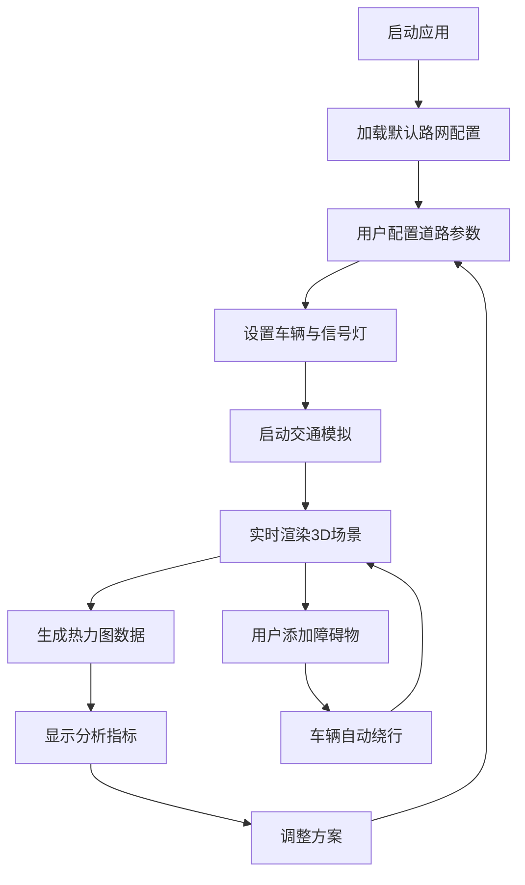

## 1. 产品概述

三维城市交通流模拟与拥堵热点分析交互式可视化应用，为城市规划者和交通工程师提供直观工具，用于测试不同道路设计方案对整体交通效率的影响。

- 核心目标：提供可交互的3D交通模拟环境，支持路网编辑、车辆行为模拟、障碍物测试和拥堵热力分析
- 目标用户：城市规划师、交通工程师、科研教育人员
- 市场价值：降低交通规划成本，加速方案验证，提升决策科学性

## 2. 核心功能

### 2.1 用户角色
| 角色 | 注册方式 | 核心权限 |
|------|----------|----------|
| 规划者 | 本地应用 | 路网编辑、参数配置、模拟运行、数据分析 |

### 2.2 功能模块
1. **三维场景视图**：路网渲染、车辆模拟、热力图叠加、障碍物可视化
2. **路网编辑器**：道路绘制、参数配置（车道数/限速/掉头）、交叉路口管理
3. **交通模拟引擎**：车辆生成、A*路径规划、信号灯控制、避障绕行、物理运动
4. **控制面板**：路网管理、车辆参数、信号灯周期、障碍物操作
5. **数据分析显示**：车辆总数、平均车速、拥堵指数实时展示

### 2.3 功能详情
| 页面/模块 | 子模块 | 功能描述 |
|-----------|--------|----------|
| 3D场景 | 路网渲染 | 主干道橙色宽线、支路灰色细线、路口白色圆点，参数实时更新视觉表现 |
| 3D场景 | 车辆模拟 | 圆角立方体车辆，随机目的地，最短路径/避堵策略，信号灯等待，尾灯+制动粒子 |
| 3D场景 | 障碍物系统 | 橙色锥形台拖拽添加/删除，半透明蓝线绕行路径，移除后自动恢复 |
| 3D场景 | 热力图 | 红/黄/绿三色叠加，5秒刷新淡入过渡，基于车速百分比判定 |
| 控制面板 | 路网编辑 | 导入/绘制路网，至少4条主干道和8条支路，道路参数调整 |
| 控制面板 | 车辆参数 | 车辆数量、行驶策略配置 |
| 控制面板 | 信号灯 | 全局信号灯周期设置（默认红灯15s绿灯20s） |
| 数据显示 | 实时指标 | 车辆总数、平均车速、拥堵指数，等宽字体翻转动画 |

## 3. 核心流程

用户打开应用 → 加载默认路网（或导入/绘制新路网） → 配置道路参数和信号灯周期 → 设置车辆数量和策略 → 启动模拟 → 实时观察车辆行驶与热力图 → 添加/删除障碍物测试绕行 → 查看数据分析指标 → 调整方案重新模拟

## 4. 用户界面设计

### 4.1 设计风格
- 主色调：深蓝星空背景（#0a1628）、浅蓝按钮（#4da6ff）、橙色主干道（#ff8c00）、白色文字
- 辅助色：灰色支路（#888888）、绿色畅通（#00cc66）、黄色缓行（#ffcc00）、红色拥堵（#ff3333）
- 按钮风格：浅蓝圆角按钮，按压下沉动效，hover微亮
- 字体：数字使用等宽字体（JetBrains Mono），正文使用现代无衬线字体
- 布局：左侧控制面板（白色圆角卡片）+ 右侧80%主场景 + 右上角悬浮数据卡片
- 视觉风格：科技感扁平设计，深蓝星空配浅灰网格地面

### 4.2 界面设计概览
| 模块 | UI元素 | 视觉描述 |
|------|--------|----------|
| 控制面板 | 白色圆角卡片（20%宽度），深灰文字，浅蓝按钮，可折叠水平滑动动画（400ms缓出） |
| 3D主场景 | 80%宽度，深蓝星空背景，浅灰网格地面，橙色/灰色道路，白色路口圆点 |
| 数据显示 | 右上角悬浮卡片，等宽字体数字，翻转动画更新，绿/黄/红状态指示灯 |
| 响应式 | 屏幕<768px时控制面板滑到底部变为横向滚动栏 |

### 4.3 响应式
- 桌面端优先（>1024px）：左侧控制面板 + 主场景标准布局
- 平板端（768-1024px）：控制面板宽度自适应压缩
- 移动端（<768px）：控制面板滑至底部，横向滚动，场景全屏

### 4.4 3D场景指引
- 环境：深蓝星空渐变背景，程序化星点粒子，浅灰网格地面（Y=0平面）
- 光照：环境光（0.6强度）+ 方向光模拟日光（0.8强度，带柔和阴影）
- 相机：PerspectiveCamera（fov 60），默认俯视45°角，支持OrbitControls拖拽旋转缩放
- 车辆动画：位置插值平滑移动，朝向沿路径切线，停止时尾灯发红光+粒子喷发
- 后处理：轻微Bloom效果增强科技感，FXAA抗锯齿
- 性能：车辆模拟≥30fps，热力图生成延迟<200ms，InstancedMesh优化批量车辆渲染
