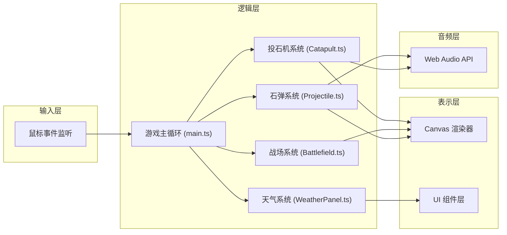
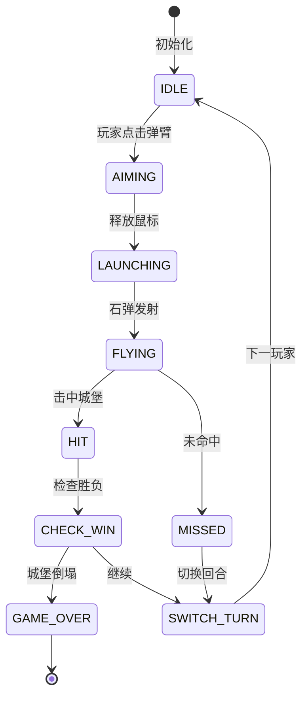

## 1. 架构设计



## 2. 技术描述

- **前端框架**：无框架，原生 TypeScript + Canvas 2D API
- **构建工具**：Vite 5.x
- **语言**：TypeScript 5.x (严格模式)
- **音频**：Web Audio API (程序化生成音效)
- **类型检查**：tsc --noEmit

### 技术选型理由
1. **原生 Canvas**：性能最优，完全控制渲染流程，适合2D物理模拟游戏
2. **TypeScript 严格模式**：确保类型安全，减少运行时错误
3. **Vite**：开发体验好，热更新快，构建效率高
4. **Web Audio API**：无需音频文件，程序化生成撞击音效

## 3. 模块职责与接口定义

### 3.1 main.ts - 游戏主控制器

**职责**：
- 初始化Canvas和游戏状态
- 管理主循环(requestAnimationFrame)
- 协调各模块间通信
- 处理回合切换逻辑
- 绑定全局鼠标事件

**核心状态**：
```typescript
type GameState = {
  currentPlayer: 1 | 2;
  round: number;
  isAiming: boolean;
  isProjectileFlying: boolean;
  gameOver: boolean;
  winner: 1 | 2 | null;
};
```

### 3.2 Battlefield.ts - 战场管理

**职责**：
- 绘制战场背景(天空、云朵、地面、树木)
- 管理双方城堡(城墙、塔楼)的状态和绘制
- 处理城堡损伤和血量系统
- 绘制中央虚线分隔
- 绘制计分板
- 管理旗帜和树叶的风力摆动动画

**核心接口**：
```typescript
interface Castle {
  id: 1 | 2;
  x: number;
  y: number;
  width: number;
  height: number;
  health: number;
  maxHealth: number;
  damage: number;
  cracks: Crack[];
  towerShake: number;
}

interface Battlefield {
  draw(ctx: CanvasRenderingContext2D, wind: number): void;
  checkCollision(projectile: Projectile): { hit: boolean; target: 'wall' | 'tower' | null };
  applyDamage(target: 1 | 2, damage: number, hitType: 'wall' | 'tower'): void;
  isCastleDestroyed(player: 1 | 2): boolean;
  getHealthPercentage(player: 1 | 2): number;
}
```

### 3.3 Catapult.ts - 投石机系统

**职责**：
- 绘制投石机(基座、弹臂、投石篮)
- 处理弹臂拖拽调整角度
- 管理弹臂弹性弯曲动画
- 管理弹臂回弹动画
- 发射石弹时计算初速度
- 显示当前角度数值

**核心接口**：
```typescript
interface Catapult {
  player: 1 | 2;
  x: number;
  y: number;
  angle: number;
  isDragging: boolean;
  armBend: number;
  isRecoiling: boolean;
  
  draw(ctx: CanvasRenderingContext2D): void;
  handleMouseDown(x: number, y: number): boolean;
  handleMouseMove(x: number, y: number): void;
  handleMouseUp(): Projectile | null;
  updateAnimation(dt: number): void;
  getLaunchPosition(): { x: number; y: number };
  getLaunchVelocity(): { vx: number; vy: number };
}
```

### 3.4 Projectile.ts - 石弹系统

**职责**：
- 石弹物理模拟(重力、风力)
- 轨迹残影绘制
- 碰撞检测
- 粒子爆炸效果
- 撞击音效播放

**核心接口**：
```typescript
interface Projectile {
  x: number;
  y: number;
  vx: number;
  vy: number;
  radius: number;
  active: boolean;
  trail: TrailPoint[];
  particles: Particle[];
  
  update(dt: number, gravity: number, wind: number): void;
  draw(ctx: CanvasRenderingContext2D): void;
  explode(): void;
  isOffScreen(width: number, height: number): boolean;
}

interface Particle {
  x: number;
  y: number;
  vx: number;
  vy: number;
  life: number;
  maxLife: number;
  color: string;
  size: number;
}
```

### 3.5 WeatherPanel.ts - 天气调节面板

**职责**：
- 绘制风力和重力调节面板
- 处理滑块拖拽交互
- 实时更新风向箭头和数值显示
- 提供当前风力和重力值

**核心接口**：
```typescript
interface WeatherPanel {
  wind: number;
  gravity: number;
  active: boolean;
  
  draw(ctx: CanvasRenderingContext2D): void;
  handleMouseDown(x: number, y: number): boolean;
  handleMouseMove(x: number, y: number): void;
  handleMouseUp(): void;
  setActive(active: boolean): void;
}
```

## 4. 数据模型

### 4.1 游戏配置常量
```typescript
const CONFIG = {
  CANVAS_WIDTH: 1200,
  CANVAS_HEIGHT: 700,
  GRAVITY_BASE: 500, // 像素/秒²
  WIND_FORCE_MULTIPLIER: 15,
  PROJECTILE_RADIUS: 10,
  CATAPULT_ARM_LENGTH: 120,
  CASTLE_WIDTH: 180,
  CASTLE_HEIGHT: 200,
  MAX_HEALTH: 100,
  WALL_DAMAGE: 15,
  TOWER_DAMAGE: 25,
  TRAIL_DURATION: 500,
  MIN_ANGLE: 0,
  MAX_ANGLE: 90,
  MIN_WIND: -10,
  MAX_WIND: 10,
  MIN_GRAVITY: 0.5,
  MAX_GRAVITY: 2.0,
} as const;
```

### 4.2 状态流转


## 5. 性能优化策略

### 5.1 渲染优化
- 使用离屏Canvas预渲染静态元素(城堡、投石机基座)
- 只在状态变化时重绘，避免无效渲染
- 粒子数量限制在100个以内，自动清理过期粒子
- 轨迹点限制在50个以内

### 5.2 物理计算优化
- 使用固定时间步长(dt)进行物理更新
- 碰撞检测使用空间分区，减少检测次数
- 石弹飞出屏幕后立即标记为非活动状态

### 5.3 内存管理
- 及时清理过期的粒子和轨迹点
- 复用粒子对象，避免频繁GC
- 事件监听器在组件销毁时正确移除

## 6. 音效设计

使用Web Audio API程序化生成：
- **撞击音效**：低频方波 + 快速衰减包络
- **发射音效**：中频锯齿波 + 弹性衰减
- **背景风声**：白噪音 + 滤波器调制

```typescript
function playImpactSound(ctx: AudioContext): void {
  const osc = ctx.createOscillator();
  const gain = ctx.createGain();
  osc.type = 'square';
  osc.frequency.setValueAtTime(80, ctx.currentTime);
  osc.frequency.exponentialRampToValueAtTime(30, ctx.currentTime + 0.3);
  gain.gain.setValueAtTime(0.3, ctx.currentTime);
  gain.gain.exponentialRampToValueAtTime(0.001, ctx.currentTime + 0.3);
  osc.connect(gain);
  gain.connect(ctx.destination);
  osc.start();
  osc.stop(ctx.currentTime + 0.3);
}
```
