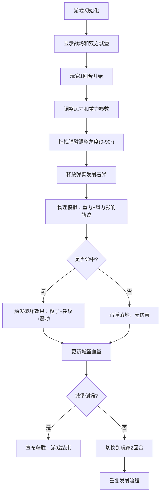

## 1. 产品概述

基于物理模拟的双人回合制投石机对战游戏，玩家通过调整发射角度和力度摧毁对方城堡获胜。融合真实物理引擎、动态破坏效果和精美视觉表现，提供沉浸式的策略对战体验。

- 核心玩法：两名玩家轮流操控投石机，利用重力和风力的物理效果击中敌方城堡
- 目标用户：休闲游戏玩家、物理模拟爱好者
- 市场价值：填补网页端高品质物理对战游戏的空白，提供即开即玩的双人对战体验

## 2. 核心功能

### 2.1 用户角色
| 角色 | 注册方式 | 核心权限 |
|------|----------|----------|
| 玩家1 | 本地操作 | 操控左侧投石机，调整角度和力度发射石弹 |
| 玩家2 | 本地操作 | 操控右侧投石机，调整角度和力度发射石弹 |

### 2.2 功能模块
1. **游戏主界面**：战场渲染、城堡绘制、投石机显示、计分板展示
2. **投石机操控系统**：角度调整、弹性动画、发射逻辑、力度控制
3. **物理模拟系统**：重力模拟、风力影响、抛物线轨迹、碰撞检测
4. **破坏效果系统**：城墙裂纹、塔楼震动、粒子爆炸、音效反馈
5. **天气调节系统**：风力调节面板、重力调节面板、环境反馈（旗帜、树叶摆动）
6. **回合控制系统**：回合切换、胜负判定、数据统计

### 2.3 页面详情
| 页面名称 | 模块名称 | 功能描述 |
|----------|----------|----------|
| 游戏主界面 | 战场布局 | 左右半场对称布局，白色虚线分隔，渐变天空背景，云朵飘动 |
| 游戏主界面 | 投石机组件 | 三角形基座、可旋转弹臂、圆形投石篮、角度显示、弹性弯曲动画 |
| 游戏主界面 | 城堡组件 | 城墙砖块纹理、塔楼结构、血量条、裂纹效果、震动动画 |
| 游戏主界面 | 计分板 | 木质纹理背景、手写字体、回合数、双方血量、发射石弹数 |
| 游戏主界面 | 石弹系统 | 抛物线飞行、半透明轨迹残影、粒子爆炸效果、碰撞检测 |
| 天气调节面板 | 风力调节 | 滑块控制(-10到+10级)、风向箭头、强度数值、旗帜树叶联动 |
| 天气调节面板 | 重力调节 | 滑块控制(0.5到2.0倍)、实时数值显示 |

## 3. 核心流程

## 4. 用户界面设计

### 4.1 设计风格
- **主色调**：黄昏暖色主题 - 橙黄(#FFB347)、暗红(#8B0000)、深棕(#4A3728)
- **辅助色**：天空渐变(橙蓝过渡)、灰色砖块(#707070)、绿色血量(#228B22)、红色血量(#DC143C)
- **字体**：手写风格字体(如 Caveat 或 Permanent Marker)，搭配清晰的数字字体
- **视觉质感**：木质纹理、砖块纹理、纸张质感、粒子光晕
- **动画风格**：弹性物理动画、渐隐轨迹、震动反馈、粒子飘散

### 4.2 页面设计概述
| 页面名称 | 模块名称 | UI元素 |
|----------|----------|--------|
| 游戏主界面 | 战场布局 | 左右对称布局、中央白色虚线分隔、渐变天空(橙→蓝)、缓慢飘动云朵、地面深棕色、树木点缀 |
| 游戏主界面 | 投石机 | 深棕色木质纹理、三角形基座(深棕渐变)、可旋转弹臂(木质纹理)、圆形投石篮(深棕边框)、角度数值(白色粗体)、弹性弯曲效果 |
| 游戏主界面 | 城堡 | 灰色砖块城墙(砖块纹理)、方形塔楼(城垛造型)、血量条(顶部居中，绿→红渐变)、裂纹纹理(随损伤加深)、旗帜(随风摆动) |
| 游戏主界面 | 计分板 | 木质纹理背景(左右各一)、手写字体标题、回合数显示、血量百分比、发射石弹计数 |
| 游戏主界面 | 石弹 | 深灰色圆形石弹、半透明抛物线残影(逐渐淡出500ms)、爆炸粒子(橙黄+灰色石屑) |
| 天气调节面板 | 控制面板 | 底部居中、半透明木质背景、风力滑块(带风向箭头)、重力滑块、实时数值显示 |

### 4.3 响应式
- 采用固定画布尺寸(1200x700)，居中显示
- 自适应窗口大小，保持画布比例
- 鼠标交互优先，不支持触摸操作

### 4.4 性能要求
- 石弹飞行模拟帧率 ≥ 30fps
- 碰撞检测响应时间 ≤ 50ms
- 粒子效果同时存在数量 ≤ 100个
- 内存占用稳定，无内存泄漏

## 5. 技术实现要点

### 5.1 核心技术
- TypeScript 严格模式
- 原生 Canvas 2D API 渲染
- Web Audio API 音效播放
- Vite 构建工具

### 5.2 物理引擎
- 重力加速度：可调节倍率 × 9.8 m/s²
- 风力影响：水平加速度 = 风力等级 × 0.5
- 轨迹计算：每帧更新位置，使用运动学公式
- 碰撞检测：AABB 碰撞检测 + 圆形与矩形碰撞

### 5.3 文件结构
- package.json - 项目配置
- vite.config.js - 构建配置
- tsconfig.json - TypeScript配置
- index.html - 入口页面
- src/main.ts - 游戏主循环、事件绑定
- src/Battlefield.ts - 战场管理、城堡绘制、血量系统
- src/Catapult.ts - 投石机绘制、角度调整、发射逻辑
- src/Projectile.ts - 石弹物理、轨迹、碰撞、粒子
- src/WeatherPanel.ts - 天气调节UI
