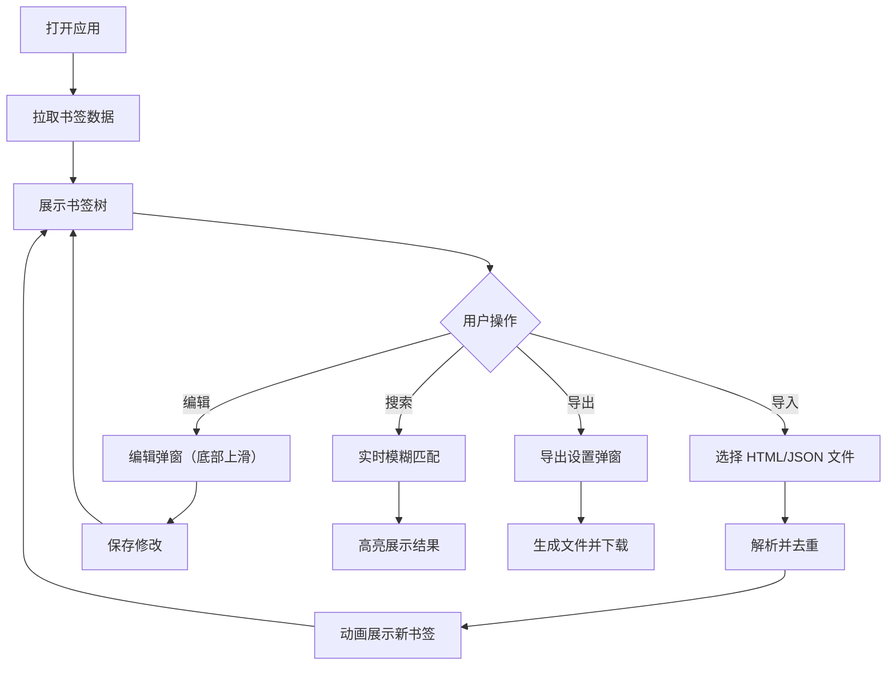

## 1. 产品概述

书签管理应用，帮助用户高效整理、检索和跨平台同步个人书签收藏。解决用户在不同浏览器和设备上书签分散、重复且难以检索的问题。

- 核心目标：提供统一的书签管理入口，支持批量导入、智能去重、标签化管理、实时搜索和多格式导出
- 目标用户：使用多浏览器/多设备、有大量书签管理需求的个人用户

## 2. 核心功能

### 2.1 用户角色

| 角色 | 注册方式 | 核心权限 |
|------|----------|----------|
| 普通用户 | 无需注册（本地使用） | 导入、编辑、删除、搜索、导出书签 |

### 2.2 功能模块

1. **书签导入模块**：支持 HTML/JSON 批量导入，自动清洗去重，下滑淡入动画展示
2. **书签树管理模块**：树状层级展示，拖拽排序/调整层级，右键上下文菜单
3. **标签系统模块**：基于域名自动打标签，手动增删标签（最多5个），标签筛选翻转动画
4. **实时搜索模块**：模糊搜索标题和 URL，关键字高亮，动态展开匹配文件夹
5. **书签导出模块**：支持 HTML/JSON 格式导出，全部或单文件夹范围选择

### 2.3 页面详情

| 页面名称 | 模块名称 | 功能描述 |
|----------|----------|----------|
| 主页面 | 顶部工具栏 | 导入、导出、搜索、设置按钮，hover 浅靛蓝背景和轻微上浮阴影 |
| 主页面 | 左侧书签树面板 | 可拖拽调节宽度，树状递归展示，拖拽排序，右键菜单，下边框分隔 |
| 主页面 | 右侧主内容区 | 展示当前选中文件夹内容，书签卡片 hover 上浮和阴影加深 |
| 主页面 | 搜索面板 | 搜索输入框底线展开动画，结果卡片列表，关键字高亮 |
| 模态弹窗 | 编辑表单 | 底部上滑入场，半透明遮罩，输入框聚焦下划线展开动画 |
| 模态弹窗 | 导出设置 | 单选框组填充动画，格式和范围选择，下载成功绿色对勾反馈 |

## 3. 核心流程

用户打开应用后从后端拉取已有书签数据，可通过顶部工具栏的导入按钮批量导入书签（HTML/JSON），系统自动去重后以动画方式展示在左侧书签树中。用户可通过拖拽调整书签层级和顺序，右键菜单进行编辑、移动、删除等操作。系统根据书签 URL 域名自动打标签，用户也可手动管理标签。通过顶部搜索栏可实时模糊搜索所有书签，匹配关键字高亮显示。最后用户可选择全部或部分书签导出为 HTML 或 JSON 文件。

## 4. 用户界面设计

### 4.1 设计风格

- **主色调**：靛蓝色(#4F46E5) 搭配柔和灰色系
- **辅助色**：浅靛蓝(#EEF2FF) 用于 hover 状态
- **按钮样式**：圆角矩形按钮，hover 时背景变为 #EEF2FF 并伴随轻微上浮阴影（200ms ease-out）
- **字体**：系统无衬线字体栈，清晰易读
- **布局风格**：左右分栏布局，顶部工具栏，卡片式内容展示
- **图标**：简洁线性图标，使用 lucide-react

### 4.2 页面设计概览

| 页面名称 | 模块名称 | UI 元素 |
|----------|----------|---------|
| 主页面 | 顶部工具栏 | 靛蓝色品牌标识，功能按钮组，搜索输入框（底线展开动画） |
| 主页面 | 左侧书签树 | 可拖拽分隔栏（ew-resize 光标，1px 阴影指示），树状节点，1px 下边框，文件夹/书签图标，来源图标，标签药丸 |
| 主页面 | 右侧内容区 | 书签卡片网格/列表，卡片 hover 上浮 2px（shadow-sm → shadow-md，200ms ease-out） |
| 模态弹窗 | 通用 | 半透明遮罩，从底部 30px 上滑淡入（300ms cubic-bezier），退出时下滑淡出 |
| 编辑弹窗 | 表单 | 输入框聚焦时底部下划线从 0 展开到 100% |
| 导出弹窗 | 选项 | 单选框选中项带填充动画，下载按钮成功时短暂显示绿色对勾 |

### 4.3 响应式设计

- **桌面优先**设计，宽度 ≥ 768px 采用左右分栏布局
- **移动端适配**：宽度 < 768px 时书签树折叠为左侧抽屉侧边栏，点击汉堡菜单按钮从左边缘滑出，书签列表占满全宽
- **触摸优化**：移动端按钮和可点击区域最小 44px，拖拽操作支持触摸事件

### 4.4 动效规范

- **书签导入**：条目从顶部逐个下滑淡入（stagger 动画）
- **标签筛选**：列表内容以翻转卡片动画切换
- **弹窗进入/退出**：底部 30px 上滑淡入 / 下滑淡出，300ms cubic-bezier(0.4, 0, 0.2, 1)
- **搜索框**：输入时底部分割线从 0 到 100% 宽度展开动画
- **卡片 hover**：translateY(-2px) + shadow-sm → shadow-md，200ms ease-out
- **按钮 hover**：背景色变为 #EEF2FF + 轻微上浮阴影
