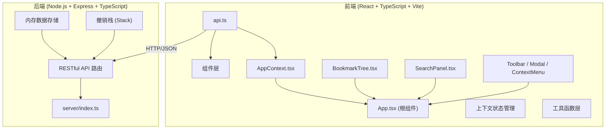
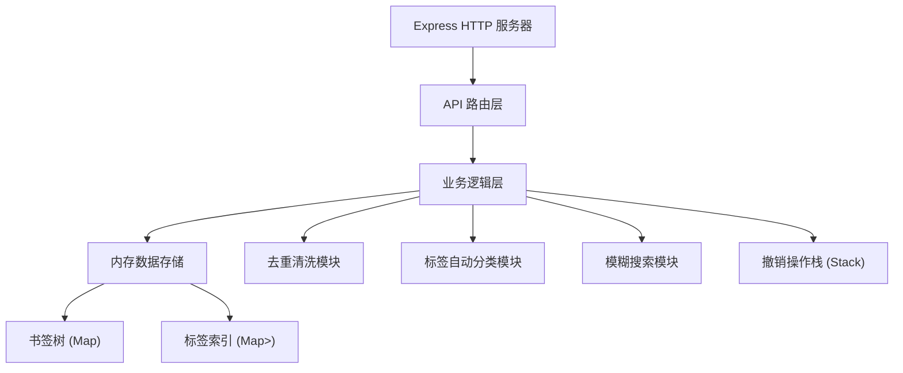
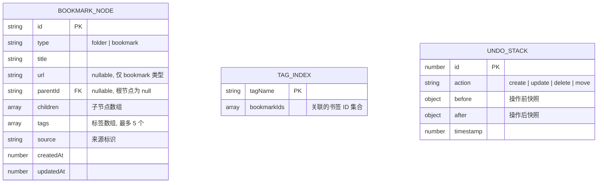

## 1. 架构设计



## 2. 技术说明

- **前端**：React 18 + TypeScript + Vite + lucide-react 图标库
- **构建工具**：Vite (@vitejs/plugin-react)
- **后端**：Express 4 + TypeScript + CORS 中间件
- **数据存储**：服务端内存存储（树结构书签数据 + 标签映射 + 撤销操作栈）
- **状态管理**：React Context (AppContext) 管理全局书签数据、选中状态、搜索状态、撤销栈

## 3. 路由定义

| 路由 | 用途 |
|------|------|
| / | 应用主页面（单页应用，所有功能在同一页面） |

## 4. API 定义

```typescript
// 书签节点类型
interface BookmarkNode {
  id: string;
  type: 'folder' | 'bookmark';
  title: string;
  url?: string;
  parentId: string | null;
  children: BookmarkNode[];
  tags: string[];
  source?: 'chrome' | 'firefox' | 'edge' | 'safari' | 'import-html' | 'import-json' | 'manual';
  createdAt: number;
  updatedAt: number;
}

// 导入请求
interface ImportRequest {
  format: 'html' | 'json';
  data: string; // HTML 字符串或 JSON 字符串
  targetFolderId?: string | null;
}

// 导入响应
interface ImportResponse {
  success: boolean;
  imported: number;
  duplicates: number;
  bookmarks: BookmarkNode[];
}

// 搜索响应
interface SearchResult {
  id: string;
  title: string;
  url?: string;
  tags: string[];
  matches: { field: 'title' | 'url'; indices: [number, number][] }[];
}

// 导出请求
interface ExportRequest {
  format: 'html' | 'json';
  scope: 'all' | 'folder';
  folderId?: string;
}

// 导出响应
interface ExportResponse {
  format: 'html' | 'json';
  filename: string;
  data: string; // HTML 或 JSON 字符串
}
```

### REST API 端点

| 方法 | 路径 | 描述 |
|------|------|------|
| POST | /api/import | 批量导入书签，自动去重 |
| GET | /api/bookmarks | 获取完整书签树 |
| PUT | /api/bookmarks/:id | 更新单个书签/文件夹 |
| DELETE | /api/bookmarks/:id | 删除单个书签/文件夹 |
| POST | /api/export | 导出书签为 HTML/JSON |
| GET | /api/search?q= | 实时模糊搜索书签 |

## 5. 服务端架构图



## 6. 数据模型

### 6.1 数据模型定义



### 6.2 内存数据结构

```typescript
// 服务端内存存储
interface ServerStore {
  // 书签节点存储 (id -> node)
  nodes: Map<string, BookmarkNode>;
  
  // 根节点 ID 列表
  rootIds: string[];
  
  // 标签反向索引 (tag -> Set<bookmarkId>)
  tagIndex: Map<string, Set<string>>;
  
  // URL 去重索引 (normalizedUrl -> bookmarkId)
  urlIndex: Map<string, string>;
  
  // 撤销操作栈
  undoStack: UndoOperation[];
}
```
