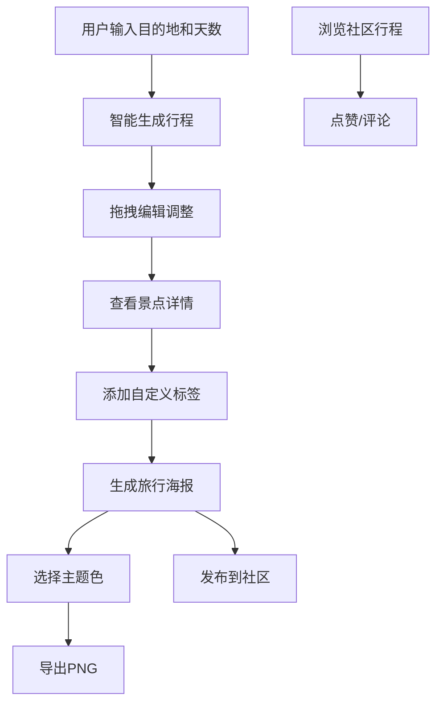

## 1. 产品概述
旅行规划助手是一款智能行程生成与社交分享应用，解决用户在制定旅行攻略时信息过载、行程安排混乱的痛点。通过智能算法自动生成个性化行程，配合拖拽编辑、海报分享和社区互动功能，让旅行规划变得轻松有趣。

- 核心目标用户：热爱旅行、需要快速规划行程的用户群体
- 市场价值：将复杂的行程规划简化为一键生成，结合社交属性提升用户粘性

## 2. 核心功能

### 2.1 用户角色
| 角色 | 注册方式 | 核心权限 |
|------|----------|----------|
| 普通用户 | 无需注册即可使用核心功能 | 生成行程、编辑行程、导出海报、浏览社区、点赞评论 |

### 2.2 功能模块
1. **行程生成页**：目的地搜索、天数选择、智能行程生成
2. **行程编辑页**：拖拽排序、删除替换、时段自动调整、景点详情
3. **海报生成页**：主题选择、海报预览、高清导出
4. **社区广场页**：瀑布流展示、行程详情、点赞评论、发布行程

### 2.3 页面详情
| 页面名称 | 模块名称 | 功能描述 |
|---------|----------|----------|
| 行程生成页 | 搜索模块 | 支持城市名称和关键词模糊搜索，下拉提示匹配结果 |
| 行程生成页 | 天数选择 | 1-14天滑块选择，实时显示天数 |
| 行程生成页 | 生成按钮 | 触发生成算法，骨架屏加载动画 |
| 行程编辑页 | 时间线卡片 | 显示景点名称、游玩时长、推荐时段、简介 |
| 行程编辑页 | 拖拽排序 | HTML5 Drag and Drop实现，平滑动画过渡 |
| 行程编辑页 | 详情面板 | 点击展开，图片轮播、开放时间、门票价格、星级评分、自定义标签 |
| 海报生成页 | 主题选择 | 8种渐变色板，点击切换预览 |
| 海报生成页 | 海报预览 | Canvas实时渲染，包含目的地、行程要点、日期 |
| 海报生成页 | 导出按钮 | 进度条动画，导出高清PNG |
| 社区广场页 | 瀑布流布局 | 响应式卡片，显示用户头像、目的地、天数、点赞评论数 |
| 社区广场页 | 点赞交互 | 爱心放大缩小动画，数字实时更新 |
| 社区广场页 | 评论系统 | 评论框淡入，气泡样式弹出 |

## 3. 核心流程
用户输入目的地和出行天数 → 系统根据景点数据库智能生成每日行程 → 用户拖拽调整或删除替换行程卡片 → 点击景点查看详情并添加标签 → 选择主题色生成旅行海报 → 一键导出PNG或发布到社区广场 → 浏览其他用户行程并互动

## 4. 用户界面设计

### 4.1 设计风格
- **主色调**：青绿渐变（#4ECDC4 → #44A08D）与米白（#FAF9F7）搭配
- **辅助色**：珊瑚橙（#FF6B6B）、柠檬黄（#FFE66D）、薰衣草紫（#A8E6CF）
- **按钮风格**：圆角8px，悬停时上移2px，阴影加深，过渡动画0.3s
- **字体**：Quicksand（Google Fonts），标题500-700字重，正文400字重
- **布局风格**：卡片式设计，12px圆角，柔和阴影，充足留白
- **图标风格**：Lucide图标库，线性风格，与文字垂直居中对齐

### 4.2 页面设计概述
| 页面名称 | 模块名称 | UI元素 |
|---------|----------|--------|
| 导航栏 | 固定顶部 | 半透明磨砂玻璃效果，滚动时背景模糊度渐变，左侧Logo，右侧导航链接，移动端汉堡菜单 |
| 行程生成页 | 搜索区域 | 大型搜索框带图标，下拉建议列表，天数滑块，生成主按钮 |
| 行程编辑页 | 时间线 | 左侧时间轴连接线，右侧卡片列表，拖拽时半透明效果，放置时位置高亮 |
| 行程编辑页 | 详情面板 | 从右侧滑入，图片轮播指示器，星级评分组件，标签输入框，标签飞入动画 |
| 海报生成页 | 预览区域 | 居中海报预览，下方色板选择器，导出按钮带进度条 |
| 社区广场页 | 瀑布流 | 两/三列自适应布局，卡片悬停放大效果，用户头像渐变边框 |

### 4.3 响应式设计
- **桌面端**（1200px以上）：三列瀑布流，侧边导航，完整功能展示
- **平板端**（768px-1200px）：两列瀑布流，顶部导航
- **移动端**（375px-768px）：单列瀑布流，汉堡菜单，底部标签导航，触摸优化

### 4.4 动效设计
- **骨架屏**：灰色矩形块波浪闪烁动画，响应时间≤200ms
- **卡片展开**：60fps平滑动画，transform + opacity过渡
- **标签飞入**：从卡片边缘飞入，scale(0) → scale(1) + 位移
- **点赞动画**：爱心图标scale(1) → scale(1.3) → scale(1)
- **评论气泡**：从底部translateY(20px) + opacity(0) 弹出
- **进度条**：0%到100%线性填充，颜色与主题色一致

## 5. 性能要求
- 景点详情面板展开动画：60fps
- 骨架屏加载响应时间：≤200ms
- 拖拽操作：无卡顿，平滑过渡
- 海报导出：高清PNG（≥1920px宽度）
