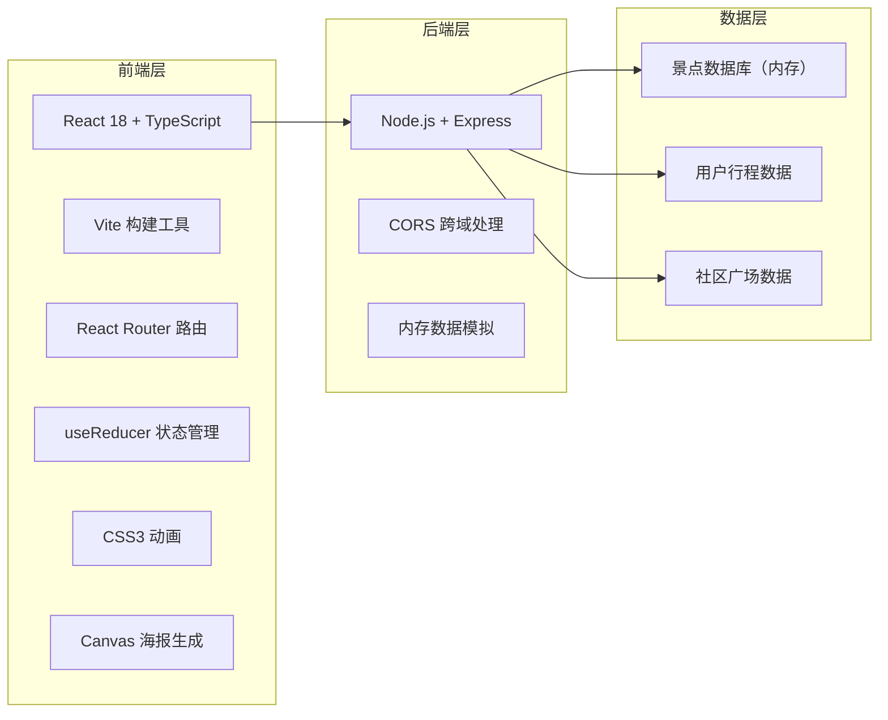

## 1. 架构设计



## 2. 技术描述
- **前端**：React 18 + TypeScript 5 + Vite 5
- **构建工具**：Vite 5，配置路径别名 `@` 指向 `src`
- **后端**：Express 4，CORS 中间件，内存模拟数据
- **样式**：原生 CSS3 + CSS 变量，无 UI 框架
- **图标**：Lucide React
- **状态管理**：React useReducer（行程数据）+ 组件本地状态
- **路由**：React Router DOM v6
- **拖拽**：HTML5 Drag and Drop API
- **海报生成**：Canvas API
- **数据**：内存模拟，uuid 生成唯一标识

## 3. 目录结构

```
auto64/
├── package.json
├── vite.config.js
├── tsconfig.json
├── index.html
├── server/
│   └── index.ts          # Express 后端服务
└── src/
    ├── main.tsx          # React 入口
    ├── App.tsx           # 主应用组件
    ├── types.ts          # 类型定义
    ├── api.ts            # API 封装
    ├── components/
    │   ├── Navbar.tsx        # 导航栏
    │   ├── PlanGenerator.tsx # 行程生成器
    │   ├── PlanEditor.tsx    # 行程编辑器
    │   ├── SpotCard.tsx      # 景点卡片
    │   ├── SpotDetail.tsx    # 景点详情
    │   ├── PosterMaker.tsx   # 海报生成器
    │   ├── Community.tsx     # 社区广场
    │   ├── PlanCard.tsx      # 社区行程卡片
    │   ├── Skeleton.tsx      # 骨架屏组件
    │   └── StarRating.tsx    # 星级评分组件
    ├── hooks/
    │   └── useDragDrop.ts    # 拖拽逻辑钩子
    ├── utils/
    │   ├── itineraryGenerator.ts # 行程生成算法
    │   └── canvasPoster.ts       # Canvas 海报工具
    └── styles/
        ├── global.css       # 全局样式
        └── variables.css    # CSS 变量
```

## 4. 路由定义

| 路由 | 页面 | 说明 |
|------|------|------|
| `/` | 行程生成页 | 首页，输入目的地和天数 |
| `/plan` | 行程编辑页 | 展示生成的行程，支持拖拽编辑 |
| `/poster` | 海报生成页 | 选择主题色，导出海报 |
| `/community` | 社区广场 | 瀑布流展示用户行程 |

## 5. API 定义

### 5.1 类型定义

```typescript
interface Spot {
  id: string;
  name: string;
  description: string;
  duration: number; // 预计游玩时长（分钟）
  recommendedTime: string; // 推荐到达时段
  openTime: string;
  ticketPrice: string;
  rating: number; // 0-5，精确到0.5
  images: string[]; // 3张图片URL
  tags: string[];
  category: 'attraction' | 'restaurant' | 'shopping';
}

interface DayPlan {
  day: number;
  spots: Spot[];
}

interface TravelPlan {
  id: string;
  destination: string;
  days: number;
  itinerary: DayPlan[];
  createdAt: string;
  theme?: string;
}

interface Comment {
  id: string;
  userId: string;
  userName: string;
  avatar: string;
  content: string;
  createdAt: string;
}

interface CommunityPost {
  id: string;
  userId: string;
  userName: string;
  avatar: string;
  plan: TravelPlan;
  likes: number;
  comments: Comment[];
  liked: boolean;
}
```

### 5.2 接口列表

| 方法 | 路径 | 说明 |
|------|------|------|
| GET | `/api/spots?destination=xxx` | 获取目的地景点列表 |
| GET | `/api/spots/search?keyword=xxx` | 模糊搜索景点/城市 |
| POST | `/api/plan/generate` | 生成行程 |
| POST | `/api/plan/publish` | 发布行程到社区 |
| GET | `/api/community` | 获取社区行程列表 |
| POST | `/api/community/:id/like` | 点赞行程 |
| POST | `/api/community/:id/comment` | 评论行程 |

## 6. 核心模块设计

### 6.1 行程生成算法 (itineraryGenerator.ts)
- 输入：目的地景点列表、出行天数
- 输出：每日行程安排（DayPlan[]）
- 策略：
  1. 按评分排序筛选TOP景点
  2. 均衡分配每日景点数量（3-5个/天）
  3. 上午安排热门景点，下午安排休闲景点，晚餐安排餐厅
  4. 自动计算推荐到达时段

### 6.2 拖拽排序 (useDragDrop.ts)
- HTML5 Drag and Drop API 封装
- 支持跨天拖拽
- 拖拽时实时计算位置
- 放置后自动重新计算时段

### 6.3 Canvas 海报生成 (canvasPoster.ts)
- 尺寸：1920x2560px（2:3比例，高清）
- 内容：目的地图标、行程要点、日期、装饰元素
- 支持8种主题渐变色
- 导出为Blob并触发下载

### 6.4 动画实现
- CSS Transition + Transform 实现60fps动画
- will-change 优化性能
- requestAnimationFrame 实现进度条动画

## 7. 性能优化

1. **代码分割**：按路由分割代码包
2. **图片懒加载**：Intersection Observer API
3. **骨架屏**：提前渲染骨架屏占位，≤200ms响应
4. **GPU加速**：transform动画使用GPU合成
5. **防抖节流**：搜索输入防抖，拖拽节流
6. **虚拟列表**：社区瀑布流使用虚拟滚动（大数据量时）
