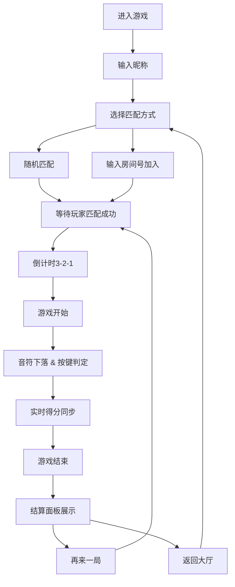

## 1. 产品概述
基于音律节奏的多人实时对战音乐游戏，玩家在音乐节拍下精准点击从屏幕上方下落的音符，与其他玩家实时PK得分。

- 核心玩法：节奏音符下落+按键命中判定+实时多人对战
- 目标用户：休闲游戏玩家、音乐游戏爱好者
- 市场价值：填补轻量级Web端多人对战音乐游戏的空白

## 2. 核心功能

### 2.1 用户角色
| 角色 | 注册方式 | 核心权限 |
|------|----------|----------|
| 普通玩家 | 输入昵称即可进入 | 匹配对战、查看排行榜、创建/加入房间 |

### 2.2 功能模块
1. **首页/大厅**：玩家昵称输入、排行榜展示、匹配入口、房间列表
2. **匹配界面**：在线玩家列表、随机匹配、房间号加入、对战邀请
3. **游戏主界面**：音符下落画布、得分面板、连击显示、倒计时
4. **结算面板**：对战结果展示、评级动画、重赛/退出按钮

### 2.3 页面详情
| 页面名称 | 模块名称 | 功能描述 |
|----------|----------|----------|
| 首页 | 排行榜 | 按总胜场排序展示玩家排名，前三名有特殊奖杯图标 |
| 首页 | 匹配入口 | 随机匹配按钮、创建房间按钮、加入房间输入框 |
| 匹配界面 | 玩家列表 | 显示在线玩家及其状态，支持发起对战邀请 |
| 匹配界面 | 房间信息 | 显示房间号、已加入玩家、开始/准备状态 |
| 游戏界面 | 音符轨道 | Canvas绘制的下落轨道，每位玩家4条轨道 |
| 游戏界面 | 判定系统 | Perfect/Good/Miss三级判定，得分和连击统计 |
| 游戏界面 | 实时对战 | 显示所有玩家的实时得分和连击情况 |
| 结算界面 | 结果展示 | 双方得分、最高连击、判定统计、综合评级 |
| 结算界面 | 赛后操作 | 再来一局按钮、退出按钮 |

## 3. 核心流程
玩家进入游戏→输入昵称→选择匹配方式（随机/房间号）→等待其他玩家加入→倒计时3-2-1→游戏开始→音符下落→玩家按键命中→实时得分同步→游戏结束→结算展示→重赛或返回大厅

## 4. 用户界面设计

### 4.1 设计风格
- 主色调：深灰背景#1a1a2e，辅以蓝/红/绿/黄四色区分玩家
- 按钮风格：圆角渐变按钮，悬停放大+投影效果，状态色过渡平滑
- 字体：现代无衬线字体，大号加粗用于标题和倒计时数字
- 布局：卡片式布局，轨道区域采用渐变半透明背景
- 动画：requestAnimationFrame驱动60fps流畅动画，粒子特效增强打击感

### 4.2 页面设计概述
| 页面名称 | 模块名称 | UI元素 |
|----------|----------|----------|
| 首页 | 排行榜 | 奖杯图标、光晕动画、玩家卡片悬停效果 |
| 匹配界面 | 玩家卡片 | 渐变边框、悬停放大、在线状态指示 |
| 游戏界面 | 轨道区域 | 半透明彩色渐变条、判定线发光效果 |
| 游戏界面 | 音符 | 圆形彩色音符、白色编号文字、命中爆炸粒子 |
| 游戏界面 | 连击提示 | 大号文字居中、上升旋转动画 |
| 结算界面 | 评级字母 | 逐个弹跳出现动画、烟花粒子背景 |

### 4.3 响应式设计
- 桌面端优先：完整显示所有玩家轨道区域
- 移动端适配：自动调整为2轨道显示，触摸按钮替代键盘输入
- 触控优化：增大点击区域，支持滑动手势

### 4.4 特效与动效
- 音符命中：爆炸粒子特效+Web Audio合成音效
- Miss反馈：屏幕红色半透明闪烁
- Perfect连击：金色闪光动画
- 倒计时：大号数字居中缩放动画
- 评级展示：字母弹跳动画+烟花粒子3秒
