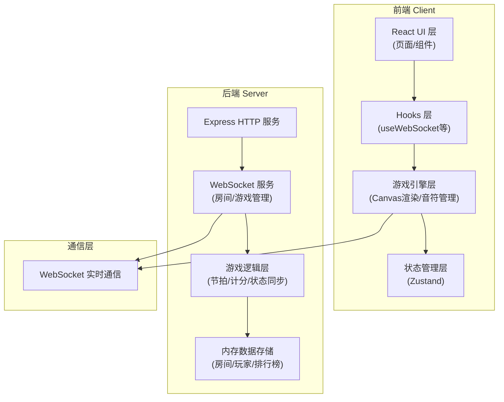
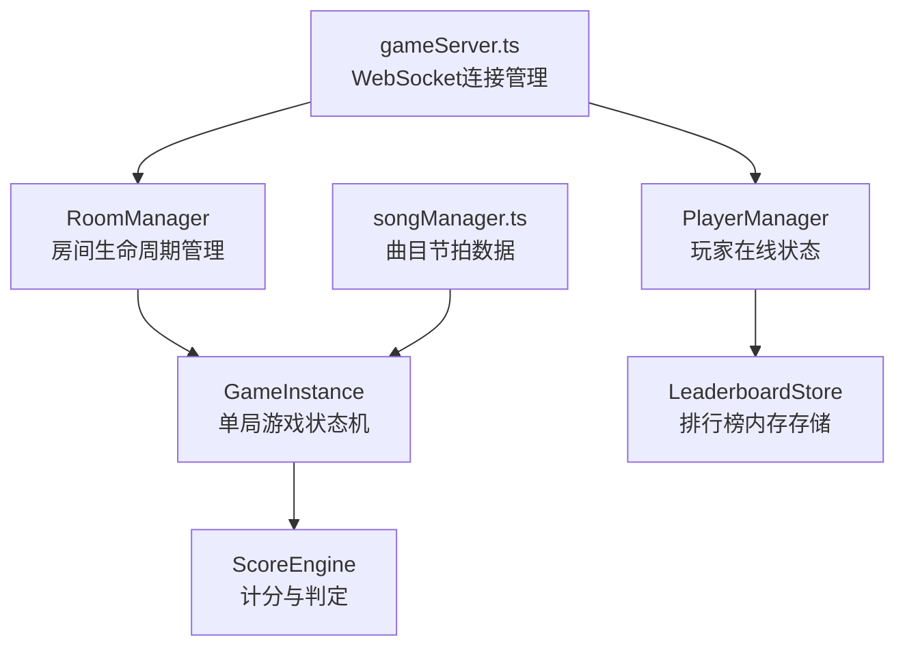

## 1. 架构设计



## 2. 技术描述
- 前端：React 18 + TypeScript + Vite
- 后端：Node.js Express + WebSocket (ws库)
- 构建工具：Vite（路径别名@指向src）
- 状态管理：Zustand
- 渲染：HTML5 Canvas + requestAnimationFrame 60fps
- 音频：Web Audio API合成音效
- 通信：WebSocket实时双向通信
- 存储：内存存储（Room、Player、Leaderboard数据）

## 3. 路由定义
| 路由 | 用途 |
|------|------|
| / | 首页/大厅（排行榜、匹配入口） |
| /match | 匹配界面（玩家列表、房间信息） |
| /game | 游戏主界面（Canvas画布、实时对战） |
| /result | 结算面板（结果展示、赛后操作） |

## 4. API / WebSocket 消息定义

### 4.1 WebSocket 消息类型
```typescript
// 客户端发送消息
type ClientMessage =
  | { type: 'JOIN_ROOM'; playerId: string; nickname: string; roomId?: string }
  | { type: 'CREATE_ROOM'; playerId: string; nickname: string }
  | { type: 'RANDOM_MATCH'; playerId: string; nickname: string }
  | { type: 'NOTE_HIT'; playerId: string; noteIndex: number; timestamp: number; trackIndex: number }
  | { type: 'GAME_READY'; playerId: string; roomId: string }
  | { type: 'RESTART_GAME'; playerId: string; roomId: string }
  | { type: 'LEAVE_ROOM'; playerId: string; roomId: string };

// 服务端发送消息
type ServerMessage =
  | { type: 'ROOM_JOINED'; roomId: string; players: Player[] }
  | { type: 'PLAYER_JOINED'; player: Player }
  | { type: 'PLAYER_LEFT'; playerId: string }
  | { type: 'GAME_COUNTDOWN'; countdown: number }
  | { type: 'GAME_START'; songData: SongData; startTime: number }
  | { type: 'SCORE_UPDATE'; playerId: string; score: ScoreData }
  | { type: 'GAME_END'; results: GameResult[] }
  | { type: 'LEADERBOARD_UPDATE'; leaderboard: LeaderboardEntry[] }
  | { type: 'ERROR'; message: string };

// 数据类型
interface Player {
  id: string;
  nickname: string;
  color: string;
  score: number;
  combo: number;
  maxCombo: number;
  perfect: number;
  good: number;
  miss: number;
}

interface Note {
  time: number;      // ms
  track: number;     // 0-3
  index: number;
}

interface SongData {
  name: string;
  bpm: number;
  duration: number;  // ms
  notes: Note[];
}

interface ScoreData {
  score: number;
  combo: number;
  maxCombo: number;
  perfect: number;
  good: number;
  miss: number;
  hitType: 'perfect' | 'good' | 'miss';
}

interface GameResult {
  playerId: string;
  nickname: string;
  score: number;
  maxCombo: number;
  perfect: number;
  good: number;
  miss: number;
  rank: 'S' | 'A' | 'B' | 'C' | 'D';
  wins: number;
}

interface LeaderboardEntry {
  playerId: string;
  nickname: string;
  wins: number;
  totalGames: number;
  winRate: number;
}
```

## 5. 服务端架构



## 6. 文件结构

```
auto65/
├── package.json
├── vite.config.js
├── tsconfig.json
├── index.html
├── server/
│   ├── gameServer.ts       # WebSocket服务、房间/游戏管理
│   └── songManager.ts      # 音乐节拍数据管理
└── src/
    ├── main.tsx            # React入口、路由
    ├── GameBoard.tsx       # 游戏主画布Canvas
    ├── NoteDrop.ts         # 音符对象类
    ├── Matchmaking.tsx     # 匹配界面
    ├── ResultPanel.tsx     # 结算面板
    ├── hooks/
    │   └── useWebSocket.ts # WebSocket连接Hook
    ├── pages/              # 页面组件
    ├── components/         # UI组件
    ├── store/              # Zustand状态管理
    └── utils/              # 工具函数
```

## 7. 性能要求
- 游戏主循环：60fps requestAnimationFrame
- WebSocket消息延迟：< 50ms
- 首屏可交互时间：< 2.5秒
- Canvas渲染优化：脏区重绘、对象池复用
