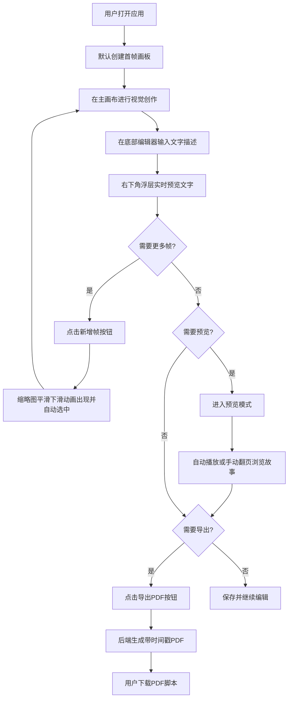

## 1. 产品概述

交互式故事板创作工具，面向动画师和故事创作者，提供可视化的序列帧画板创作、文字描述编辑、幻灯片预览以及PDF脚本导出功能。

- 核心目标：让创作者高效地组织故事序列，直观预览故事节奏，并一键导出专业的带时间戳PDF脚本
- 目标用户：动画师、故事板艺术家、编剧、影视前期策划人员
- 产品价值：简化传统故事板创作流程，将可视化创作与文字脚本紧密结合，提升协作效率

## 2. 核心功能

### 2.1 功能模块

1. **故事板编辑主界面**：画板画布、缩略图列表、文字编辑器
2. **帧管理模块**：新增帧、删除帧、拖拽排序、帧切换
3. **文字编辑模块**：富文本输入（加粗、斜体、换行）、实时浮层预览
4. **预览模式**：全屏幻灯片播放、自动播放、手动翻页、快捷键支持
5. **导出模块**：生成带时间戳的PDF脚本文件

### 2.2 页面详情

| 页面名称 | 模块名称 | 功能描述 |
|-----------|-------------|---------------------|
| 主编辑界面 | 左侧缩略图列表 | 垂直排列画板缩略图，支持新增/删除/拖拽排序，选中高亮 |
| 主编辑界面 | 中央主画布 | 显示当前帧画板，浅灰网格背景方便对齐视觉元素 |
| 主编辑界面 | 底部文字编辑器 | 富文本输入框（加粗、斜体、换行），高度自适应扩展 |
| 主编辑界面 | 画布浮层预览 | 右下角半透明毛玻璃浮层，实时显示文字预览（最多3行） |
| 预览模式 | 幻灯片播放器 | 全屏黑色背景，淡入/滑入动画展示帧内容 |
| 预览模式 | 播放控制器 | 上一帧、下一帧、自动播放按钮，键盘左右箭头支持 |
| 导出功能 | PDF生成 | 调用后端API生成带时间戳的PDF脚本并下载 |

## 3. 核心流程

## 4. 用户界面设计

### 4.1 设计风格

- **主色调**：深色侧边栏 `#2b2b2b`，浅色主工作区 `#f5f5f5`，选中高亮 `#4a9eff`
- **按钮风格**：圆角矩形，悬停时颜色微妙加深，点击有轻微反馈
- **字体**：无衬线字体族，保持现代简洁感
- **布局风格**：三栏式布局（左侧缩略图 + 中央画布 + 底部编辑器），可拖拽调整面板宽度
- **视觉效果**：毛玻璃浮层、平滑过渡动画、弹性拖拽动画、淡入/滑入切换效果

### 4.2 页面设计概述

| 页面名称 | 模块名称 | UI元素 |
|-----------|-------------|-------------|
| 主编辑界面 | 缩略图列表 | 垂直卡片排列，选中态蓝色边框 `2px solid #4a9eff`，拖拽时弹性让位动画，新增时下滑入场 |
| 主编辑界面 | 主画布 | 浅灰网格背景 (`background-image: linear-grid`)，白色画板居中，四周留白 |
| 主编辑界面 | 文字编辑器 | 工具栏（B/I按钮）+ 可扩展输入区域，最小高度60px，随内容自动增长 |
| 主编辑界面 | 浮层预览 | `backdrop-filter: blur(10px)` 毛玻璃，半透明白底，右下角定位，最多3行文字+省略号 |
| 预览模式 | 幻灯片 | 全屏黑色背景，帧内容居中，切换时向右滑入+轻微缩放，淡入过渡 |
| 预览模式 | 控制器 | 左侧垂直按钮组，播放/暂停、上/下帧图标按钮，当前帧进度指示 |

### 4.3 响应式设计

- **桌面端优先**：≥1024px 完整三栏布局
- **平板端**：768px-1024px 面板宽度自动适配
- **移动端**：<768px 侧边栏自动折叠为图标模式，画布占满主区域

### 4.4 性能指标

- 帧切换响应时间：≤100ms
- 自动播放帧率：稳定 ≥30fps
- 动画流畅度：CSS transitions 300ms cubic-bezier 曲线
