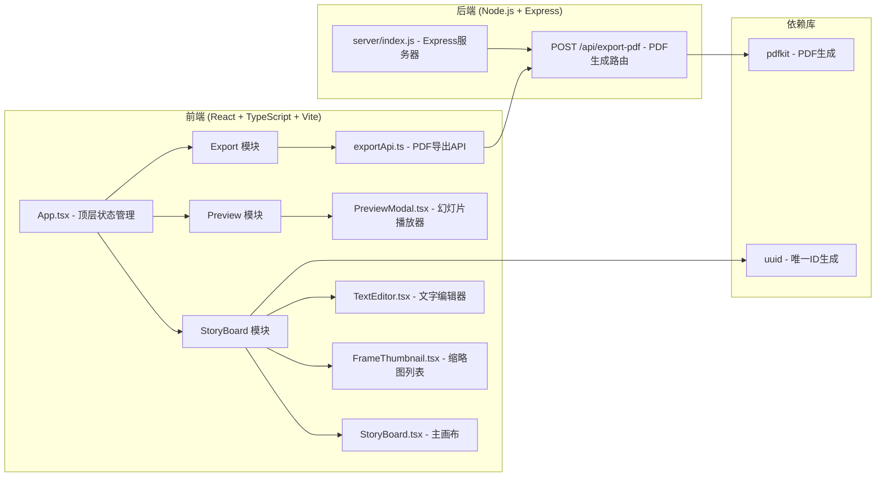

## 1. 架构设计



## 2. 技术栈说明

- **前端框架**：React 18 + TypeScript
- **构建工具**：Vite 5
- **后端框架**：Express 4
- **状态管理**：React useState/useReducer（局部状态）
- **样式方案**：原生 CSS + CSS Variables（主题色管理）
- **PDF生成**：pdfkit（后端）
- **唯一ID**：uuid
- **路径别名**：`@` → `src/`

## 3. 文件结构

```
auto66/
├── package.json
├── index.html
├── vite.config.js
├── tsconfig.json
├── server/
│   └── index.js          # Express后端 + PDF生成
└── src/
    ├── main.tsx          # React入口
    ├── App.tsx           # 顶层组件
    └── modules/
        ├── storyboard/
        │   ├── StoryBoard.tsx        # 主画布渲染与帧切换
        │   ├── FrameThumbnail.tsx    # 缩略图列表与拖拽排序
        │   └── TextEditor.tsx        # 文字编辑器与预览浮层
        ├── preview/
        │   └── PreviewModal.tsx      # 幻灯片播放器
        └── export/
            └── exportApi.ts          # PDF导出API封装
```

## 4. API 定义

### 4.1 POST /api/export-pdf

**请求体**：
```typescript
interface ExportPdfRequest {
  frames: Array<{
    id: string;
    index: number;
    description: string;  // HTML格式的富文本
    timestamp: string;    // 格式 "00:00" (分:秒)
  }>;
}
```

**响应**：
```typescript
interface ExportPdfResponse {
  success: boolean;
  downloadUrl?: string;   // 临时下载链接
  error?: string;
}
```

**响应头**：
- 成功时直接返回 `Content-Type: application/pdf` + `Content-Disposition: attachment`

## 5. 数据模型

### 5.1 Frame 帧数据

```typescript
interface Frame {
  id: string;           // uuid
  index: number;        // 帧序号（从1开始）
  description: string;  // 富文本HTML内容
  canvasData?: string;  // 画布数据URL（可选扩展）
  createdAt: number;    // 时间戳
}
```

### 5.2 应用状态

```typescript
interface AppState {
  frames: Frame[];
  currentFrameId: string | null;
  isPreviewMode: boolean;
  isAutoPlaying: boolean;
  sidebarCollapsed: boolean;
}
```

## 6. 核心交互实现方案

### 6.1 拖拽排序
- 使用原生 HTML5 Drag and Drop API
- 拖拽时计算位置，使用 CSS transform + transition 实现弹性让位动画
- 排序完成后更新 frames 数组顺序和 currentFrameId

### 6.2 富文本编辑
- 使用 `contenteditable` div 实现
- `document.execCommand('bold')` / `document.execCommand('italic')` 实现格式
- 高度自适应：监听 input 事件，设置 `height: auto` 后再设为 `scrollHeight`

### 6.3 幻灯片动画
- 入场：`opacity: 0 → 1` + `transform: translateX(30px) scale(0.98) → translateX(0) scale(1)`
- 时长：300ms，缓动：`cubic-bezier(0.4, 0, 0.2, 1)`

### 6.4 面板宽度拖拽
- 监听分隔条 mousedown → mousemove → mouseup
- 使用 CSS Variables 存储面板宽度，实时更新

### 6.5 PDF生成（后端）
- 使用 pdfkit 创建 A4 文档
- 每帧输出：帧序号 + 时间戳 + 文字描述（纯文本提取）
- 使用 `blob-stream` 将 PDF 流式返回
