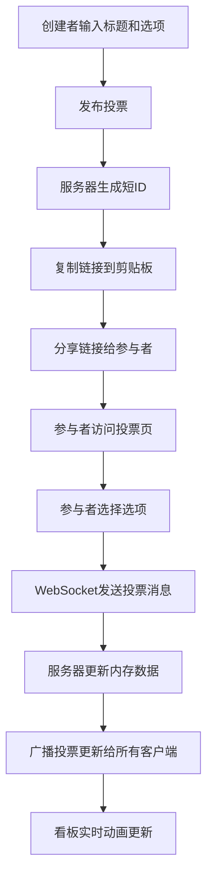

## 1. 产品概述

交互式在线投票与实时结果看板应用，为团队协作和项目管理场景提供轻量级、高反馈的投票解决方案。解决现有投票工具功能过于复杂或缺乏直观交互反馈的痛点。

- 核心用户：团队成员、项目管理者、会议组织者
- 核心价值：快速发起投票、实时结果可视化、直观的交互动画反馈

## 2. 核心功能

### 2.1 用户角色

| 角色 | 注册方式 | 核心权限 |
|------|----------|----------|
| 投票创建者 | 无需注册，本地存储 | 创建投票、查看历史投票、导出CSV数据 |
| 投票参与者 | 无需注册，通过链接访问 | 参与投票、查看实时看板、修改选择（如允许） |

### 2.2 功能模块

1. **投票创建页面**：标题输入、选项管理、拖拽排序、发布分享
2. **投票参与页面**：标题展示、选项选择、动画反馈
3. **实时结果看板**：柱状图展示、环形进度条、数字跳动动画
4. **投票历史页面**：创建记录列表、详情跳转、CSV导出

### 2.3 页面详情

| 页面名称 | 模块名称 | 功能描述 |
|----------|----------|----------|
| 首页/投票创建 | 标题输入 | 输入投票标题，最多100字符，实时计数 |
| 首页/投票创建 | 选项管理 | 添加/删除选项，每个选项最多50字符，最少2个最多8个选项 |
| 首页/投票创建 | 拖拽排序 | 选项支持拖拽调整顺序 |
| 首页/投票创建 | 重投设置 | 开关控制是否允许参与者修改选择 |
| 首页/投票创建 | 发布按钮 | 发布投票后返回短ID，自动复制链接到剪贴板 |
| 投票参与页 | 投票标题 | 淡入动画显示投票标题 |
| 投票参与页 | 选项列表 | 卡片式选项，悬停上浮，选中放大渐变动画 |
| 投票参与页 | 重投交互 | 允许修改时，旧选项缩回动画，新选项选中动画 |
| 实时看板 | 柱状图 | 横向柱状图展示各选项得票比例，顶部百分比 |
| 实时看板 | 环形进度条 | 环形进度条展示得票比例 |
| 实时看板 | 数字动画 | 计数器跳动动画，0.5秒从旧值过渡到新值 |
| 投票历史 | 列表展示 | 时间倒序排列，显示标题、选项数、总票数、创建时间 |
| 投票历史 | 详情跳转 | 点击条目进入对应投票看板 |
| 投票历史 | CSV导出 | 导出投票数据为CSV文件 |

## 3. 核心流程

用户创建投票 → 系统生成短ID → 分享链接给参与者 → 参与者打开链接投票 → WebSocket实时广播结果 → 所有客户端看板动态更新

## 4. 用户界面设计

### 4.1 设计风格

- **主色调**：霓虹渐变 #e94560 → #0f3460
- **背景色**：深灰色 #16213e
- **看板背景**：深色 #1a1a2e
- **高亮色**：#e94560
- **底色**：#0f3460
- **警示色**：#ff6b6b（重连提示条）
- **字体**：粗体无衬线字体（标题）、现代无衬线字体（正文）
- **按钮风格**：圆角矩形、渐变填充、悬停阴影加深
- **卡片风格**：圆角矩形、投影效果、悬停上浮

### 4.2 页面设计概述

| 页面名称 | 模块名称 | UI元素 |
|----------|----------|--------|
| 投票创建页 | 标题区 | 居中展示、霓虹渐变描边输入框、字符计数 |
| 投票创建页 | 选项区 | 卡片列表、拖拽手柄、添加/删除按钮 |
| 投票创建页 | 发布区 | 开关组件、渐变主按钮、复制成功提示条 |
| 投票参与页 | 标题区 | 淡入动画、大字号粗体 |
| 投票参与页 | 选项区 | 卡片网格布局、悬停上浮、选中放大渐变 |
| 实时看板 | 标题区 | 小字号标签、总票数展示 |
| 实时看板 | 柱状图区 | 横向条形、渐变填充、百分比标签 |
| 实时看板 | 环形图区 | 圆形进度、霓虹发光效果 |
| 投票历史页 | 列表区 | 卡片列表、时间戳、操作按钮 |

### 4.3 响应式设计

- **桌面端**：看板图水平排列（柱状图 + 环形进度条并排）
- **移动端**：看板图垂直堆叠，图表宽度自适应屏幕
- **触摸优化**：点击区域最小44x44px，手势友好

### 4.4 动画与反馈

- **页面加载**：标题和选项淡入动画（0.5s）
- **选项选中**：放大+渐变动画（0.3s，从底部到顶部渐变填充）
- **选项取消**：缩回+渐变还原动画（0.2s）
- **柱状图更新**：宽度平滑过渡（0.5s，requestAnimationFrame驱动60fps）
- **环形图更新**：圆弧角度平滑过渡（0.5s）
- **数字跳动**：计数器递增动画（0.5s）
- **悬停效果**：卡片轻微上浮+投影变深10%
- **WebSocket重连**：顶部半透明红色提示条
