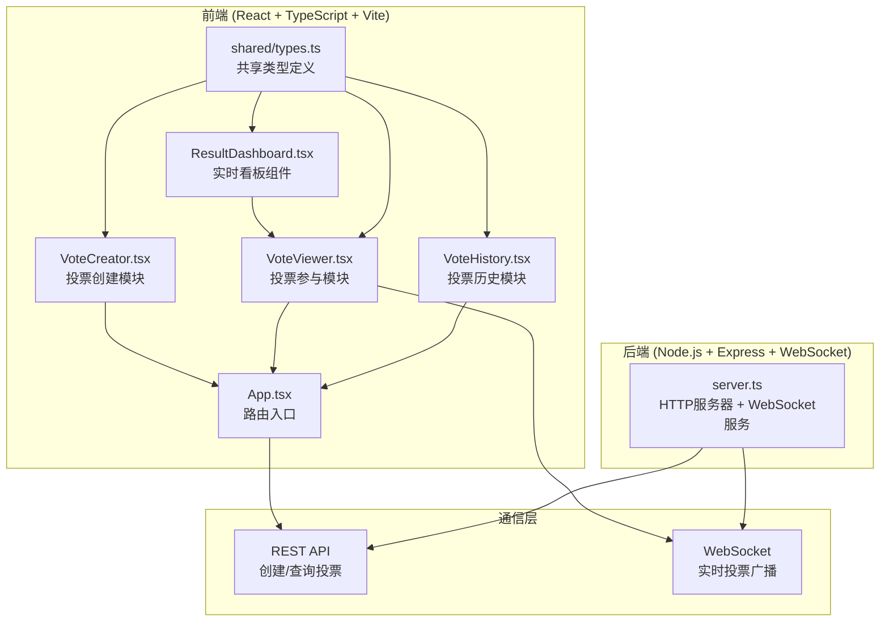
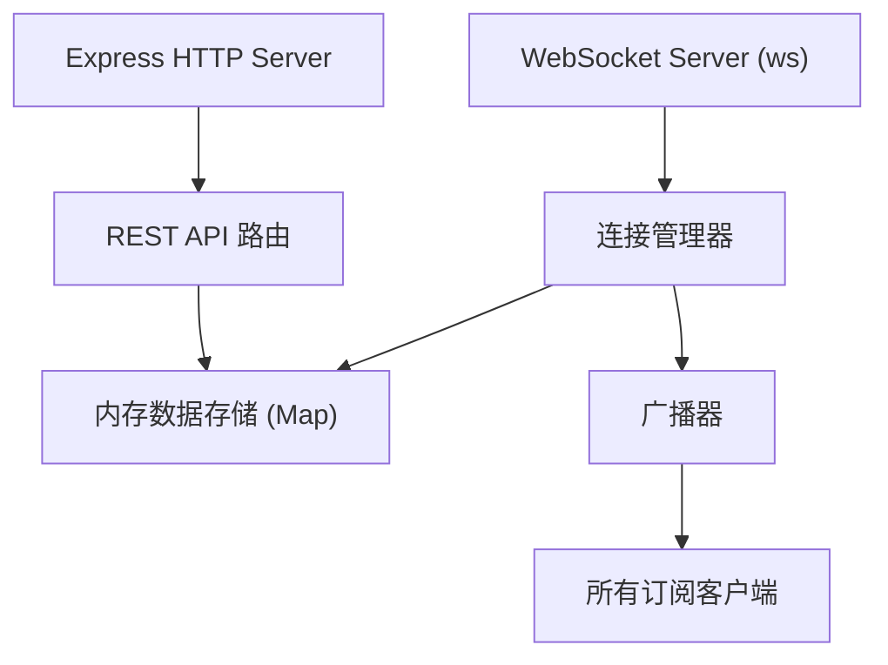

## 1. 架构设计



## 2. 技术描述

- **前端框架**：React 18 + TypeScript
- **构建工具**：Vite 5（路径别名 @ 指向 src）
- **路由管理**：React Router DOM（hash模式，避免服务器路由配置）
- **状态管理**：React Hooks (useState, useEffect, useRef)
- **拖拽功能**：原生 HTML5 Drag & Drop API
- **后端服务**：Express 4（HTTP服务） + ws（WebSocket实时通信）
- **数据存储**：内存存储（Map数据结构）
- **ID生成**：uuid v4（短ID截取前8位）
- **图表实现**：原生 Canvas + requestAnimationFrame 实现60fps动画
- **样式方案**：原生 CSS + CSS Variables（主题系统）

## 3. 路由定义

| 路由 | 页面组件 | 用途 |
|------|----------|------|
| / | VoteCreator | 首页 - 创建投票 |
| /vote/:id | VoteViewer | 投票参与页 |
| /vote/:id/dashboard | ResultDashboard | 独立看板页 |
| /history | VoteHistory | 投票历史页 |

## 4. API 定义

### 4.1 REST API

#### 创建投票
```typescript
// POST /api/votes
interface CreateVoteRequest {
  title: string;           // 投票标题 (1-100字符)
  options: string[];       // 选项列表 (2-8个，每个1-50字符)
  allowChangeVote: boolean; // 是否允许修改选择
}

interface CreateVoteResponse {
  id: string;              // 短ID (8位)
  title: string;
  options: VoteOption[];
  allowChangeVote: boolean;
  createdAt: number;
}
```

#### 查询投票
```typescript
// GET /api/votes/:id
interface GetVoteResponse {
  id: string;
  title: string;
  options: VoteOption[];
  allowChangeVote: boolean;
  createdAt: number;
  totalVotes: number;
}
```

### 4.2 WebSocket 消息协议

```typescript
// 客户端 -> 服务端
interface ClientMessage {
  type: 'subscribe' | 'vote' | 'unsubscribe';
  voteId: string;
  payload?: {
    optionId: string;      // vote类型需要
    voterId?: string;      // 参与者ID（localStorage生成）
    previousOptionId?: string; // 修改投票时的旧选项ID
  };
}

// 服务端 -> 客户端
interface ServerMessage {
  type: 'voteUpdate' | 'initialState' | 'error';
  voteId: string;
  payload: {
    options: { id: string; votes: number }[];
    totalVotes: number;
  };
}
```

## 5. 服务端架构



**模块职责**：
- `Express Server`：托管静态文件、处理REST API请求
- `WebSocket Server`：管理客户端连接、处理实时消息
- `连接管理器`：维护voteId -> 客户端连接列表的映射
- `内存数据存储`：使用Map存储所有投票数据（投票信息、选项票数）
- `广播器`：将投票更新推送到所有订阅的客户端

## 6. 数据模型

### 6.1 共享类型定义

```typescript
// shared/types.ts

interface VoteOption {
  id: string;
  text: string;
  votes: number;
}

interface Vote {
  id: string;
  title: string;
  options: VoteOption[];
  allowChangeVote: boolean;
  createdAt: number;
  voterSelections: Map<string, string>; // voterId -> optionId
}

interface VoteUpdateMessage {
  voteId: string;
  optionId: string;
  previousOptionId?: string;
  timestamp: number;
}
```

### 6.2 数据流向

```
用户创建投票 → REST API POST /api/votes → 服务端生成Vote对象 → 返回短ID
用户参与投票 → WebSocket发送vote消息 → 服务端更新votes计数 → 广播给所有订阅客户端
客户端接收广播 → 更新本地状态 → requestAnimationFrame触发图表动画 → 60fps平滑渲染
```

## 7. 文件结构

```
auto67/
├── package.json              # 依赖与脚本配置
├── vite.config.js            # Vite构建配置（路径别名@）
├── tsconfig.json             # TypeScript严格模式配置
├── index.html                # 入口HTML
├── shared/
│   └── types.ts              # 前后端共享类型定义
└── src/
    ├── main.tsx              # React入口
    ├── App.tsx               # 路由配置
    ├── server.ts             # Express + WebSocket后端
    ├── VoteCreator.tsx       # 投票创建组件
    ├── VoteViewer.tsx        # 投票参与组件
    ├── ResultDashboard.tsx   # 实时看板组件
    ├── VoteHistory.tsx       # 投票历史组件
    ├── hooks/
    │   └── useAnimatedNumber.ts  # 数字跳动动画Hook
    └── styles/
        ├── global.css        # 全局样式与CSS变量
        └── animations.css    # 关键帧动画定义
```
