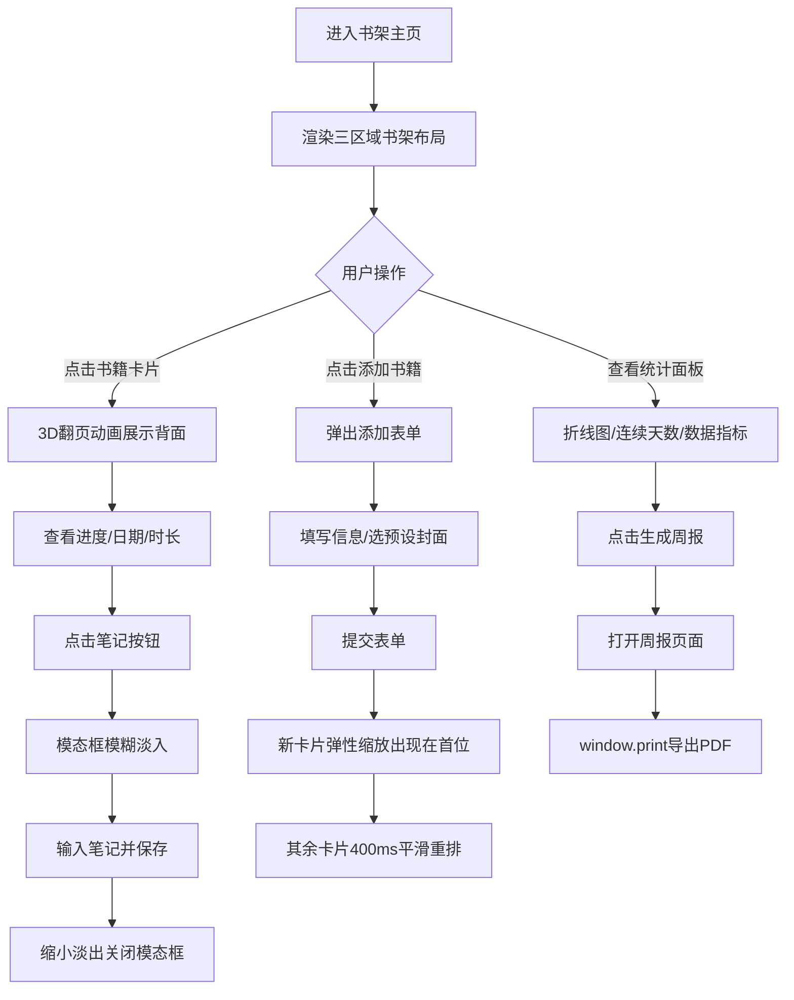

## 1. 产品概述

虚拟书架与阅读进度追踪系统，为阅读爱好者提供数字化书籍管理与阅读数据可视化服务。用户可在虚拟木质书架上管理想读、在读、已读三类书籍，追踪每本书的阅读进度、添加读书笔记，并自动生成个人阅读统计报告与周报。

- **核心价值**：将实体书架的视觉美感与数字化阅读追踪功能结合，通过精美的3D翻页动画和木质纹理界面营造沉浸式阅读管理体验
- **目标用户**：热爱阅读、希望系统化管理书单并追踪阅读习惯的个人用户

---

## 2. 核心功能

### 2.1 用户角色

| 角色 | 注册方式 | 核心权限 |
|------|----------|----------|
| 普通用户 | 无需注册，本地数据存储 | 添加/编辑/删除书籍、记录阅读进度、添加笔记、查看统计报告、生成周报 |

### 2.2 功能模块

1. **主界面（书架视图）**：木质纹理书架背景、三区域分区展示、书籍卡片网格布局、添加书籍按钮
2. **书籍卡片模块**：书籍封面展示、3D翻页动画、阅读进度条（圆形百分比+直线进度）、阅读日期时长、笔记入口
3. **笔记模态框**：半透明模糊背景、文本输入、保存/关闭动画
4. **添加书籍表单**：书名/作者/页数输入、封面URL或预设名著选择、状态选择（想读/在读/已读）
5. **统计面板**：本周阅读时长、本月读完数量、连续阅读天数火焰指示、7天阅读折线图、周报生成按钮
6. **周报页面**：每日阅读时间分布、笔记数量统计、PDF打印导出

### 2.3 页面详情

| 页面名称 | 模块名称 | 功能描述 |
|----------|----------|----------|
| 书架主页 | 书架背景 | CSS渐变模拟木质纹理，分为已读/在读/想读三层隔板区域 |
| 书架主页 | 书籍卡片 | 1:1.4封面卡片，hover微抬升效果，点击触发3D翻页动画（0.6s cubic-bezier） |
| 书架主页 | 卡片背面 | 圆形SVG进度环（百分比）+ 文字进度条、开始日期、上次阅读时长（分钟）、笔记按钮 |
| 书架主页 | 添加书籍 | 顶部按钮弹出表单，提交后新卡片以spring弹性缩放动画出现，其余卡片平滑重排（400ms） |
| 笔记模态框 | 背景效果 | backdrop-filter blur(8px) 淡入0.3s，关闭时modal缩小+淡出0.25s |
| 统计面板 | 数据指标 | 本周总时长（小时保留1位）、本月读完数、🔥连续天数（中断变灰色🔥） |
| 统计面板 | 折线图 | Recharts渲染最近7天每天阅读时长曲线，渐变填充区域 |
| 统计面板 | 周报生成 | 打开独立周报页面，展示每日分布和笔记数，window.print()支持PDF导出 |

---

## 3. 核心流程

**主用户流程描述**：用户进入书架主页 → 浏览三区域书籍 → 点击书籍卡片翻页查看进度 → 点击笔记按钮添加/编辑笔记 → 点击顶部添加按钮录入新书（选择预设封面或自定义URL） → 查看右侧统计面板了解阅读习惯 → 点击生成周报打印个人阅读总结。

---

## 4. 用户界面设计

### 4.1 设计风格

**设计方向**：温暖质感的书房风格，营造沉浸感与文化气息

- **主色调**：木质棕色 `#8B5E3C`（书架/强调元素）、米白色 `#F5F0E1`（卡片背景/文字区域）、墨绿色 `#2E4A2A`（进度条/按钮/强调色）
- **辅助色**：深棕 `#6B4423`（书架层板阴影）、暖金 `#C9A86C`（装饰边框）、纸黄 `#FAF6EB`（笔记区背景）
- **字体**：衬线体栈 `'Georgia', 'Playfair Display', 'Noto Serif SC', serif` —— 标题加粗，正文常规
- **按钮风格**：圆角6px，墨绿色填充+米色文字，hover时亮度提升8%，box-shadow 2px 4px 12px rgba(46,74,42,0.25)
- **卡片阴影**：统一 `2px 2px 8px #0000001A`，hover时阴影增强为 `4px 6px 16px rgba(0,0,0,0.12)` + translateY(-2px)
- **图标风格**：线性图标，火焰🔥emoji用于连续天数指示

### 4.2 页面设计概述

| 页面名称 | 模块名称 | UI 元素 |
|----------|----------|---------|
| 书架主页 | 整体布局 | 左侧75%书架区 + 右侧25%统计面板，最大宽度1440px居中，flex布局 |
| 书架主页 | 书架区域 | 三层隔板（已读在上/在读居中/想读在下），每层header带区域标签+数量徽标，flex-wrap网格 |
| 书架主页 | 书架纹理 | repeating-linear-gradient + radial-gradient 叠加模拟木纹节疤，层板底部10px深棕阴影 |
| 书架主页 | 书籍卡片 | 固定宽140px高196px（1:1.4），封面图object-fit:cover，底部书名条米色半透明 |
| 书架主页 | 卡片背面 | SVG圆形进度环（r=36, stroke-dasharray动画）、直线进度条div、日期文本行、按钮组 |
| 添加表单 | 表单弹窗 | 米色卡片背景，表单元素左对齐，预设封面横向滚动选择区，选中有墨绿边框 |
| 笔记模态框 | 模态框 | 米色圆角卡片，textarea高度180px边框浅棕，保存按钮墨绿填充 |
| 统计面板 | 数据卡片 | 三项指标横向排列（flex），每卡片米色圆角，🔥图标24px |
| 统计面板 | 折线图 | 280x160px，曲线墨绿，下方渐变填充从墨绿50%→透明，数据点白色圆点 |
| 周报页面 | 打印适配 | @media print优化，隐藏导航，A4纸尺寸，分页控制 |

### 4.3 响应式

- **桌面优先**：>1280px 采用书架75% + 面板25%布局
- **平板**：768-1280px 统计面板移至书架下方，宽度100%，两列指标网格
- **移动端**：<768px 卡片宽度自适应为45%两列，面板单列堆叠，图表宽度100%

### 4.4 动画与性能规范

- 3D翻页：`perspective: 1000px` + `transform: rotateY(180deg)`，`backface-visibility: hidden`，0.6s `cubic-bezier(0.4, 0, 0.2, 1)`
- 卡片出现：`transform: scale(0.3) → scale(1.08) → scale(1)`，总计450ms弹性曲线
- 卡片重排：CSS Grid/Flex自动布局 + `transition: transform 400ms ease, opacity 400ms ease`
- 模态框：打开时`backdrop-filter`从0→blur(8px) 0.3s，modal从`scale(0.9) opacity(0)`→`scale(1) opacity(1)`；关闭反向0.25s
- **性能要求**：10本书渲染≤500ms（使用React.memo卡片），翻页动画稳定≥30fps（will-change: transform）
