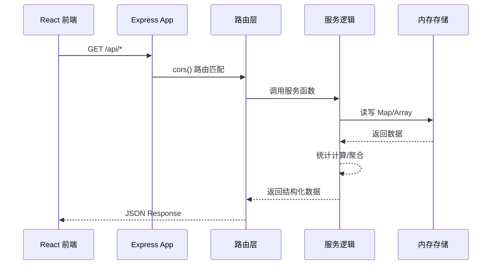
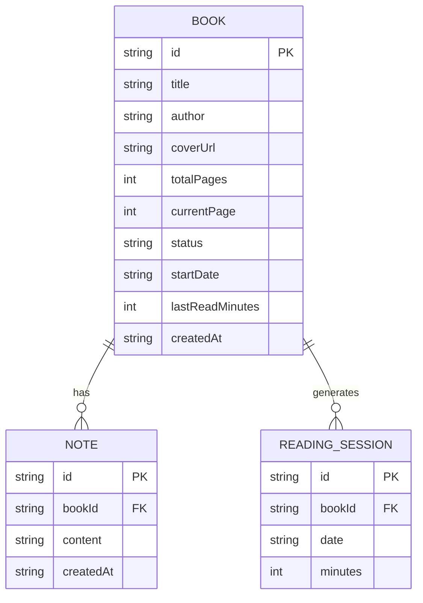

## 1. 架构设计

```mermaid
graph TD
    subgraph "客户端 (React 18 + TypeScript + Vite 前端渲染层
    A["BrowserRouter 路由"] --> B["App.tsx 全局状态/布局"]
    B --> C["BookShelf 书架主区"]
    B --> D["StatsPanel 统计面板"]
    B --> E["WeeklyReport 周报页"]
    C --> C1["BookCard x N (React.memo)"]
    C --> C2["AddBookForm 添加书籍表单"]
    C --> C3["NoteModal 笔记模态框"]
    D --> D1["Recharts 折线图"]
    E --> E1["jsPDF / window.print"]
    F["api.ts axios封装层"] --> C
    F --> D
    F --> E
    end
    F <-->|REST JSON| G["Express 4.x + CORS"]
    subgraph "Node.js 后端 API 层
    G --> H["内存存储 (Map / Array)"]
    G --> I["统计计算中间件"]
    H --> H1["books: Book[]"]
    H --> H2["readingSessions: Session[]"]
    H --> H3["notes: Note[]"]
    I --> I1["周/月聚合"]
    I --> I2["连续天数算法"]
    end
```

---

## 2. 技术描述

- **前端框架**：React 18 + TypeScript 严格模式 + Vite 构建
- **前端初始化**：`npm create vite-init@latest -- --template react-ts（后续按需求增删依赖）
- **样式方案**：原生 CSS + CSS Modules 变量 + @keyframes 动画
- **后端**：Express 4.x + CORS 中间件，内存数据结构持久化
- **数据存储**：Node.js 内存存储（服务运行时持久，进程重启重置）+ 预置 20 本名著默认数据
- **图表库**：Recharts（折线图）
- **PDF 方案**：jspdf + 浏览器 window.print() 周报打印
- **状态管理**：React useState + useReducer（轻量场景无需 zustand）
- **路由**：react-router-dom（主页 `/`、周报页 `/weekly-report`）

---

## 3. 路由定义

| 路由路径 | 页面组件 | 用途说明 |
|----------|----------|----------|
| `/` | `App`（含 `BookShelf` + `StatsPanel`） | 书架主页，三区域书架 + 统计面板主界面 |
| `/weekly-report` | `WeeklyReport` | 周报页面，展示一周阅读数据，支持打印/PDF |

---

## 4. API 定义

### 4.1 共享类型

```typescript
// BookStatus = 'to-read' | 'reading' | 'finished'

interface Book {
  id: string;                 // uuid
  title: string;
  author: string;
  coverUrl: string;
  totalPages: number;
  currentPage: number;
  status: BookStatus;
  startDate: string | null;     // ISO date
  lastReadMinutes: number;
  createdAt: string;
}

interface Note {
  id: string;
  bookId: string;
  content: string;
  createdAt: string;
}

interface ReadingSession {
  id: string;
  bookId: string;
  date: string;        // YYYY-MM-DD
  minutes: number;
}

interface WeeklyStats {
  weekTotalHours: number;         // 本周总时长（小时）
  monthFinishedCount: number;  // 本月读完数量
  streakDays: number;         // 连续阅读天数
  streakActive: boolean;      // 火焰是否激活（今日是否阅读）
  dailyMinutes: { date: string; minutes: number }[];  // 最近7天
}

interface WeeklyReport {
  dateRange: { start: string; end: string };
  dailyBreakdown: { date: string; minutes: number; noteCount: number }[];
  totalHours: number;
  booksRead: string[];
  totalNotes: number;
}
```

### 4.2 端点清单

| Method | Path | 入参 | 返回 | 说明 |
|--------|------|------|------|------|
| `GET` | `/api/books` | — | `Book[]` | 获取全部书籍 |
| `POST` | `/api/books` | `{title,author,coverUrl,totalPages,currentPage?,status?}` | `Book` | 新增书籍 |
| `PUT` | `/api/books/:id` | `Partial<Book>` | `Book` | 更新书籍（进度/状态） |
| `DELETE` | `/api/books/:id` | — | `{success:true}` | 删除书籍 |
| `GET` | `/api/books/:id/notes` | — | `Note[]` | 单本书笔记列表 |
| `POST` | `/api/books/:id/notes` | `{content:string}` | `Note` | 新增笔记 |
| `GET` | `/api/stats/weekly` | — | `WeeklyStats` | 统计面板数据 |
| `GET` | `/api/stats/report` | `?weeksAgo?=0` | `WeeklyReport` | 周报数据 |
| `GET` | `/api/preset-books` | — | `PresetBook[]` | 20本预设名著目录（封面/作者）

---

## 5. 服务器架构



**文件分层**：
- 路由层 `server/server.ts`（单文件组织，含 `express.Router()`）
- 服务逻辑内嵌于路由处理器内（本项目规模下不拆分 server 模块）
- 内存存储模块：顶层 `const store = { books: [], notes: [], sessions: [] }`

---

## 6. 数据模型

### 6.1 ER 关系图



### 6.2 初始数据

启动时注入 20 本预置名著数据：

| 书名 | 作者 | 页数 |
|------|------|------|
| 红楼梦 | 曹雪芹 | 1606 |
| 三国演义 | 罗贯中 | 1200 |
| 西游记 | 吴承恩 | 1008 |
| 水浒传 | 施耐庵 | 1200 |
| 百年孤独 | 马尔克斯 | 360 |
| 1984 | 乔治·奥威尔 | 328 |
| 追忆似水年华 | 普鲁斯特 | 4200 |
| 战争与和平 | 托尔斯泰 | 1225 |
| 罪与罚 | 陀思妥耶夫斯基 | 670 |
| 傲慢与偏见 | 简·奥斯汀 | 432 |
| 简爱 | 夏洛蒂·勃朗特 | 532 |
| 巴黎圣母院 | 雨果 | 550 |
| 悲惨世界 | 雨果 | 1463 |
| 活着 | 余华 | 191 |
| 围城 | 钱钟书 | 359 |
| 白鹿原 | 陈忠实 | 684 |
| 平凡的世界 | 路遥 | 1627 |
| 挪威的森林 | 村上春树 | 384 |
| 追风筝的人 | 胡赛尼 | 362 |
| 小王子 | 圣埃克苏佩里 | 97 |
