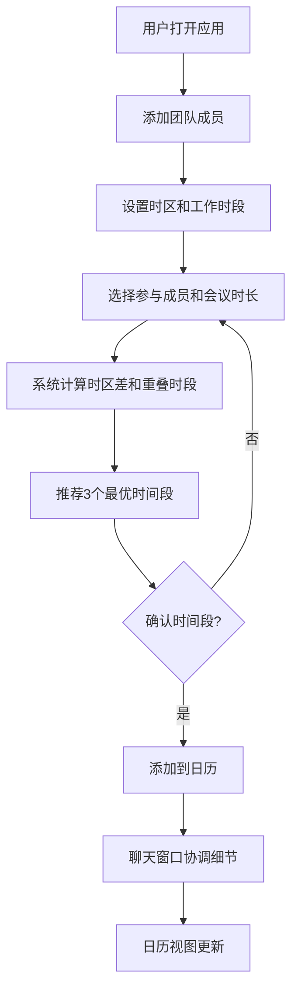

## 1. 产品概述
团队跨时区协作日历与自动化时间建议应用，旨在解决远程团队因时区差异导致的沟通和会议安排效率低下问题。系统支持成员设置各自时区与工作时段，自动检测最佳会议时间，并通过内嵌聊天窗口协调日程。

- 目标用户：跨时区远程办公团队
- 核心价值：消除时区计算负担，智能推荐最优会议时间，实时协调日程

## 2. 核心功能

### 2.1 用户角色
| 角色 | 注册方式 | 核心权限 |
|------|----------|----------|
| 团队成员 | 手动添加 | 设置时区、工作时段、参与会议推荐 |
| 团队管理员 | 手动添加 | 添加/删除成员、创建会议、管理日程 |

### 2.2 功能模块
1. **主页面**：左侧成员面板 + 右侧日历视图 + 底部推荐卡片 + 右下角聊天窗口
2. **成员管理面板**：成员卡片列表、添加/删除成员、时区设置
3. **日历视图**：当月日历、会议标签、月切换导航
4. **自动推荐面板**：3个最优时间段推荐、重叠人数显示
5. **聊天窗口**：实时消息收发、表情选择、日程绑定

### 2.3 页面详情
| 页面名称 | 模块名称 | 功能描述 |
|----------|----------|----------|
| 主页面 | 成员管理面板 | 添加/删除成员，设置时区和工作时段，成员卡片展示头像首字母、时区偏移、在线状态 |
| 主页面 | 日历视图 | 当月日历展示已确认会议，彩色标签按人数区分，月切换动画，显示会议总数和冲突数 |
| 主页面 | 自动推荐面板 | 选择参与成员和会议时长，自动推荐3个最优时间段，显示各成员本地时间和重叠百分比 |
| 主页面 | 聊天窗口 | 对推荐时间段发起快速聊天，消息带头像和时间戳，表情选择器，日程绑定切换 |

## 3. 核心流程

用户打开应用 → 左侧面板添加团队成员（设置时区和工作时段）→ 选择参与成员和会议时长 → 系统自动计算时区差和工作时段重叠 → 推荐3个最优时间段 → 用户确认时间段 → 日历视图显示会议 → 通过聊天窗口协调日程细节

## 4. 用户界面设计

### 4.1 设计风格
- 主色调：深蓝色（#1A237E）与白色对比
- 辅助色：浅灰背景（#F5F5F5）、浅蓝渐变卡片（#E3F2FD → #BBDEFB）
- 按钮风格：圆角8px，点击0.2秒弹性缩放反馈
- 字体：系统无衬线字体，标题加粗18px
- 布局：左侧固定280px成员面板 + 右侧自适应日历区域
- 圆角统一：8px（小组件）或12px（卡片）

### 4.2 页面设计概览
| 页面名称 | 模块名称 | UI元素 |
|----------|----------|--------|
| 主页面 | 成员管理面板 | 浅灰背景280px固定宽，成员卡片8px上下间距，悬停浅蓝背景+3px蓝色左边框，渐入动画，在线绿/灰圆点 |
| 主页面 | 日历视图 | 深蓝标题行加粗18px+左右箭头导航（悬停缩放），会议圆角彩色标签（1-3人浅蓝/4-6人浅橙/7+人浅红），底部会议总数+冲突红感叹号，月切换水平滑动动画 |
| 主页面 | 推荐面板 | 半透明渐变蓝卡片（#E3F2FD→#BBDEFB），圆角12px，轻微阴影外发光，从底部滑入显示 |
| 主页面 | 聊天窗口 | 右下角固定320×400px，可拖拽移动，最小化时头像竖条，消息左侧头像首字母+本地时间戳，底部淡入，12个表情弹出选择器 |

### 4.3 响应式设计
- 桌面优先设计
- 768px以下：左侧成员面板折叠为汉堡菜单，日历全宽显示
- 触摸优化：按钮和卡片适配触摸操作

### 4.4 动效设计
- 页面加载：各模块0.5秒错开淡入
- 成员卡片添加：渐入动画
- 推荐卡片：从底部滑入
- 月切换：水平滑动动画
- 新消息：从底部淡入
- 交互按钮：0.2秒弹性缩放
