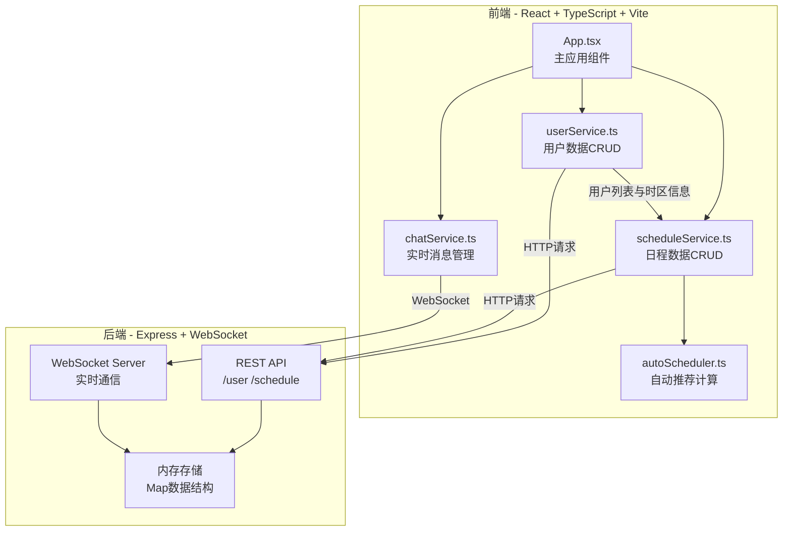
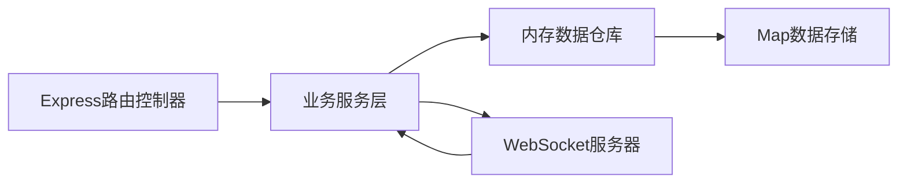
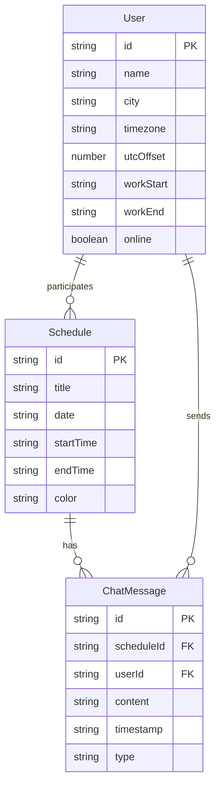

## 1. 架构设计



## 2. 技术说明
- 前端：React@18 + TypeScript + Vite + Tailwind CSS + Zustand
- 初始化工具：vite-init（react-express-ts模板）
- 后端：Express@4 + ws（WebSocket）
- 数据库：内存存储（Map数据结构）
- 实时通信：WebSocket（ws库）

## 3. 路由定义
| 路由 | 用途 |
|------|------|
| / | 主页面，包含成员面板、日历视图、推荐面板、聊天窗口 |

## 4. API定义

### 4.1 用户管理 API
| 方法 | 路径 | 描述 | 请求体 | 响应 |
|------|------|------|--------|------|
| GET | /api/users | 获取所有用户 | - | User[] |
| POST | /api/users | 添加用户 | { name, city, timezone, workStart, workEnd } | User |
| DELETE | /api/users/:id | 删除用户 | - | { success: boolean } |

### 4.2 日程管理 API
| 方法 | 路径 | 描述 | 请求体 | 响应 |
|------|------|------|--------|------|
| GET | /api/schedules | 获取所有日程 | - | Schedule[] |
| POST | /api/schedules | 创建日程 | { title, date, startTime, endTime, participantIds } | Schedule |
| DELETE | /api/schedules/:id | 删除日程 | - | { success: boolean } |
| POST | /api/schedules/recommend | 推荐会议时间 | { participantIds, duration } | Recommendation[] |

### 4.3 数据类型定义
```typescript
interface User {
  id: string;
  name: string;
  city: string;
  timezone: string;
  utcOffset: number;
  workStart: string;
  workEnd: string;
  online: boolean;
}

interface Schedule {
  id: string;
  title: string;
  date: string;
  startTime: string;
  endTime: string;
  participantIds: string[];
  color: string;
}

interface Recommendation {
  startTime: string;
  endTime: string;
  overlapCount: number;
  overlapPercent: number;
  participantLocalTimes: { userId: string; localTime: string }[];
}

interface ChatMessage {
  id: string;
  scheduleId: string;
  userId: string;
  content: string;
  timestamp: string;
  type: 'text' | 'emoji';
}
```

## 5. 服务器架构图



## 6. 数据模型

### 6.1 数据模型定义



### 6.2 数据初始化
- 时区数据库：预置50+主流城市及其UTC偏移量
- 初始用户：空
- 初始日程：空
- 聊天消息：空

## 7. 文件调用关系与数据流向

### 前端模块调用关系
- `App.tsx` → 组合 `userService`、`scheduleService`、`chatService` 的UI组件
- `userService.ts` → 调用后端 `/api/users`，输出用户列表给 `scheduleService`
- `scheduleService.ts` → 接收 `userService` 的用户列表，调用后端 `/api/schedules`
- `autoScheduler.ts` → 从 `scheduleService` 获取日程数据 → 计算权重 → 输出排序后的时间段列表
- `chatService.ts` → WebSocket连接后端，消息流：用户输入 → ws服务器 → 广播给参与者

### 后端数据流向
- REST请求 → Express路由 → 业务逻辑 → 内存Map存储
- WebSocket消息 → ws服务器 → 广播给同日程参与者
