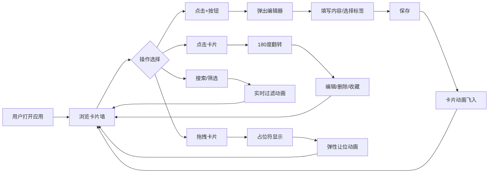

## 1. 产品概述

灵感速记板是一款面向创意工作者的灵感碎片记录与可视化管理工具，解决创意灵感来临时无法快速记录、整理和回溯的痛点。通过卡片墙形式直观展示，支持拖拽排序、标签分类、搜索过滤等功能，让每一个灵感都被妥善保存和高效管理。

## 2. 核心功能

### 2.1 功能模块

1. **卡片墙主页面**: 三列瀑布流布局展示、浮动新增按钮、搜索过滤栏
2. **卡片编辑器**: 标题输入、内容编辑、颜色标签选择、Emoji图标选择
3. **卡片交互**: 翻转动画、拖拽排序、收藏置顶、编辑删除操作
4. **搜索筛选**: 关键词搜索、按时间排序、按颜色筛选、按收藏状态筛选

### 2.2 页面详情

| 页面名称 | 模块名称 | 功能描述 |
|-----------|-------------|---------------------|
| 主页面 | 卡片墙 | 三列瀑布流布局展示灵感卡片，支持响应式适配 |
| 主页面 | 浮动按钮 | 右下角+号按钮，点击弹出编辑器 |
| 主页面 | 搜索栏 | 实时模糊搜索标题和内容 |
| 主页面 | 筛选栏 | 按时间排序、颜色标签筛选、收藏状态筛选 |
| 编辑器弹窗 | 表单输入 | 标题(50字)、内容(500字换行支持) |
| 编辑器弹窗 | 标签选择 | 8种莫兰迪色系标签，弹性选中反馈 |
| 编辑器弹窗 | Emoji选择 | Emoji选择器，可选表情图标 |
| 卡片组件 | 翻转动画 | 180度翻转展示完整内容和操作按钮 |
| 卡片组件 | 拖拽功能 | HTML5 Drag and Drop跨列拖拽排序 |
| 卡片组件 | 操作按钮 | 编辑、删除（确认对话框）、收藏 |

## 3. 核心流程

用户打开应用 → 浏览三列瀑布流卡片墙 → 点击浮动+按钮 → 弹出毛玻璃编辑器 → 填写标题、内容、选择标签和Emoji → 保存后卡片动画飞入卡片墙 → 点击卡片翻转查看详情 → 可拖拽排序、编辑、删除或收藏 → 使用搜索栏实时过滤 → 使用筛选栏按维度排序筛选

## 4. 用户界面设计

### 4.1 设计风格

- **主色调**: 深蓝到紫色渐变背景 (#1a1a2e → #16213e → #0f3460)
- **卡片材质**: 半透明白色毛玻璃 (rgba(255,255,255,0.1)，backdrop-filter: blur(10px))
- **标签色**: 8种低饱和度莫兰迪色系 (雾霾蓝、灰粉、抹茶绿、暖橙、灰紫、雾霾灰、豆沙红、米黄)
- **文字色**: 主色米白色 (#f5f5f0)，辅助灰色 (#a0a0a0)
- **动效曲线**: cubic-bezier(0.22, 1, 0.36, 1)，时长200-400ms
- **字体**: Google Fonts - Playfair Display (标题) + Source Han Sans CN (正文)

### 4.2 页面设计概览

| 页面名称 | 模块名称 | UI元素 |
|-----------|-------------|-------------|
| 主页面 | 卡片墙 | 三列瀑布流、毛玻璃卡片、柔和阴影、悬浮偏移 |
| 主页面 | 浮动按钮 | 圆形渐变按钮、悬浮发光、点击展开动画 |
| 主页面 | 搜索栏 | 毛玻璃输入框、聚焦发光、实时过滤动画 |
| 主页面 | 筛选栏 | 下拉菜单、标签胶囊、切换交错动画 |
| 编辑器弹窗 | 弹窗 | 半透明毛玻璃、背景模糊淡入(0.2s)、从按钮位置升起展开 |
| 编辑器弹窗 | 标签选择 | 圆形色块、弹性缩放选中反馈 |
| 卡片组件 | 翻转效果 | 3D 180度翻转、正反面内容 |
| 卡片组件 | 收藏效果 | 淡金色边框呼吸闪烁、置顶显示 |
| 卡片组件 | 拖拽效果 | 半透明跟随、浅色占位符、弹性让位 |

### 4.3 响应式设计

- 桌面端: 三列布局，左右各10%留白
- 平板端: 两列布局
- 手机端: 单列布局，卡片宽度自适应
- 触摸优化: 拖拽区域增大、按钮触控区域不小于44px

## 5. 性能要求

- 100张卡片规模下筛选/搜索响应 ≤ 150ms
- 滚动/翻页帧率 ≥ 30fps
- 使用CSS transform和opacity属性实现动画，避免重排重绘
