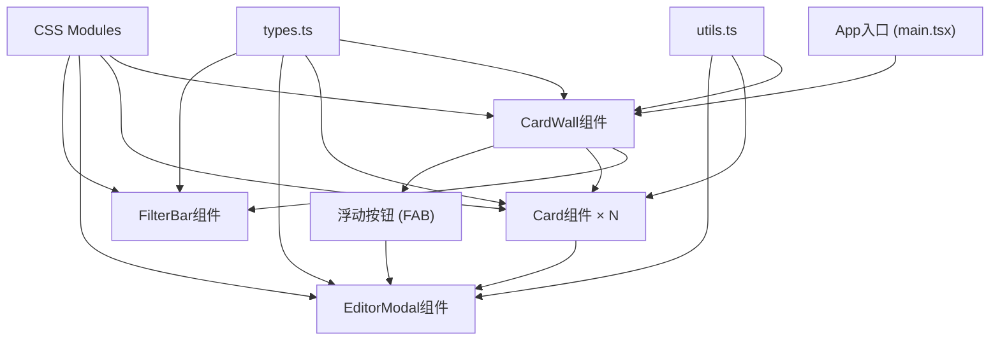

## 1. 架构设计



## 2. 技术描述

- **前端框架**: React 18 + TypeScript (严格模式)
- **构建工具**: Vite 5
- **样式方案**: CSS Modules
- **拖拽实现**: 原生 HTML5 Drag and Drop API
- **状态管理**: React Hooks (useState, useMemo, useCallback)
- **图标方案**: Emoji Unicode
- **唯一ID生成**: uuid
- **路径别名**: @ → src

## 3. 路由定义

纯前端单页应用，无路由配置。所有交互在主页面内完成。

## 4. 数据模型

### 4.1 类型定义

```typescript
interface InspirationCard {
  id: string;
  title: string;
  content: string;
  color: TagColor;
  emoji?: string;
  createdAt: number;
  updatedAt: number;
  isFavorite: boolean;
  column: number;
  order: number;
}

type TagColor = 
  | 'dustyBlue'
  | 'dustyPink' 
  | 'matchaGreen'
  | 'warmOrange'
  | 'dustyPurple'
  | 'dustyGray'
  | 'beanRed'
  | 'creamYellow';

type SortOrder = 'newest' | 'oldest';

interface FilterState {
  searchQuery: string;
  sortOrder: SortOrder;
  selectedColors: TagColor[];
  onlyFavorites: boolean;
}

interface DragState {
  isDragging: boolean;
  draggedCardId: string | null;
  targetColumn: number | null;
  targetIndex: number | null;
}
```

## 5. 文件结构

```
src/
├── components/
│   ├── CardWall.tsx       # 卡片墙主组件
│   ├── Card.tsx           # 单张卡片组件
│   ├── EditorModal.tsx    # 编辑器弹窗组件
│   └── FilterBar.tsx      # 搜索筛选栏组件
├── styles/
│   ├── CardWall.module.css
│   ├── Card.module.css
│   ├── EditorModal.module.css
│   └── FilterBar.module.css
├── types.ts               # 类型定义
├── utils.ts               # 工具函数
├── App.tsx                # 应用根组件
├── main.tsx               # 入口文件
└── index.css              # 全局样式
```

## 6. 核心实现要点

### 6.1 瀑布流布局
- CSS Grid + flexbox 混合实现三列/两列/单列响应式布局
- 卡片按column属性分配到对应列，order控制列内顺序

### 6.2 拖拽排序
- 使用HTML5 Drag and Drop API (dragstart, dragover, drop, dragend)
- 拖拽时通过dataTransfer传递卡片ID和源列信息
- dragover时计算目标位置并显示占位符
- drop时更新所有卡片的column和order属性

### 6.3 卡片翻转动画
- CSS 3D transform: rotateY(180deg)
- transform-style: preserve-3d
- backface-visibility: hidden
- transition: transform 0.6s cubic-bezier(0.22, 1, 0.36, 1)

### 6.4 毛玻璃效果
- backdrop-filter: blur(10px)
- background: rgba(255, 255, 255, 0.08)
- border: 1px solid rgba(255, 255, 255, 0.15)

### 6.5 搜索筛选性能
- useMemo缓存过滤结果
- 搜索使用includes进行模糊匹配
- 筛选条件变化时触发重新计算

### 6.6 收藏置顶
- 渲染时先显示isFavorite=true的卡片
- 收藏卡片添加金色呼吸边框动画 (box-shadow pulse)
