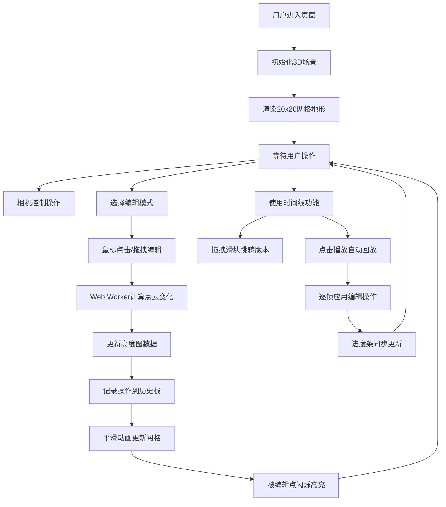

## 1. 产品概述

基于3D点云数据的地形编辑器与历史回放应用，用户可通过鼠标拖拽在三维空间中对地形高度图进行自由雕刻与平滑处理，并支持回放所有编辑步骤。

- 主要用途：为设计师和开发者提供直观的3D地形编辑工具，支持实时编辑和历史操作回放
- 目标用户：游戏开发者、3D设计师、地理信息系统从业者
- 产品价值：提供高性能、交互友好的3D地形编辑体验，支持操作回溯和可视化回放

## 2. 核心功能

### 2.2 功能模块

1. **3D场景模块**：Three.js渲染的20x20网格地形，渐变色高度可视化
2. **地形编辑模块**：抬高、降低、平滑三种编辑模式，基于半径的点云操作
3. **相机控制模块**：左键旋转、右键平移、滚轮缩放
4. **历史记录模块**：编辑操作栈管理，支持撤销和版本跳转
5. **回放控制模块**：时间线进度条，逐帧自动回放，暂停/播放控制
6. **性能优化模块**：Web Worker处理点云运算，平滑动画过渡

### 2.3 页面详情

| 页面名称 | 模块名称 | 功能描述 |
|-----------|-------------|---------------------|
| 主页面 | 3D场景渲染 | 居中显示20x20网格地形，深蓝到雪白渐变着色，支持相机交互 |
| 主页面 | 左侧工具栏 | 三种编辑模式切换按钮，选中高亮淡蓝色，弹性缩放动画 |
| 主页面 | 顶部时间线 | 编辑操作进度条，播放/暂停按钮，滑块拖拽跳转 |
| 主页面 | 编辑交互 | 鼠标点击/拖拽编辑，点高亮闪烁动画，网格平滑变形 |
| 主页面 | 回放系统 | 自动逐帧回放，进度条同步，地形平滑过渡动画 |

## 3. 核心流程

用户打开页面后看到居中的3D地形场景，可通过鼠标控制视角，选择编辑模式后在地形上进行雕刻操作，所有操作被记录到历史栈，用户可通过时间线回放或跳转到任意历史版本。

## 4. 用户界面设计

### 4.1 设计风格

- 主色调：深色背景 #1a1a2e，工具栏半透明深色
- 强调色：淡蓝色 #64b5f6（选中高亮），白色（图标和文字）
- 地形渐变色：深蓝 #0d47a1 → 中蓝 #1976d2 → 浅绿 #4caf50 → 黄色 #ffeb3b → 橙色 #ff9800 → 雪白 #ffffff
- 按钮风格：圆角矩形，半透明背景，白色图标，选中时淡蓝色发光效果
- 字体：现代无衬线字体，清晰易读
- 布局：左侧垂直工具栏，顶部水平时间线，中央3D场景
- 图标风格：简洁线性白色图标

### 4.2 页面设计概述

| 页面名称 | 模块名称 | UI Elements |
|-----------|-------------|-------------|
| 主页面 | 3D场景 | 深色背景 #1a1a2e，20x20网格，顶点渐变着色，平滑光照 |
| 主页面 | 左侧工具栏 | 垂直排列，3个工具按钮，弹性缩放动画，选中高亮淡蓝色 |
| 主页面 | 顶部时间线 | 半透明背景，进度条显示操作节点，播放/暂停按钮，滑块 |
| 主页面 | 交互反馈 | 编辑点白色闪烁0.3秒，网格平滑过渡200ms，按钮弹性动画0.2秒 |

### 4.3 响应式

- 桌面端优先设计，最小宽度768px
- 工具栏和时间线位置固定，3D场景自适应剩余空间
- 按钮尺寸保持适中，确保触控可用性

### 4.4 3D场景指导

- 环境：深色背景，无外部HDRI，使用方向光+环境光照明
- 光照设置：一个主方向光（白色，强度1.0），一个环境光（白色，强度0.4）
- 相机设置：初始位置(30, 20, 30)，看向原点，视角60度
- 相机运动：左键绕Y轴旋转，右键水平平移，滚轮限制距离5-50单位
- 交互：Raycaster检测鼠标点击的顶点，高亮显示编辑区域
- 动画：顶点位置插值动画200ms，颜色闪烁动画300ms
- 性能：Web Worker处理高度图计算，仅更新受影响顶点（最多60个），帧率保持30fps以上
