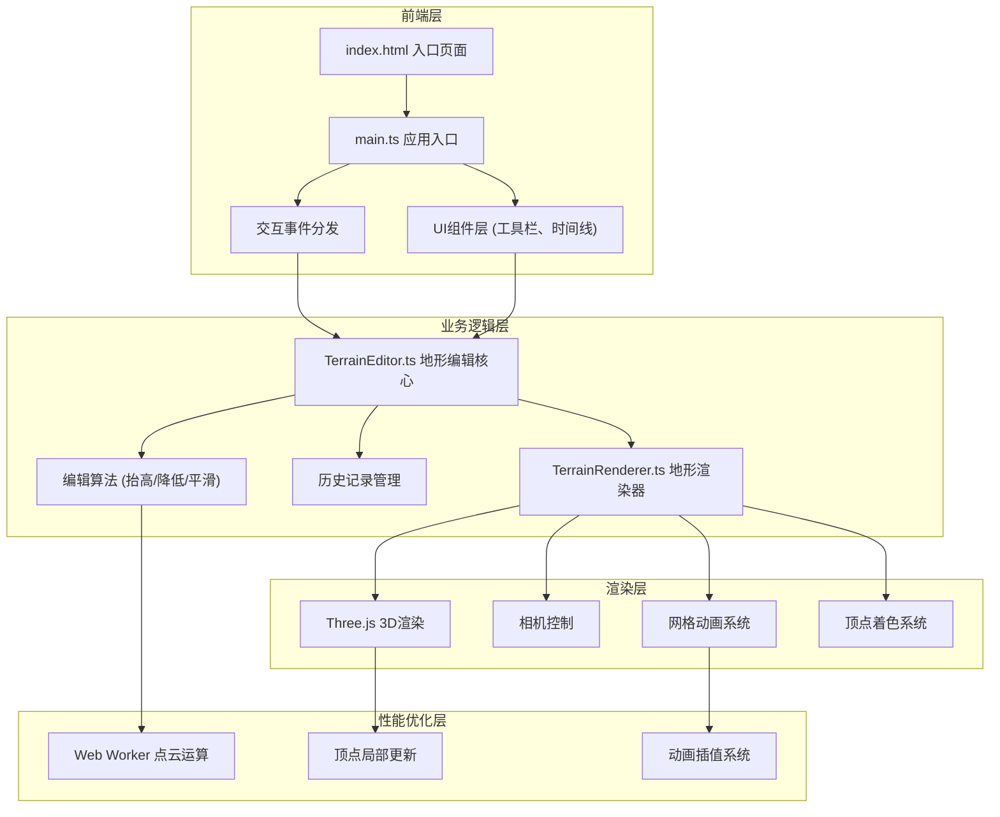

## 1. 架构设计



## 2. 技术描述

- **前端框架**: TypeScript + Three.js (无UI框架，原生DOM)
- **构建工具**: Vite 5.x
- **核心依赖**: three@0.160.x, @types/three@0.160.x, typescript@5.x, vite@5.x
- **Web Worker**: 内联Worker处理点云高度计算，避免阻塞主线程
- **动画系统**: 自定义requestAnimationFrame插值动画，支持顶点位置和颜色过渡

## 3. 文件结构

```
auto72/
├── package.json              # 项目依赖和脚本
├── vite.config.js            # Vite构建配置，路径别名@
├── tsconfig.json             # TypeScript严格模式配置
├── index.html                # 入口HTML页面
└── src/
    ├── main.ts               # 应用初始化、场景搭建、渲染循环、事件分发
    ├── TerrainEditor.ts      # 地形编辑核心：高度图管理、编辑算法、历史栈、Worker通信
    ├── TerrainRenderer.ts    # Three.js渲染：网格创建、着色、法线计算、动画更新
    └── terrain.worker.ts     # Web Worker：点云运算（抬高、降低、平滑算法）
```

## 4. 核心数据结构

### 4.1 高度图数据

```typescript
interface HeightMap {
  size: number;           // 网格大小，固定20
  heights: Float32Array;  // 高度值数组，长度size*size
  colors: Float32Array;   // 顶点颜色数组，长度size*size*3
  normals: Float32Array;  // 顶点法线数组，长度size*size*3
}
```

### 4.2 编辑操作记录

```typescript
interface EditOperation {
  id: number;
  type: 'raise' | 'lower' | 'smooth';
  centerX: number;        // 网格坐标X
  centerZ: number;        // 网格坐标Z
  radius: number;         // 编辑半径
  strength: number;       // 编辑强度
  affectedVertices: number[];  // 受影响顶点索引
  previousHeights: Map<number, number>;  // 操作前的高度值
  timestamp: number;
}
```

### 4.3 历史记录栈

```typescript
interface HistoryState {
  operations: EditOperation[];
  currentIndex: number;   // 当前历史位置，-1表示初始状态
  maxSize: number;        // 最大记录数
}
```

## 5. 核心算法

### 5.1 抬高/降低算法

```typescript
// 在Web Worker中执行
function editHeight(
  heights: Float32Array,
  centerX: number,
  centerZ: number,
  radius: number,
  strength: number,
  size: number
): { affected: number[]; previousHeights: Map<number, number> } {
  const affected: number[] = [];
  const previousHeights = new Map<number, number>();
  const radiusSq = radius * radius;
  
  for (let z = Math.max(0, Math.floor(centerZ - radius)); z <= Math.min(size - 1, Math.ceil(centerZ + radius)); z++) {
    for (let x = Math.max(0, Math.floor(centerX - radius)); x <= Math.min(size - 1, Math.ceil(centerX + radius)); x++) {
      const dx = x - centerX;
      const dz = z - centerZ;
      const distSq = dx * dx + dz * dz;
      
      if (distSq <= radiusSq) {
        const index = z * size + x;
        const falloff = 1 - Math.sqrt(distSq) / radius;
        previousHeights.set(index, heights[index]);
        heights[index] += strength * falloff;
        affected.push(index);
      }
    }
  }
  
  return { affected, previousHeights };
}
```

### 5.2 平滑算法

```typescript
function smoothHeight(
  heights: Float32Array,
  centerX: number,
  centerZ: number,
  radius: number,
  size: number
): { affected: number[]; previousHeights: Map<number, number> } {
  const affected: number[] = [];
  const previousHeights = new Map<number, number>();
  const radiusSq = radius * radius;
  const newHeights = new Map<number, number>();
  
  // 首先计算所有受影响点的新高度
  for (let z = Math.max(0, Math.floor(centerZ - radius)); z <= Math.min(size - 1, Math.ceil(centerZ + radius)); z++) {
    for (let x = Math.max(0, Math.floor(centerX - radius)); x <= Math.min(size - 1, Math.ceil(centerX + radius)); x++) {
      const dx = x - centerX;
      const dz = z - centerZ;
      const distSq = dx * dx + dz * dz;
      
      if (distSq <= radiusSq) {
        const index = z * size + x;
        // 取周围8个邻居的平均值
        let sum = 0;
        let count = 0;
        for (let nz = Math.max(0, z - 1); nz <= Math.min(size - 1, z + 1); nz++) {
          for (let nx = Math.max(0, x - 1); nx <= Math.min(size - 1, x + 1); nx++) {
            if (nx === x && nz === z) continue;
            sum += heights[nz * size + nx];
            count++;
          }
        }
        newHeights.set(index, sum / count);
        previousHeights.set(index, heights[index]);
        affected.push(index);
      }
    }
  }
  
  // 应用新高度
  newHeights.forEach((height, index) => {
    heights[index] = height;
  });
  
  return { affected, previousHeights };
}
```

### 5.3 高度到颜色映射

```typescript
function heightToColor(height: number, minHeight: number, maxHeight: number): [number, number, number] {
  const normalized = maxHeight === minHeight ? 0.5 : (height - minHeight) / (maxHeight - minHeight);
  
  if (normalized < 0.2) {
    // 深蓝
    return [0.05, 0.28, 0.63];
  } else if (normalized < 0.4) {
    // 中蓝到浅绿
    const t = (normalized - 0.2) / 0.2;
    return [
      0.05 + t * (0.30 - 0.05),
      0.28 + t * (0.69 - 0.28),
      0.63 + t * (0.31 - 0.63)
    ];
  } else if (normalized < 0.6) {
    // 浅绿到黄色
    const t = (normalized - 0.4) / 0.2;
    return [
      0.30 + t * (1.00 - 0.30),
      0.69 + t * (0.92 - 0.69),
      0.31 + t * (0.23 - 0.31)
    ];
  } else if (normalized < 0.8) {
    // 黄色到橙色
    const t = (normalized - 0.6) / 0.2;
    return [
      1.00 + t * (1.00 - 1.00),
      0.92 + t * (0.60 - 0.92),
      0.23 + t * (0.00 - 0.23)
    ];
  } else {
    // 橙色到雪白
    const t = (normalized - 0.8) / 0.2;
    return [
      1.00 + t * (1.00 - 1.00),
      0.60 + t * (1.00 - 0.60),
      0.00 + t * (1.00 - 0.00)
    ];
  }
}
```

## 6. 性能优化策略

1. **Web Worker 分离计算**：所有点云高度计算在Worker线程执行，主线程仅处理UI和渲染
2. **局部顶点更新**：每次编辑仅更新受半径影响的顶点（最多约60个），避免全量更新
3. **动画插值**：使用自定义插值系统，在200ms内平滑过渡顶点位置，避免卡顿
4. **几何体复用**：BufferGeometry的position和color属性使用setUsage(DynamicDrawUsage)，支持高效更新
5. **法线计算优化**：仅重新计算受影响区域的法线，而非整个网格
6. **历史快照优化**：仅存储受影响顶点的前值，而非完整高度图副本

## 7. 相机控制实现

```typescript
class CameraController {
  private camera: THREE.PerspectiveCamera;
  private target: THREE.Vector3;
  private isLeftDown = false;
  private isRightDown = false;
  private lastMouseX = 0;
  private lastMouseY = 0;
  private theta = Math.PI / 4;  // 水平角度
  private phi = Math.PI / 3;    // 垂直角度
  private distance = Math.sqrt(30 * 30 + 20 * 20 + 30 * 30);
  private minDistance = 5;
  private maxDistance = 50;
  
  updateCameraPosition(): void {
    const x = this.distance * Math.sin(this.phi) * Math.cos(this.theta);
    const y = this.distance * Math.cos(this.phi);
    const z = this.distance * Math.sin(this.phi) * Math.sin(this.theta);
    
    this.camera.position.set(
      this.target.x + x,
      this.target.y + y,
      this.target.z + z
    );
    this.camera.lookAt(this.target);
  }
}
```
