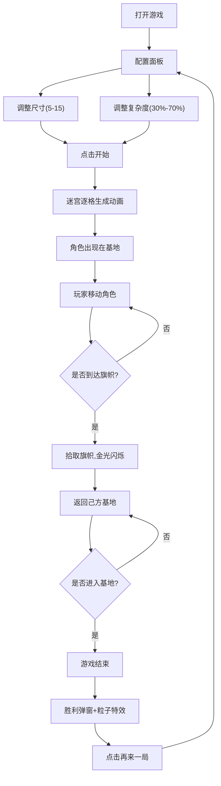

## 1. 产品概述
基于格子的迷宫生成与夺旗对战游戏，两名玩家在随机生成的迷宫中控制角色抢夺中央旗帜并带回己方基地获胜。
- 主要用途：本地双人对战休闲游戏，提供策略性和趣味性的竞技体验
- 目标用户：休闲游戏玩家，适合朋友间本地对战
- 市场价值：填补本地双人对战迷宫游戏的空白，结合策略与操作乐趣

## 2. 核心特性

### 2.1 用户角色
| 角色 | 操作方式 | 核心权限 |
|------|----------|----------|
| 红色玩家 | WASD键控制 | 控制红色角色移动、抢夺旗帜 |
| 蓝色玩家 | 方向键控制 | 控制蓝色角色移动、抢夺旗帜 |

### 2.2 功能模块
1. **配置面板**：迷宫尺寸调整、复杂度滑块、开始游戏按钮
2. **游戏主界面**：迷宫渲染、角色控制、旗帜显示、战争迷雾
3. **状态面板**：角色坐标、步数统计、旗帜持有状态、迷宫缩略图
4. **胜利界面**：获胜弹窗、粒子特效、胜利音效、再来一局按钮

### 2.3 页面详情
| 页面名称 | 模块名称 | 功能描述 |
|----------|----------|----------|
| 配置页面 | 尺寸滑块 | 5x5到15x15迷宫尺寸调节，实时显示数值 |
| 配置页面 | 复杂度滑块 | 30%到70%死胡同比例调节，拖动时数值动画提示 |
| 配置页面 | 开始按钮 | 触发迷宫生成动画并进入游戏 |
| 游戏页面 | 迷宫渲染 | 逐格展开动画，赛博朋克风格深灰背景配霓虹绿网格 |
| 游戏页面 | 角色控制 | 红蓝圆形角色，平滑移动动画，残影轨迹效果 |
| 游戏页面 | 战争迷雾 | 5x5视野范围，视野外墙体暗色不可见 |
| 游戏页面 | 旗帜系统 | 中心旋转金色三角锥，拾取后金光闪烁，带回基地获胜 |
| 状态面板 | 实时状态 | 坐标、步数、旗帜状态实时更新，迷宫缩略图动态刷新 |
| 胜利页面 | 胜利弹窗 | 全屏显示获胜方，彩色粒子爆发，显示用时和再来一局按钮 |

## 3. 核心流程
用户打开游戏 → 调整迷宫尺寸和复杂度 → 点击开始 → 迷宫逐格生成动画 → 角色出现在基地角落 → 玩家交替控制角色移动 → 角色进入中心格子拾取旗帜 → 携带旗帜返回己方基地 → 踏入基地瞬间游戏结束 → 显示胜利弹窗和用时 → 点击再来一局返回配置页面

## 4. 用户界面设计

### 4.1 设计风格
- 主色调：深灰色背景(#1a1a2e)，霓虹绿色(#00ff88)网格线和高亮
- 角色色：红色(#ff3366)和蓝色(#3399ff)圆形角色
- 旗帜色：金色(#ffd700)三角锥，旋转动画
- 按钮风格：圆角矩形，霓虹绿边框，悬停发光效果
- 字体：使用Orbitron显示字体（赛博朋克风格）搭配Roboto正文
- 布局：左侧游戏主区域，右侧状态面板
- 动画：迷宫逐格展开、角色平滑移动、残影轨迹、旗帜旋转、基地光晕闪烁、胜利粒子爆发

### 4.2 页面设计概述
| 页面名称 | 模块名称 | UI元素 |
|----------|----------|----------|
| 配置页面 | 配置面板 | 居中卡片，深色背景，霓虹绿边框，滑块带数值提示动画 |
| 游戏页面 | 迷宫区域 | 深灰背景，霓虹绿网格线，墙体半透明高亮视野内区域 |
| 游戏页面 | 角色 | 圆形带发光效果，移动时残影轨迹，持旗时金光环绕 |
| 游戏页面 | 旗帜 | CSS 3D旋转金色三角锥，脉冲光点提示方位 |
| 游戏页面 | 基地 | 角落闪烁发光光晕，角色离开熄灭，返回点亮 |
| 状态面板 | 信息区 | 两行玩家状态，坐标/步数/旗帜图标，底部缩略图 |
| 胜利页面 | 弹窗 | 全屏半透明黑背景，居中白色文字，彩色粒子特效 |

### 4.3 响应式
桌面端优先，固定尺寸游戏区域，状态面板固定宽度，不考虑移动端适配

### 4.4 性能要求
- 角色移动和状态更新帧率保持30FPS以上
- 迷宫生成时间不超过1秒
- 动画流畅无卡顿
