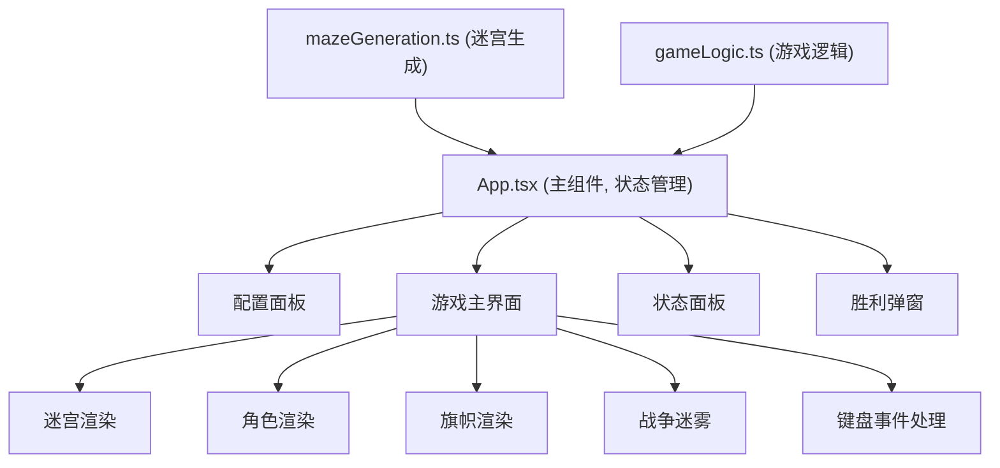

## 1. 架构设计



## 2. 技术描述
- 前端：React@18 + TypeScript + Vite
- 状态管理：React useState/useReducer 本地状态管理
- 样式：纯CSS + CSS变量，CSS动画和3D变换
- 工具库：uuid（唯一标识）
- 初始化工具：vite-init react-ts模板

## 3. 目录结构
```
.
├── package.json
├── index.html
├── vite.config.js
├── tsconfig.json
└── src/
    ├── main.tsx
    ├── App.tsx
    ├── mazeGeneration.ts
    ├── gameLogic.ts
    └── components/
        ├── GameBoard.tsx
        └── PlayerPanel.tsx
```

## 4. 核心模块说明

### 4.1 mazeGeneration.ts
- 深度优先搜索(DFS)算法生成随机迷宫
- 支持自定义尺寸和复杂度（死胡同比例）
- 输出二维数组表示迷宫结构
- 计算实际死胡同比例用于验证

### 4.2 gameLogic.ts
- 角色位置管理和移动规则
- 碰撞检测（墙体、角色碰撞）
- 旗帜拾取和携带逻辑
- 胜利判定（携带旗帜返回基地）
- 视野范围计算（5x5区域）
- 步数统计

### 4.3 GameBoard.tsx
- 迷宫网格渲染
- 角色渲染（圆形、残影效果）
- 旗帜渲染（CSS 3D旋转三角锥）
- 战争迷雾效果
- 键盘事件监听（WASD和方向键）
- 动画控制（生成动画、移动动画）

### 4.4 PlayerPanel.tsx
- 玩家坐标显示（x, y格式）
- 步数统计
- 旗帜持有状态（高亮/灰显图标）
- 迷宫缩略图（已探索区域、旗帜位置）
- 淡入淡出动画过渡

### 4.5 App.tsx
- 游戏状态管理（配置阶段/游戏中/胜利）
- 配置面板UI
- 胜利弹窗UI
- 粒子特效
- 胜利音效（Web Audio API）
- 路由/状态切换逻辑

## 5. 数据模型

### 5.1 迷宫数据结构
```typescript
type CellType = 'wall' | 'path';
type Maze = CellType[][];
```

### 5.2 角色状态
```typescript
interface Player {
  id: string;
  x: number;
  y: number;
  color: 'red' | 'blue';
  steps: number;
  hasFlag: boolean;
  baseX: number;
  baseY: number;
  isMoving: boolean;
  trail: { x: number; y: number; opacity: number }[];
}
```

### 5.3 游戏状态
```typescript
interface GameState {
  phase: 'config' | 'playing' | 'victory';
  maze: Maze;
  mazeSize: number;
  complexity: number;
  players: Player[];
  flagPosition: { x: number; y: number };
  flagHolder: string | null;
  exploredCells: Set<string>;
  startTime: number;
  endTime: number;
  winner: 'red' | 'blue' | null;
}
```

### 5.4 配置状态
```typescript
interface ConfigState {
  mazeSize: number;
  complexity: number;
}
```

## 6. 关键实现要点

### 6.1 迷宫生成算法
- 使用递归回溯法(DFS)生成完美迷宫
- 复杂度控制：通过随机打通额外墙体调整死胡同比例
- 确保从任意位置到中心和角落都有可达路径

### 6.2 移动控制
- 同一时间只允许一个角色行动（移动锁机制）
- 每步0.3秒冷却，0.2秒平滑过渡动画
- 使用requestAnimationFrame保证30+FPS

### 6.3 动画实现
- 迷宫生成：逐格从中心向外scale动画
- 角色移动：CSS transition + transform
- 残影效果：trail数组保存历史位置，opacity递减
- 旗帜旋转：CSS 3D transform rotateY
- 粒子特效：Canvas或DOM元素动画

### 6.4 性能优化
- 使用CSS transform而非top/left实现动画
- 缩略图使用requestAnimationFrame批量更新
- 视野计算使用缓存，避免每帧全量计算
