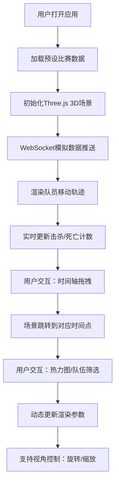

## 1. 产品概述

交互式3D电竞赛事数据复盘看板，为观众提供超越传统直播的沉浸式比赛数据分析体验。通过Three.js渲染3D地图场景，实时展示队员移动轨迹、击杀事件分布和关键团战回放，支持用户自由探索比赛数据。

- 核心价值：将抽象的比赛数据转化为直观可交互的3D可视化体验，帮助观众深入理解战术布局和关键瞬间
- 目标用户：电竞赛事观众、数据分析爱好者、职业战队教练及分析师
- 市场定位：专业级赛事复盘工具，填补直播画面与数据统计之间的体验鸿沟

## 2. 核心功能

### 2.1 功能模块
1. **3D场景渲染模块**：Three.js地图场景、队员模型、轨迹绘制、击杀特效
2. **数据管理模块**：预设比赛数据解析、WebSocket模拟推送、时间轴控制
3. **UI交互模块**：时间轴进度条、队伍筛选开关、热力图切换、状态面板
4. **动画系统模块**：队员移动动画、击杀冲击波、热力图渐隐、数字弹性动效

### 2.2 页面详情
| 页面名称 | 模块名称 | 功能描述 |
|-----------|-------------|---------------------|
| 主看板页面 | 3D场景渲染 | 全屏3D地图展示，支持鼠标拖拽旋转和滚轮缩放，俯角45度初始视角 |
| 主看板页面 | 时间轴控制 | 底部80%宽度进度条，支持拖拽跳转、击杀事件标记、悬停tooltip |
| 主看板页面 | 左侧控制面板 | 毛玻璃半透明面板，包含队伍筛选开关和热力图模式切换按钮 |
| 主看板页面 | 右上角状态面板 | 实时显示双方击杀/死亡计数，数字变化带弹性缩放动画 |
| 主看板页面 | 数据可视化 | 红蓝队伍轨迹区分、击杀冲击波动画、热力图热点叠加 |

## 3. 核心流程

用户打开应用 → 自动加载预设CS:GO比赛数据 → 3D场景初始化完成 → 点击播放按钮开始回放 → 队员沿轨迹移动，击杀事件触发特效 → 用户拖拽时间轴跳转到关键时刻 → 开启热力图模式查看击杀分布 → 使用队伍筛选聚焦单个队伍战术 → 滚轮缩放查看细节，拖拽旋转切换视角

## 4. 用户界面设计

### 4.1 设计风格
- **主色调**：深蓝灰色(#0a0a14)为背景，红色(#FF3333)代表红队，蓝色(#3377FF)代表蓝队，金黄色(#FFD700)为击杀特效和强调色
- **视觉风格**：科技感电竞风格，深色主题配合发光特效，半透明毛玻璃UI元素悬浮于3D场景之上
- **字体**：采用Orbitron作为数字显示字体（等宽，间距2px），Inter作为界面文本字体
- **动效**：击杀冲击波扩散、球体闪烁发光、数字弹性缩放、热力图渐隐、滑块平滑过渡

### 4.2 页面设计概述
| 页面名称 | 模块名称 | UI元素 |
|-----------|-------------|-------------|
| 主看板页面 | 3D场景 | 淡灰色地面网格，发光球体队员，半透明圆柱轨迹，金黄色冲击波 |
| 主看板页面 | 左侧控制面板 | 宽280px，圆角16px，阴影模糊12px，底色rgba(20,20,30,0.8)，毛玻璃效果 |
| 主看板页面 | 底部时间轴 | 高80px，底色rgba(0,0,0,0.7)，金黄色圆形滑块拇指，红蓝击杀标记点 |
| 主看板页面 | 右上角状态面板 | 显示红队/蓝队K/D计数，等宽数字，变化时弹性缩放动画 |

### 4.3 响应式设计
- **桌面端优先**：默认布局适配1920×1080及以上分辨率
- **断点适配**：窗口宽度≤680px时，所有UI元素自动缩小50%并纵向排列，3D场景保持全屏
- **触摸优化**：移动端支持单指拖拽旋转视角、双指捏合缩放

### 4.4 3D场景设计
- **环境设置**：深色背景配合环境光+方向光，营造电竞氛围
- **灯光配置**：AmbientLight(0xffffff, 0.4) + DirectionalLight(0xffffff, 0.8)，方向光投射阴影增强立体感
- **相机设置**：PerspectiveCamera，初始位置(0, 15, 15)，俯角45度，fov=60
- **相机控制**：OrbitControls，X轴旋转限制-30°~60°，缩放范围0.5~2倍，启用阻尼效果
- **后处理效果**：Bloom发光效果增强球体和冲击波的视觉冲击力
- **性能预算**：帧率≥45FPS，球体≤10个，轨迹线段≤400条（2队×200），热力图标记≤50个
